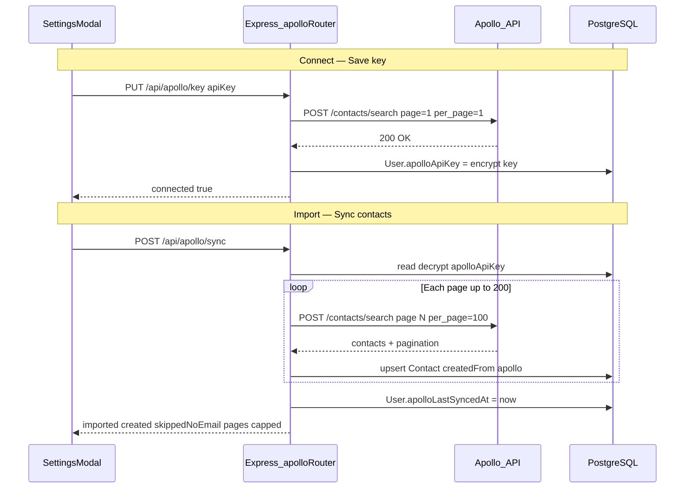

# Apollo.io Contact Import — Integration Guide

**File:** `docs/APOLLO_INTEGRATION.md`  
**Purpose:** Complete reference for how Apollo.io contact import is implemented in FlyConnector (server + web). Use this to understand the feature or re-implement it in another project.

---

## Table of contents

1. [Overview](#1-overview)
2. [What Apollo does vs does not do](#2-what-apollo-does-vs-does-not-do)
3. [Architecture](#3-architecture)
4. [Prerequisites](#4-prerequisites)
5. [Database schema](#5-database-schema)
6. [Server file map](#6-server-file-map)
7. [API reference](#7-api-reference)
8. [Save key flow (connect)](#8-save-key-flow-connect)
9. [Sync flow (import contacts)](#9-sync-flow-import-contacts)
10. [Apollo HTTP client](#10-apollo-http-client)
11. [Contact upsert behavior](#11-contact-upsert-behavior)
12. [Frontend implementation](#12-frontend-implementation)
13. [Security](#13-security)
14. [Testing](#14-testing)
15. [Manual verification](#15-manual-verification)
16. [Troubleshooting](#16-troubleshooting)
17. [Port to another project](#17-port-to-another-project)

---

## 1. Overview

Apollo integration lets a logged-in user:

1. **Connect** — save and validate their Apollo.io API key (encrypted in the database).
2. **Import** — pull contacts from their Apollo account into the CRM workspace as `Contact` rows tagged `createdFrom: 'apollo'`.

This is a **two-step** user flow:

| Step | UI action | API | Result |
|------|-----------|-----|--------|
| Connect | **Save key** in Settings | `PUT /api/apollo/key` | Key stored; UI shows "Connected" |
| Import | **Sync contacts now** in Settings | `POST /api/apollo/sync` | Contacts appear in contact list |

Saving the key does **not** import contacts. Sync does **not** run automatically on save.

---

## 2. What Apollo does vs does not do

| Does | Does not |
|------|----------|
| Import contacts from Apollo `contacts/search` | Send or receive email |
| Store API key encrypted per user | Sync Gmail or Outlook mail |
| Upsert contacts by `(workspaceId, email)` | Replace manual `/api/gmail/sync` |
| Backfill name/company on existing contacts if blank | Expose the API key back to the client after save |
| Set `User.apolloLastSyncedAt` after sync | Delete imported contacts on Disconnect |

### Do not confuse with top-bar Sync

The **Sync now** button in the app header calls **`POST /api/gmail/sync`** or **`POST /api/outlook/sync`**. That response looks like:

```json
{
  "messagesAdded": 0,
  "messagesSkipped": 0,
  "contactsCreated": 0,
  "messageIdsBackfilled": 0,
  "newHistoryId": "63067"
}
```

Apollo sync is only triggered by **Sync contacts now** in Settings → Apollo section. Its response looks like:

```json
{
  "imported": 42,
  "created": 10,
  "skippedNoEmail": 3,
  "pages": 1,
  "capped": false
}
```

---

## 3. Architecture



---

## 4. Prerequisites

### Application

- User logged in (session cookie `gmail_connector.sid`)
- `requireAuth` middleware resolves `userId` and `workspaceId`
- `ENCRYPTION_KEY` in root `.env` (32-byte base64 — same key used for OAuth tokens)
- Router mounted: `app.use('/api/apollo', apolloRouter)` in `server/src/index.ts`

### Apollo.io account

- User creates an API key in Apollo: **Settings → Integrations → API**
- Apollo REST auth for this integration: **header-only** `X-Api-Key` on POST requests (not query string)

### No extra env vars

Apollo does not need its own environment variable. The key is per-user and stored in the database.

---

## 5. Database schema

### User fields (`server/prisma/schema.prisma`)

```prisma
apolloApiKey        String?    // encrypted v1:iv:tag:ciphertext
apolloLastSyncedAt  DateTime?
```

- `apolloApiKey` — set on successful **Save key**; cleared on **Disconnect**
- `apolloLastSyncedAt` — updated only after successful **Sync contacts now**

### Contact fields

```prisma
enum ContactSource {
  manual
  logged_email
  apollo
}

model Contact {
  workspaceId   String
  email         String
  name          String?
  company       String?
  createdFrom   ContactSource @default(manual)
  @@unique([workspaceId, email])
}
```

There are **no** separate Apollo tables. Imported contacts are normal `Contact` rows with `createdFrom = 'apollo'`.

---

## 6. Server file map

| File | Responsibility |
|------|----------------|
| `server/src/apollo/client.ts` | `apolloFetch`, `verifyApolloKey`, `getApolloKey`, typed errors |
| `server/src/apollo/sync.ts` | `syncApolloContacts` — pagination, field mapping, upsert loop |
| `server/src/apollo/routes.ts` | Express routes: status, key CRUD, sync |
| `server/src/contacts/upsert.ts` | Shared `upsertContact()` used by Apollo, Gmail sync, send |
| `server/src/auth/crypto.ts` | `encrypt()`, `readToken()` / `decrypt()` for key at rest |
| `server/src/auth/middleware.ts` | `requireAuth` — session + workspace |
| `server/src/index.ts` | Mount `/api/apollo` |
| `server/src/apollo/client.test.ts` | Client unit tests |
| `server/src/apollo/sync.test.ts` | Sync unit tests |

### Frontend

| File | Responsibility |
|------|----------------|
| `web/src/components/SettingsModal.tsx` | Apollo UI: key input, Save, Sync, Disconnect |
| `web/vite.config.ts` | Proxy `/api` → backend `:3000` |

---

## 7. API reference

All routes require session authentication (`apolloRouter.use(requireAuth)`).

Base path: **`/api/apollo`**

### GET `/status`

**Purpose:** Check whether the user has a saved key (never returns the key).

**Response 200:**

```json
{
  "connected": true,
  "lastSyncedAt": "2026-06-02T10:30:00.000Z"
}
```

`lastSyncedAt` is `null` if sync has never run.

---

### PUT `/key`

**Purpose:** Validate API key with Apollo, then encrypt and store it.

**Request body:**

```json
{
  "apiKey": "your-apollo-api-key"
}
```

**Response 200:**

```json
{
  "connected": true
}
```

**Errors:**

| Status | `error` | When |
|--------|---------|------|
| 400 | `missing_api_key` | Empty or non-string `apiKey` |
| 400 | `invalid_api_key` | Apollo returned 401/403 on probe |
| 500 | — | Network or unexpected Apollo error |

**Side effects:** Updates `User.apolloApiKey` only. Does **not** import contacts or update `apolloLastSyncedAt`.

---

### DELETE `/key`

**Purpose:** Disconnect Apollo (remove stored key).

**Response 200:**

```json
{
  "connected": false
}
```

**Side effects:** Sets `User.apolloApiKey = null`. Imported `Contact` rows are **not** deleted.

---

### POST `/sync`

**Purpose:** Import contacts from Apollo into the user's workspace.

**Request body:** none

**Response 200:**

```json
{
  "imported": 42,
  "created": 10,
  "skippedNoEmail": 3,
  "pages": 2,
  "capped": false
}
```

| Field | Meaning |
|-------|---------|
| `imported` | Contacts with email that were upserted |
| `created` | Brand-new `Contact` rows (not updates to existing) |
| `skippedNoEmail` | Apollo records with missing/empty email |
| `pages` | Number of API pages fetched |
| `capped` | `true` if stopped at 200-page safety limit |

**Errors:**

| Status | `error` | When |
|--------|---------|------|
| 400 | `apollo_not_connected` | No `apolloApiKey` saved |
| 401 | `apollo_reauth_required` | Apollo rejected key (401/403 during sync) |
| 429 | `apollo_rate_limited` | Apollo HTTP 429 |
| 500 | — | Other failures |

**Side effects:** Upserts contacts; sets `User.apolloLastSyncedAt`.

---

## 8. Save key flow (connect)

### Frontend (`SettingsModal.saveApolloKey`)

1. Trim key from password input.
2. `PUT /api/apollo/key` with `{ apiKey }` and `credentials: 'include'`.
3. On success:
   - `setApolloConnected(true)` → green **Connected** badge
   - Clear input field (key not kept in UI)
   - Toast: "Apollo connected."
4. On failure: show `apolloError` under the field.

### Backend (`routes.ts` → `client.ts`)

1. `requireAuth` → `userId`
2. Reject empty key → `400 missing_api_key`
3. **`verifyApolloKey(apiKey)`**:
   ```http
   POST https://api.apollo.io/api/v1/contacts/search
   X-Api-Key: <apiKey>
   Content-Type: application/json

   { "page": 1, "per_page": 1 }
   ```
4. If Apollo returns 401/403 → `400 invalid_api_key`
5. **`encrypt(apiKey)`** → AES-256-GCM string `v1:iv:tag:ciphertext`
6. `prisma.user.update({ apolloApiKey: encrypted })`
7. Return `{ connected: true }`

### What is NOT done on save

- No contact import
- No `apolloLastSyncedAt` update
- Key never returned in any API response

---

## 9. Sync flow (import contacts)

### Frontend (`SettingsModal.syncApollo`)

1. `POST /api/apollo/sync` with session cookie.
2. On success:
   - Toast: `Imported N contacts (M new).`
   - Update `apolloLastSyncedAt` in UI
   - Call `onContactsChanged()` → parent refreshes contact list
3. On `401 apollo_reauth_required`: mark disconnected, show re-enter key message.

### Backend (`syncApolloContacts`)

**File:** `server/src/apollo/sync.ts`

1. **`getApolloKey(userId)`** — load user, `readToken(apolloApiKey)`, decrypt if encrypted.
2. **Pagination loop:**
   - `PER_PAGE = 100`
   - `MAX_PAGES = 200` (safety cap; Apollo allows up to 500 pages)
   - For `page = 1 .. totalPages`:
     ```http
     POST /contacts/search
     { "page": page, "per_page": 100 }
     ```
   - Read `pagination.total_pages` from response
   - If `page > MAX_PAGES`: set `capped = true`, stop, log warning
3. **For each contact in `contacts[]`:**
   - Skip if no email (`skippedNoEmail++`)
   - Normalize email: `trim().toLowerCase()`
   - Map fields (see table below)
   - Call `upsertContact(workspaceId, userId, { email, name }, { createdFrom: 'apollo', company })`
   - `imported++`; if upsert returned `created: true`, `created++`
4. **`prisma.user.update({ apolloLastSyncedAt: new Date() })`**
5. Return `ApolloSyncResult`

### Apollo → CRM field mapping

| Apollo field | CRM field | Logic |
|--------------|-----------|-------|
| `email` | `Contact.email` | Required; lowercase trim |
| `name` | `Contact.name` | Use `name` if set |
| `first_name` + `last_name` | `Contact.name` | Join if `name` empty |
| `organization.name` | `Contact.company` | Preferred |
| `organization_name` | `Contact.company` | Fallback |
| — | `Contact.createdFrom` | Always `'apollo'` for new rows |

### Example Apollo contact JSON (subset)

```json
{
  "id": "abc123",
  "name": "Jane Doe",
  "first_name": "Jane",
  "last_name": "Doe",
  "email": "jane@example.com",
  "organization_name": "Acme Inc",
  "organization": { "name": "Acme Inc" }
}
```

---

## 10. Apollo HTTP client

**File:** `server/src/apollo/client.ts`

### Constants

```typescript
APOLLO_BASE_URL = 'https://api.apollo.io/api/v1'
```

### `apolloFetch(apiKey, path, body)`

- Method: **POST**
- URL: `APOLLO_BASE_URL + path`
- Headers:
  - `Content-Type: application/json`
  - `Cache-Control: no-cache`
  - `X-Api-Key: <apiKey>`
- Body: JSON-serialized object

### Error mapping

| Apollo HTTP | Thrown error | Route maps to |
|-------------|--------------|---------------|
| 401, 403 | `ApolloAuthError` | 400 on save; 401 on sync |
| 429 | `ApolloRateLimitError` | 429 on sync |
| Other non-2xx | `ApolloApiError` | 500 |
| No key in DB | `ApolloNotConnectedError` | 400 on sync |

### `getApolloKey(userId)`

Loads `User.apolloApiKey`, decrypts via `readToken()`, throws `ApolloNotConnectedError` if missing.

### `verifyApolloKey(apiKey)`

Calls `apolloFetch(apiKey, '/contacts/search', { page: 1, per_page: 1 })`. Used only before first save.

---

## 11. Contact upsert behavior

**File:** `server/src/contacts/upsert.ts`

Shared by Apollo import, Gmail sync, and compose/send.

| Scenario | Behavior |
|----------|----------|
| New `(workspaceId, email)` | Create row with `createdFrom: 'apollo'`, name, company |
| Existing contact | **Do not** change `createdFrom` |
| Existing, name empty | Backfill name from Apollo |
| Existing, company empty | Backfill company from Apollo |
| Re-run sync | Idempotent — no duplicate rows |

Unique constraint: `@@unique([workspaceId, email])`

---

## 12. Frontend implementation

**File:** `web/src/components/SettingsModal.tsx`

### State

- `apolloConnected` — from `GET /api/apollo/status`
- `apolloLastSyncedAt` — from status or after sync
- `apolloKey` — local input only (cleared after save)
- `apolloSaving`, `apolloSyncing`, `apolloError`

### On modal open

```javascript
fetch('/api/apollo/status', { credentials: 'include' })
fetch('/api/settings', { credentials: 'include' })
```

### UI elements

| Element | Action |
|---------|--------|
| Password input | Enter/replace API key |
| **Save key** | `PUT /api/apollo/key` |
| **Connected** badge | Shown when `apolloConnected` |
| **Sync contacts now** | `POST /api/apollo/sync` (only when connected) |
| **Disconnect** | `DELETE /api/apollo/key` |
| Last synced text | From `apolloLastSyncedAt` |

### Network paths (dev)

Browser calls `http://localhost:5173/api/apollo/...`  
Vite proxies to `http://localhost:3000/api/apollo/...`

### Refresh after sync

`App.tsx` passes `onContactsChanged={() => setRefreshSignal(n => n + 1)}`  
`ContactList` refetches `GET /api/contacts?limit=200` when `refreshSignal` changes.

---

## 13. Security

| Topic | Implementation |
|-------|----------------|
| At rest | `encrypt()` — AES-256-GCM, format `v1:iv:tag:ciphertext` |
| In transit | HTTPS in production; Apollo calls use TLS |
| Exposure | API never returns `apolloApiKey` after save |
| Scope | Key stored on `User` row (per user, not per workspace) |
| Auth | All `/api/apollo/*` routes require valid session |
| Validation | Key verified against Apollo before storage |

Uses same `ENCRYPTION_KEY` as Google/Outlook OAuth tokens (`server/src/auth/crypto.ts`).

---

## 14. Testing

```bash
cd server
npm run test -- src/apollo/
```

### `client.test.ts`

- `getApolloKey` — returns key / throws when missing
- `apolloFetch` — sends `X-Api-Key` header, correct URL
- Maps 401, 403, 429, 500 to typed errors
- `verifyApolloKey` — probe uses `per_page: 1`

### `sync.test.ts`

- Imports contacts with `createdFrom: 'apollo'`
- Skips contacts without email
- Paginates multiple pages
- Derives name from first/last, company from `organization_name`
- Counts `created` vs existing
- Updates `apolloLastSyncedAt`

---

## 15. Manual verification

1. **Save key**
   - Settings → paste Apollo key → **Save key**
   - Network: `PUT /api/apollo/key` → **200** `{ "connected": true }`
   - UI: **Connected** badge
   - DB: `User.apolloApiKey` is non-null encrypted string

2. **Sync contacts**
   - Click **Sync contacts now**
   - Network: `POST /api/apollo/sync` → **200** with `imported` > 0 (if Apollo has contacts with email)
   - Contact list refreshes
   - DB: new `Contact` rows with `createdFrom = 'apollo'`

3. **Disconnect**
   - Click **Disconnect**
   - Network: `DELETE /api/apollo/key` → **200**
   - DB: `apolloApiKey` null; contacts remain

4. **Wrong button check**
   - Top bar **Sync now** → `/api/gmail/sync` — not Apollo

---

## 16. Troubleshooting

| Symptom | Likely cause | What to do |
|---------|--------------|------------|
| `PUT /key` → 400 `invalid_api_key` | Wrong or revoked Apollo key | Create new key in Apollo |
| `POST /sync` → 400 `apollo_not_connected` | Key not saved | Save key first |
| `POST /sync` → 401 `apollo_reauth_required` | Key invalid after save | Disconnect, re-save key |
| `POST /sync` → 429 `apollo_rate_limited` | Apollo rate limit | Wait and retry |
| `imported: 0` | No contacts with email in Apollo | Check Apollo account data |
| `capped: true` | More than 200 pages (20k contacts) | Increase `MAX_PAGES` in code if needed |
| Network shows `messagesAdded` | Used top-bar Gmail sync | Use **Sync contacts now** in Settings |
| Contacts not in list after sync | Sync failed silently | Check response body and `apolloError` in UI |
| 404 on `/api/apollo/*` | Router not mounted | Ensure `app.use('/api/apollo', apolloRouter)` in `index.ts` |

---

## 17. Port to another project

### Minimum server files to copy/adapt

```
server/src/apollo/client.ts
server/src/apollo/sync.ts
server/src/apollo/routes.ts
server/src/apollo/client.test.ts
server/src/apollo/sync.test.ts
server/src/contacts/upsert.ts          # or equivalent upsert logic
server/src/auth/crypto.ts              # encrypt + readToken
server/src/auth/middleware.ts          # requireAuth + workspaceId
```

### Schema changes

```prisma
// User
apolloApiKey        String?
apolloLastSyncedAt  DateTime?

// ContactSource enum
apollo

// Contact
@@unique([workspaceId, email])
```

### Express wiring

```typescript
import { apolloRouter } from './apollo/routes';
app.use('/api/apollo', apolloRouter);
```

### Frontend

Copy Apollo section from `SettingsModal.tsx` (state + four fetch calls) or build equivalent UI.

### Environment

Only requires existing `ENCRYPTION_KEY` — no Apollo-specific env var.

---

*End of Apollo integration guide.*
