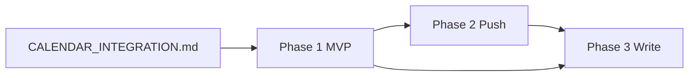
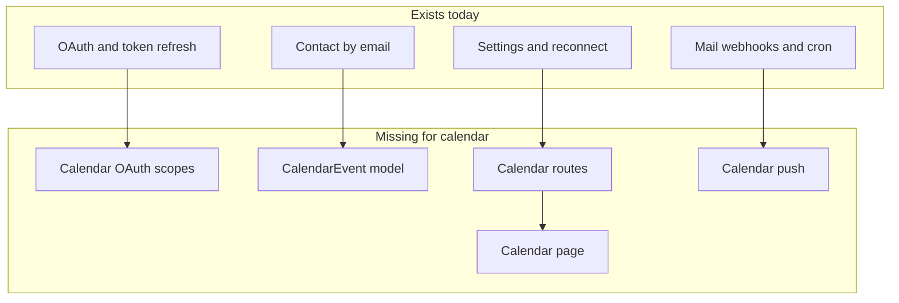

# Calendar Integration in FlyCRM — Overview

**File:** `docs/CALENDAR_INTEGRATION.md`  
**Purpose:** Feasibility assessment and index for syncing **Google Calendar** and **Outlook Calendar** into FlyCRM.  
**Status:** **Phase 1 implemented** — see [CALENDAR_PHASE_1.md](./CALENDAR_PHASE_1.md). Phase 2/3 not implemented.

---

## Which doc to read

| If you are… | Read |
|-------------|------|
| Evaluating feasibility | This document |
| Building the MVP | [CALENDAR_PHASE_1.md](./CALENDAR_PHASE_1.md) |
| Adding real-time webhooks | [CALENDAR_PHASE_2.md](./CALENDAR_PHASE_2.md) |
| Adding create/edit meetings + multi-calendar | [calendar-phase-3/README.md](./calendar-phase-3/README.md) |

---

## Phase roadmap

| Phase | Doc | Goal | Status |
|-------|-----|------|--------|
| **1** | [CALENDAR_PHASE_1.md](./CALENDAR_PHASE_1.md) | Read-only sync of **primary** calendar; manual + daily cron | Not implemented |
| **2** | [CALENDAR_PHASE_2.md](./CALENDAR_PHASE_2.md) | Push notifications (Google Channels + Graph subscriptions) | Not implemented |
| **3** | [calendar-phase-3/README.md](./calendar-phase-3/README.md) | Multi-calendar picker + create/update from CRM | Not implemented |



Phase 3 requires Phase 1. Phase 2 is recommended before Phase 3 but not strictly required.

---

## 1. Executive summary

FlyCRM today syncs **email only** from Gmail and Outlook. Calendar sync is **not built** — no calendar OAuth scopes, `CalendarEvent` model, API routes, or product UI.

**Verdict: calendar sync is feasible** using the same OAuth tokens, token refresh, workspace scoping, and sync-runner patterns already used for mail. The `googleapis` package exposes Calendar API; Microsoft Graph exposes `/me/calendar/events`.

**Phase 1 product decisions (confirmed):**

| Decision | Choice |
|----------|--------|
| Sync direction | Read-only first |
| Calendar | Primary only in Phase 1 |
| Contact linking | Attendee/organizer email → `Contact` |
| Real-time | Deferred to Phase 2 |

Full implementation detail → [CALENDAR_PHASE_1.md](./CALENDAR_PHASE_1.md).

---

## 2. Feasibility verdict

| Provider | Supported today? | Feasible? |
|----------|------------------|-----------|
| **Google Calendar** | No | Yes — same OAuth client + Calendar API |
| **Outlook Calendar** | No | Yes — same Entra app + Graph `/me/events` |

### Reusable today

| Component | Location |
|-----------|----------|
| Google/Outlook OAuth + refresh | `server/src/auth/routes.ts`, `server/src/auth/tokens.ts` |
| Encrypted tokens | `User.googleAccessToken`, `User.outlookAccessToken` |
| Workspace isolation | `Workspace`, `Membership` |
| Contact by email | `Contact` `(workspaceId, email)` |
| Sync runners | `server/src/gmail/syncRunner.ts`, `server/src/outlook/syncRunner.ts` |
| Cron | `server/src/cron/routes.ts` |
| Settings + reconnect | `server/src/users/settings.ts`, `SettingsModal.tsx` |
| Background sync hook | `web/src/hooks/useBackgroundSync.ts` |

### Missing today

| Gap | State |
|-----|-------|
| OAuth scopes | Mail only in `server/src/env.ts` |
| Database | No `CalendarEvent` in `server/prisma/schema.prisma` |
| API | No `/api/calendar/*` |
| Sync modules | No `server/src/gmail/calendar/` or `server/src/outlook/calendar/` |
| Push | No calendar webhooks |
| UI | `web/src/components/ui/calendar.tsx` is a date picker only |

---

## 3. What calendar sync means in FlyCRM

Import the user's calendar events into PostgreSQL and show them in the CRM — linked to contacts when emails match.

| Phase 1 | Later phases |
|---------|--------------|
| Read primary calendar | Multi-calendar → Phase 3 |
| List on `/calendar` | Create meetings from CRM → Phase 3 |
| Upcoming meetings on contacts | Real-time push → Phase 2 |

Events are **workspace-scoped**, like `EmailMessage`.

---

## 4. Current system baseline



Mail sync (webhooks, cron, manual) is the pattern to copy. Phase 1 uses **manual sync + daily cron** instead of webhooks. Details in [CALENDAR_PHASE_1.md](./CALENDAR_PHASE_1.md).

**Current OAuth scopes (mail only)** — from `server/src/env.ts`:

```
Google:  gmail.send, gmail.modify
Microsoft: Mail.ReadWrite, Mail.Send
```

Calendar API calls with current tokens return **403**.

---

## 5. Schema overview

Phase 1 introduces `CalendarEvent` (workspace-scoped) and User fields: `calendarSyncEnabled`, `googleCalendarSyncToken`, `outlookCalendarDeltaToken`, etc.

Full Prisma schema → [CALENDAR_PHASE_1.md §4](./CALENDAR_PHASE_1.md#4-database-schema).

Phase 2 adds watch/subscription fields on `User` → [CALENDAR_PHASE_2.md §5](./CALENDAR_PHASE_2.md#5-database-additions).

Phase 3 adds `UserCalendar`, write flags, optional `CalendarEventContact` → [calendar-phase-3/02-database-schema.md](./calendar-phase-3/02-database-schema.md).

---

## 6. Limitations and expectations

| Topic | Limitation | Phase |
|-------|------------|-------|
| Team calendar | Per-user sync, not shared workspace calendar | All |
| Recurring events | Instance expansion; exception edge cases | 1+ |
| All-day events | `allDay` + `User.timezone` | 1 |
| Attendee privacy | Some events hide attendees | 1 |
| Shared calendars | Primary only until Phase 3 picker | 1 vs 3 |
| Provider switch | No migration; new provider IDs | 3 |
| Rate limits | Google/Graph quotas; 429 backoff | 1+ |
| Vercel timeout | Paginate long backfills | 1 |
| Google Workspace | Room/working-location events may appear | 1+ |

---

## Related documentation

### Calendar phases

- [CALENDAR_PHASE_1.md](./CALENDAR_PHASE_1.md) — MVP read sync
- [CALENDAR_PHASE_2.md](./CALENDAR_PHASE_2.md) — push webhooks
- [CALENDAR_PHASE_3.md](./CALENDAR_PHASE_3.md) — Phase 3 overview
- [calendar-phase-3/README.md](./calendar-phase-3/README.md) — Phase 3 task index (8 tasks)

### Project docs

- [COMPLETE_FEATURE_SPEC.md](./COMPLETE_FEATURE_SPEC.md) — product spec (mail today; calendar planned)
- [gmail-webhook-integration-spec.md](./gmail-webhook-integration-spec.md) — mail push (Phase 2 pattern)
- [outlook-webhook-integration-spec.md](./outlook-webhook-integration-spec.md) — Graph push (Phase 2 pattern)
- [GOOGLE_CLOUD_SETUP.md](./GOOGLE_CLOUD_SETUP.md) — GCP OAuth + Calendar API
- [VERCEL.md](./VERCEL.md) — cron and webhooks

### External APIs

- [Google Calendar API — Events](https://developers.google.com/calendar/api/v3/reference/events)
- [Microsoft Graph — delta query events](https://learn.microsoft.com/en-us/graph/delta-query-events)
- [Microsoft Graph — change notifications](https://learn.microsoft.com/en-us/graph/webhooks)

---

**Last updated:** Calendar sync not implemented. Start with [CALENDAR_PHASE_1.md](./CALENDAR_PHASE_1.md).
