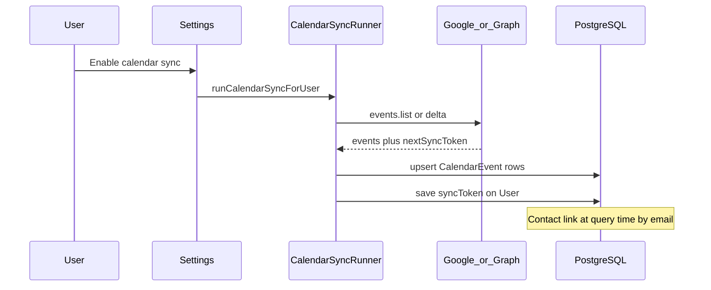

# Calendar Integration — Phase 1 (MVP)

**File:** `docs/CALENDAR_PHASE_1.md`  
**Purpose:** Read-only sync of the user's **primary** Google or Outlook calendar into FlyCRM.  
**Status:** **Phase 1 implemented** — read-only primary calendar sync (manual + daily cron). Push webhooks remain Phase 2.

**Prerequisites:**
- Mail OAuth working (Gmail or Outlook)
- Read baseline: [CALENDAR_INTEGRATION.md](./CALENDAR_INTEGRATION.md)

**Next phase:** After Phase 1 ships → [CALENDAR_PHASE_2.md](./CALENDAR_PHASE_2.md) (push notifications)

**Related docs:**
- [CALENDAR_INTEGRATION.md](./CALENDAR_INTEGRATION.md) — index, feasibility, limitations
- [GOOGLE_CLOUD_SETUP.md](./GOOGLE_CLOUD_SETUP.md) — GCP OAuth (enable Calendar API)
- [VERCEL.md](./VERCEL.md) — cron deployment

---

## Table of contents

1. [Phase 1 scope](#1-phase-1-scope)
2. [Google Calendar](#2-google-calendar)
3. [Outlook Calendar](#3-outlook-calendar)
4. [Database schema](#4-database-schema)
5. [API routes](#5-api-routes)
6. [Sync logic](#6-sync-logic)
7. [Frontend plan](#7-frontend-plan)
8. [Security and operations](#8-security-and-operations)
9. [Implementation steps](#9-implementation-steps)
10. [Manual verification](#10-manual-verification)
11. [Troubleshooting](#11-troubleshooting)
12. [Implementation checklist](#12-implementation-checklist)
13. [Build specification](#13-build-specification)

---

## 1. Phase 1 scope

| Decision | Choice |
|----------|--------|
| Sync direction | **Read-only** — import events; no create/update from CRM |
| Calendar selection | **Primary calendar only** (`primary` / default calendar) |
| Contact linking | Match attendees and organizer to `Contact.email` |
| Sync triggers | Manual sync + daily cron + session-start (24h cap) |
| Real-time push | **Not in Phase 1** — see [CALENDAR_PHASE_2.md](./CALENDAR_PHASE_2.md) |

| In scope | Out of scope (later phases) |
|----------|----------------------------|
| Read primary calendar events | Create/edit/cancel meetings from CRM → Phase 3 |
| Store title, time, location, attendees | Secondary/shared calendars → Phase 3 |
| `/calendar` page + contact upcoming meetings | Webhook push → Phase 2 |

---

## 2. Google Calendar

### 2.1 GCP and OAuth prerequisites

1. **Enable Google Calendar API** in the same GCP project as Gmail ([GOOGLE_CLOUD_SETUP.md](./GOOGLE_CLOUD_SETUP.md) — add Calendar API alongside Gmail API).
2. **Add OAuth scope** to consent screen and `GOOGLE_SCOPES`:

   ```
   https://www.googleapis.com/auth/calendar.readonly
   ```

3. **Existing users must reconnect** OAuth after scope change. Reuse `insufficient_scope` handling in `SettingsModal.tsx`.

### 2.2 Sync API

**Endpoint:** `calendar.events.list`  
**Calendar ID:** `primary`  
**Client:** `googleapis` via `getAuthorizedClient(userId)` (same as Gmail)

| Parameter | Value | Purpose |
|-----------|-------|---------|
| `calendarId` | `primary` | Phase 1 — no calendar picker |
| `singleEvents` | `true` | Expand recurring events into instances |
| `showDeleted` | `true` | Cancelled instances when using sync token |
| `timeMin` / `timeMax` | Configurable window | Limit backfill (see [Section 6](#6-sync-logic)) |
| `syncToken` | From `User.googleCalendarSyncToken` | Incremental sync |
| `maxResults` | `250` | Paginate with `pageToken` |

**Incremental sync:**
1. First sync: full list in time window → save `nextSyncToken`.
2. Later syncs: `syncToken` only (no `timeMin`/`timeMax` per Google API rules).
3. On **410 Gone**: clear token, full sync again.

**Store on User:** `googleCalendarSyncToken`, `googleCalendarLastSyncedAt`.

### 2.3 Field mapping (Google → CalendarEvent)

| Google `event` field | CalendarEvent field |
|---------------------|---------------------|
| `id` | `googleEventId` |
| `iCalUID` | `icalUid` |
| `summary` | `title` |
| `description` | `description` |
| `location` | `location` |
| `start.dateTime` / `start.date` | `startsAt`, `allDay` |
| `end.dateTime` / `end.date` | `endsAt` |
| `start.timeZone` | `timezone` |
| `status` | `status`, `isCancelled` |
| `organizer.email` | `organizerEmail` |
| `attendees[]` | `attendees` (JSON) |
| `htmlLink` | `htmlLink` |

### 2.4 Sync triggers

| Trigger | Route / job |
|---------|-------------|
| Enable in Settings | `PUT /api/settings` → `runGoogleCalendarSyncForUser('settings')` |
| Manual sync | `POST /api/gmail/calendar/sync` |
| Daily safety net | `POST /api/cron/calendar-daily-sync` |
| Session start (frontend) | `useBackgroundSync` — at most 1×/24h |

---

## 3. Outlook Calendar

### 3.1 Azure and OAuth prerequisites

1. Entra app → **API permissions** → delegated `Calendars.Read`.
2. Add to `MICROSOFT_SCOPES`: `Calendars.Read` (not `Calendars.ReadWrite` in Phase 1).
3. Admin consent may be required in org tenants.
4. **Existing users must reconnect** Microsoft OAuth after scope change.

### 3.2 Sync API

**Endpoint:** `GET https://graph.microsoft.com/v1.0/me/calendar/events/delta`

**First sync:**
```
GET /me/calendar/events/delta
  ?$select=id,iCalUId,subject,bodyPreview,start,end,location,organizer,attendees,webLink,isCancelled,showAs
  &$top=50
  &startDateTime={timeMin}
  &endDateTime={timeMax}
```

Follow `@odata.nextLink` until `@odata.deltaLink`. Store delta link as `outlookCalendarDeltaToken` (separate from mail `outlookLastDeltaToken`).

**Deleted events:** `@removed` or `isCancelled: true` → mark `isCancelled` in DB.

**Store on User:** `outlookCalendarDeltaToken`, `outlookCalendarLastSyncedAt`.

### 3.3 Field mapping (Graph → CalendarEvent)

| Graph `event` field | CalendarEvent field |
|--------------------|---------------------|
| `id` | `outlookEventId` |
| `iCalUId` | `icalUid` |
| `subject` | `title` |
| `bodyPreview` | `description` |
| `location.displayName` | `location` |
| `start` / `end` | `startsAt`, `endsAt`, `timezone`, `allDay` |
| `isCancelled` | `isCancelled` |
| `showAs` | `status` |
| `organizer.emailAddress.address` | `organizerEmail` |
| `attendees[]` | `attendees` (JSON) |
| `webLink` | `webLink` |

### 3.4 Sync triggers

| Trigger | Route / job |
|---------|-------------|
| Enable in Settings | `PUT /api/settings` → `runOutlookCalendarSyncForUser('settings')` |
| Manual sync | `POST /api/outlook/calendar/sync` |
| Daily safety net | `POST /api/cron/calendar-daily-sync` |
| Session start | Extend `useBackgroundSync` |

---

## 4. Database schema

### 4.1 `CalendarEvent` model

```prisma
enum CalendarProvider {
  gmail
  outlook
}

model CalendarEvent {
  id               String           @id @default(cuid())
  workspaceId      String
  provider         CalendarProvider
  googleEventId    String?
  outlookEventId   String?
  icalUid          String?
  title            String?
  description      String?          @db.Text
  location         String?
  startsAt         DateTime
  endsAt           DateTime
  allDay           Boolean          @default(false)
  timezone         String?
  status           String?
  isCancelled      Boolean          @default(false)
  organizerEmail   String?
  attendees        Json?
  htmlLink         String?
  webLink          String?
  lastSyncedAt     DateTime         @default(now())
  createdAt        DateTime         @default(now())
  updatedAt        DateTime         @updatedAt

  workspace Workspace @relation(fields: [workspaceId], references: [id], onDelete: Cascade)

  @@unique([workspaceId, googleEventId])
  @@unique([workspaceId, outlookEventId])
  @@index([workspaceId, startsAt])
  @@index([workspaceId, organizerEmail])
}
```

### 4.2 Contact linking

No `CalendarEventAttendee` join table in Phase 1. Filter at query time by `organizerEmail` and `attendees` JSON. Do not add `createdFrom: calendar` to `Contact` — calendar sync does not create contacts.

Optional Phase 1b: `CalendarEventContact` join table if JSON queries are too slow (see [02-database-schema.md](./calendar-phase-3/02-database-schema.md)).

### 4.3 `User` fields (Phase 1)

| Field | Type | Purpose |
|-------|------|---------|
| `calendarSyncEnabled` | `Boolean @default(false)` | User opt-in |
| `googleCalendarSyncToken` | `String? @db.Text` | Incremental sync |
| `googleCalendarLastSyncedAt` | `DateTime?` | Health / UI |
| `outlookCalendarDeltaToken` | `String? @db.Text` | Incremental sync |
| `outlookCalendarLastSyncedAt` | `DateTime?` | Health / UI |

Push-related User fields → [CALENDAR_PHASE_2.md](./CALENDAR_PHASE_2.md#3-database-additions).

### 4.4 Settings API extension

Extend `GET/PUT /api/settings` in `server/src/users/settings.ts`:

```typescript
// GET
{ calendarSyncEnabled: boolean; calendarLastSyncedAt: string | null; }

// PUT
{ calendarSyncEnabled?: boolean; }
```

When enabling: probe Calendar API; on `403` return `insufficient_scope`; on success run initial sync.

---

## 5. API routes

### 5.1 Provider sync (auth required)

| Method | Route | Purpose |
|--------|-------|---------|
| `GET` | `/api/gmail/calendar/sync-config` | `{ enabled, pushEnabled: false, syncIntervalMs, lastSyncedAt }` |
| `POST` | `/api/gmail/calendar/sync` | Manual sync → `{ imported, updated, cancelled, syncTokenSaved }` |
| `POST` | `/api/gmail/calendar/reset-sync` | Clear tokens + delete Gmail calendar events in workspace |
| `GET` | `/api/outlook/calendar/sync-config` | Same shape |
| `POST` | `/api/outlook/calendar/sync` | Manual sync |
| `POST` | `/api/outlook/calendar/reset-sync` | Clear delta + delete Outlook calendar events |

### 5.2 Workspace read API (auth required)

| Method | Route | Query params |
|--------|-------|--------------|
| `GET` | `/api/calendar/events` | `from`, `to`, `limit`, `includeCancelled` |
| `GET` | `/api/calendar/events` | `contactId` — filter by contact email |
| `GET` | `/api/calendar/events/:id` | Single event |

### 5.3 Cron

| Method | Route | Purpose |
|--------|-------|---------|
| `POST` | `/api/cron/calendar-daily-sync` | Sync all users with `calendarSyncEnabled = true` |

Document in [VERCEL.md](./VERCEL.md). Bearer `CRON_SECRET` required.

---

## 6. Sync logic

### 6.1 Sequence



### 6.2 Sync window

| Variable | Default | Purpose |
|----------|---------|---------|
| `CALENDAR_SYNC_PAST_DAYS` | `90` | Full sync — past |
| `CALENDAR_SYNC_FUTURE_DAYS` | `365` | Full sync — future |

### 6.3 Upsert rules

| Condition | Action |
|-----------|--------|
| New provider event ID | `INSERT` |
| Existing ID, not cancelled | `UPDATE` |
| Cancelled | `isCancelled = true` |
| Outside window on full sync | Skip insert |
| Disable `calendarSyncEnabled` | Stop sync; keep data unless user wipes |

### 6.4 Recurring events

| Provider | Behavior |
|----------|----------|
| Google | `singleEvents=true` — each instance has own `id` |
| Outlook | Delta returns masters/occurrences |

See [CALENDAR_INTEGRATION.md §5](./CALENDAR_INTEGRATION.md#5-limitations-and-expectations) for edge cases.

### 6.5 Sync runner

Copy `server/src/gmail/syncRunner.ts` — per-user in-flight guard. Calendar sync follows `deriveMailProvider()` / mailbox provider.

### 6.6 OAuth reconnect

1. New sign-ups get calendar scope automatically.
2. Existing users must **Reconnect** in Settings after scope env change.
3. Enable probe returns `insufficient_scope` on 403.

---

## 7. Frontend plan

### 7.1 Settings

`SettingsModal.tsx` / `EmailIntegrationSettings.tsx`:

| UI | Behavior |
|----|----------|
| Toggle **Sync primary calendar** | `PUT /api/settings` |
| Reconnect banner | On `insufficient_scope` |
| Last synced | `calendarLastSyncedAt` |
| Wipe | `POST /api/{provider}/calendar/reset-sync` |

### 7.2 `/calendar` page

- Route in `App.tsx` + `app-sidebar.tsx`
- `GET /api/calendar/events?from=&to=` (TanStack Query)
- **Sync now**, **Open in Google/Outlook**
- No create-meeting form

### 7.3 Contact upcoming meetings

`GET /api/calendar/events?contactId={id}&from=now&limit=5`

### 7.4 Background sync

Extend `useBackgroundSync.ts`: `POST .../calendar/sync` every 24h when enabled. Add `calendarSyncEnabled` to `web/src/types.ts`.

### 7.5 Types

```typescript
export interface CalendarEvent {
  id: string;
  title: string | null;
  startsAt: string;
  endsAt: string;
  allDay: boolean;
  location: string | null;
  organizerEmail: string | null;
  attendees: Array<{ email: string; name?: string; responseStatus?: string }>;
  htmlLink: string | null;
  webLink: string | null;
  isCancelled: boolean;
  provider: 'gmail' | 'outlook';
}

export interface CalendarSyncResult {
  imported: number;
  updated: number;
  cancelled: number;
}
```

---

## 8. Security and operations

### 8.1 Scopes (read-only)

| Provider | Scope |
|----------|-------|
| Google | `calendar.readonly` |
| Microsoft | `Calendars.Read` |

### 8.2 Google OAuth verification

Updating consent screen may be required. Testing mode = test users only. See [GOOGLE_CLOUD_SETUP.md](./GOOGLE_CLOUD_SETUP.md).

### 8.3 Tokens

Reuse `ENCRYPTION_KEY` and existing `getAuthorizedClient()` / `getOutlookAccessToken()`.

### 8.4 Data retention

| Action | Behavior |
|--------|----------|
| Disable sync | Stop sync; keep events |
| Reset calendar sync | Delete workspace events + clear tokens |
| Delete workspace | Cascade via Prisma |

### 8.5 Env vars

```env
CALENDAR_SYNC_PAST_DAYS=90
CALENDAR_SYNC_FUTURE_DAYS=365

GOOGLE_SCOPES=openid,email,profile,https://www.googleapis.com/auth/gmail.send,https://www.googleapis.com/auth/gmail.modify,https://www.googleapis.com/auth/calendar.readonly

MICROSOFT_SCOPES=openid profile email offline_access User.Read Mail.ReadWrite Mail.Send Calendars.Read
```

---

## 9. Implementation steps

| Step | Work |
|------|------|
| 1 | Prisma migration: `CalendarEvent` + Phase 1 User fields |
| 2 | OAuth scopes in `server/src/env.ts` and `.env.example` |
| 3 | `server/src/gmail/calendar/` — sync, syncRunner, routes |
| 4 | `server/src/outlook/calendar/` — sync, syncRunner, routes |
| 5 | `server/src/calendar/routes.ts` |
| 6 | Extend `server/src/users/settings.ts` |
| 7 | `server/src/cron/calendarDailySync.ts` + cron route |
| 8 | Frontend: Settings, `/calendar`, contact meetings, `useBackgroundSync` |
| 9 | Tests: upsert, cancel, 410, insufficient_scope, contact filter |

---

## 10. Manual verification

### Google

- [ ] Calendar API enabled; `calendar.readonly` in `GOOGLE_SCOPES`
- [ ] Reconnect OAuth; enable sync → initial sync completes
- [ ] Test event with contact attendee → `/calendar` + contact panel
- [ ] Cancel in Google → `isCancelled` in CRM
- [ ] Daily cron returns 200

### Outlook

- [ ] `Calendars.Read` in Entra + `MICROSOFT_SCOPES`
- [ ] Reconnect; enable sync → events import
- [ ] Delta token persists across syncs

### Negative

- [ ] Enable without reconnect → `insufficient_scope`
- [ ] No mail provider → clear error
- [ ] Reset sync → events removed, tokens cleared

---

## 11. Troubleshooting

| Symptom | Fix |
|---------|-----|
| `403` on Calendar API | Reconnect OAuth after scope update |
| `insufficient_scope` | Settings → Reconnect |
| No events | Widen sync window; manual sync |
| Google sync token 410 | Auto full re-sync |
| Outlook delta loop | Clear `outlookCalendarDeltaToken` |
| Cron 401 | Match `CRON_SECRET` |
| Events not on contact | Normalize email match on attendee |

---

## 12. Implementation checklist

### Backend

- [ ] Prisma migration on Supabase
- [ ] `server/src/gmail/calendar/` module
- [ ] `server/src/outlook/calendar/` module
- [ ] `server/src/calendar/routes.ts`
- [ ] Settings GET/PUT extended
- [ ] Cron daily sync; mount in `app.ts`
- [ ] Unit tests

### Frontend

- [ ] Settings toggle + reconnect
- [ ] `/calendar` page + sidebar
- [ ] Contact upcoming meetings
- [ ] `useBackgroundSync` branch

### Ops

- [ ] `.env.example` updated
- [ ] [VERCEL.md](./VERCEL.md) — `calendar-daily-sync` cron
- [ ] Postman: `node postman/generate.mjs`

---

## 13. Build specification

### 13.1 File structure

```
server/src/
  gmail/calendar/     sync.ts, syncRunner.ts, routes.ts
  outlook/calendar/   sync.ts, syncRunner.ts, routes.ts
  calendar/           routes.ts, contactFilter.ts
  cron/               calendarDailySync.ts
```

### 13.2 Google sync pseudocode

```typescript
export async function syncGoogleCalendar(userId: string): Promise<CalendarSyncResult> {
  const user = await prisma.user.findUniqueOrThrow({ where: { id: userId } });
  const workspace = await ensurePersonalWorkspace(userId);
  const calendar = google.calendar({ version: 'v3', auth: await getAuthorizedClient(userId) });

  const params: calendar_v3.Params$Resource$Events$List = {
    calendarId: 'primary',
    singleEvents: true,
    showDeleted: true,
    maxResults: 250,
  };

  if (user.googleCalendarSyncToken) {
    params.syncToken = user.googleCalendarSyncToken;
  } else {
    params.timeMin = daysAgo(env.calendarSyncPastDays).toISOString();
    params.timeMax = daysAhead(env.calendarSyncFutureDays).toISOString();
  }

  let imported = 0, updated = 0, cancelled = 0;
  let pageToken: string | undefined;
  let nextSyncToken: string | undefined;

  do {
    const res = await calendar.events.list({ ...params, pageToken });
    for (const event of res.data.items ?? []) {
      const result = await upsertGoogleEvent(workspace.id, event);
      if (result === 'imported') imported++;
      else if (result === 'updated') updated++;
      else if (result === 'cancelled') cancelled++;
    }
    pageToken = res.data.nextPageToken ?? undefined;
    nextSyncToken = res.data.nextSyncToken ?? nextSyncToken;
  } while (pageToken);

  if (nextSyncToken) {
    await prisma.user.update({
      where: { id: userId },
      data: {
        googleCalendarSyncToken: nextSyncToken,
        googleCalendarLastSyncedAt: new Date(),
      },
    });
  }

  return { imported, updated, cancelled, syncTokenSaved: Boolean(nextSyncToken) };
}
```

On HTTP 410: clear `googleCalendarSyncToken`, retry without token.

### 13.3 Outlook sync pseudocode

```typescript
export async function syncOutlookCalendar(userId: string): Promise<CalendarSyncResult> {
  const token = await getOutlookAccessToken(userId);
  const workspace = await ensurePersonalWorkspace(userId);
  const user = await prisma.user.findUniqueOrThrow({ where: { id: userId } });

  let url = user.outlookCalendarDeltaToken
    ?? buildInitialDeltaUrl(env.calendarSyncPastDays, env.calendarSyncFutureDays);

  let imported = 0, updated = 0, cancelled = 0;
  let deltaLink: string | undefined;

  while (url) {
    const res = await fetch(url, { headers: { Authorization: `Bearer ${token}` } });
    const body = await res.json();
    for (const event of body.value ?? []) {
      if (event['@removed']) {
        await markOutlookEventCancelled(workspace.id, event.id);
        cancelled++;
      } else {
        const r = await upsertOutlookEvent(workspace.id, event);
        if (r === 'imported') imported++;
        else if (r === 'updated') updated++;
        if (event.isCancelled) cancelled++;
      }
    }
    url = body['@odata.nextLink'];
    deltaLink = body['@odata.deltaLink'] ?? deltaLink;
  }

  if (deltaLink) {
    await prisma.user.update({
      where: { id: userId },
      data: {
        outlookCalendarDeltaToken: deltaLink,
        outlookCalendarLastSyncedAt: new Date(),
      },
    });
  }

  return { imported, updated, cancelled, syncTokenSaved: Boolean(deltaLink) };
}
```

### 13.4 Settings save hook

```typescript
if (calendarSyncEnabled === true && !wasEnabled) {
  const provider = deriveMailProvider(user);
  if (provider === 'gmail') await runGoogleCalendarSyncForUser(userId, 'settings');
  else if (provider === 'outlook') await runOutlookCalendarSyncForUser(userId, 'settings');
}
```

### 13.5 Cron job

```typescript
export async function runDailyCalendarSync(): Promise<void> {
  const users = await prisma.user.findMany({
    where: { calendarSyncEnabled: true },
    select: { id: true, googleAccessToken: true, outlookAccessToken: true },
  });
  for (const user of users) {
    try {
      if (user.googleAccessToken) await runGoogleCalendarSyncForUser(user.id, 'daily');
      else if (user.outlookAccessToken) await runOutlookCalendarSyncForUser(user.id, 'daily');
    } catch (e) {
      console.error('[calendar-daily]', user.id, e);
    }
  }
}
```

### 13.6 Test cases

| Test | Assert |
|------|--------|
| Google upsert new | Row with `googleEventId` |
| Google update | `title` / `startsAt` updated |
| Google cancelled | `isCancelled = true` |
| Google 410 | Token cleared, full retry |
| Outlook delta first run | `outlookCalendarDeltaToken` saved |
| Outlook `@removed` | Cancelled |
| `GET /api/calendar/events?contactId=` | Matching attendee only |
| Enable without scope | `insufficient_scope` |

---

**Last updated:** Phase 1 planning — not implemented.
