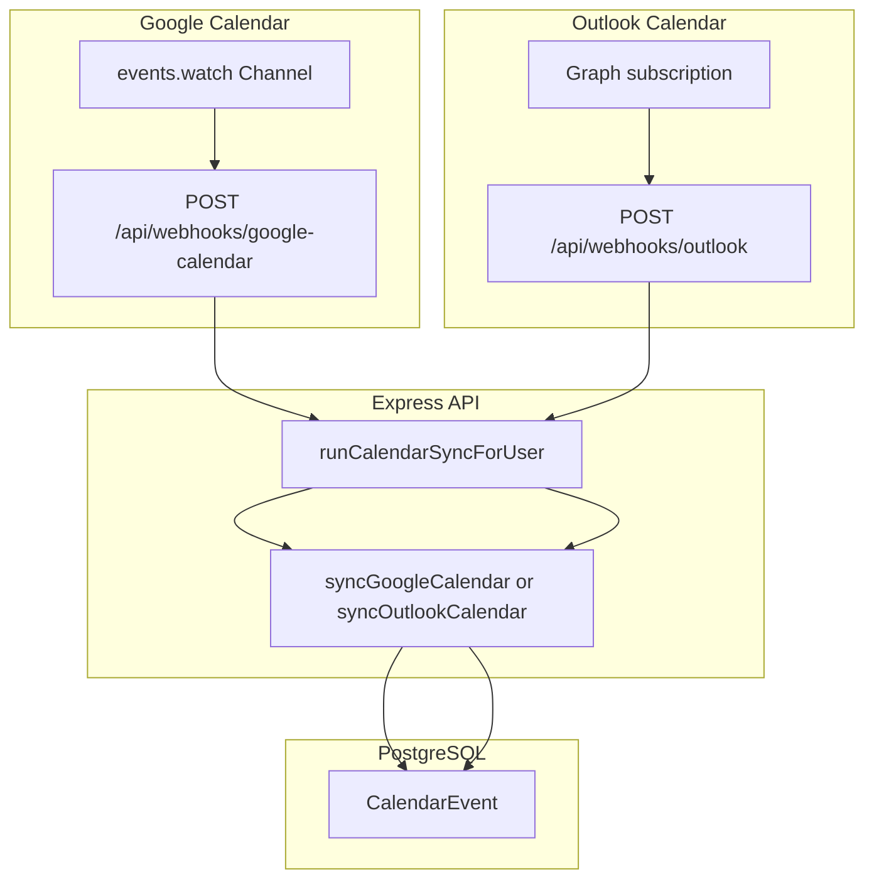

# Calendar Integration — Phase 2 (Push Notifications)

**File:** `docs/CALENDAR_PHASE_2.md`  
**Purpose:** Near-real-time calendar sync via webhooks — Google Channels API and Microsoft Graph subscriptions.  
**Status:** **Not implemented** — requires [CALENDAR_PHASE_1.md](./CALENDAR_PHASE_1.md) complete.

**Prerequisites:**
- Phase 1 shipped: read-only primary calendar sync, `CalendarEvent` model, manual + daily cron sync
- Public HTTPS API URL (production or ngrok for dev)

**Next phase:** [calendar-phase-3/README.md](./calendar-phase-3/README.md) (multi-calendar + write)

**Related docs:**
- [CALENDAR_INTEGRATION.md](./CALENDAR_INTEGRATION.md) — index and limitations
- [gmail-webhook-integration-spec.md](./gmail-webhook-integration-spec.md) — mail push pattern (Gmail uses Pub/Sub; calendar uses Channels)
- [outlook-webhook-integration-spec.md](./outlook-webhook-integration-spec.md) — Graph subscription pattern
- [VERCEL.md](./VERCEL.md) — cron and webhook URLs

---

## Table of contents

1. [Phase 2 scope](#1-phase-2-scope)
2. [Architecture](#2-architecture)
3. [Google Calendar push](#3-google-calendar-push)
4. [Outlook Calendar push](#4-outlook-calendar-push)
5. [Database additions](#5-database-additions)
6. [API routes and cron](#6-api-routes-and-cron)
7. [Security](#7-security)
8. [Frontend changes](#8-frontend-changes)
9. [Implementation steps](#9-implementation-steps)
10. [Manual verification](#10-manual-verification)

---

## 1. Phase 2 scope

| Goal | Detail |
|------|--------|
| Real-time updates | Calendar changes propagate to CRM within seconds (not only daily cron) |
| Google | `events.watch` Channels API → HTTPS webhook |
| Outlook | Graph subscription on `/me/events` or `/me/calendar/events` |
| UI | `pushEnabled: true` in sync-config; poll DB every ~60s |
| Renewal | Channels/subscriptions expire ~7 days / ~4200 min — renewal cron every 6h |

Phase 2 does **not** add write access or multi-calendar selection — see Phase 3.

---

## 2. Architecture



**Pattern:** Mirror mail webhooks — webhook returns 200 quickly; sync runs in runner (same as `server/src/gmail/syncRunner.ts` and `server/src/outlook/syncRunner.ts`).

**Reference files:**
- Google mail watch: `server/src/gmail/watchManager.ts`
- Outlook mail subscriptions: `server/src/outlook/subscriptionManager.ts`
- Outlook webhook: `server/src/outlook/outlookWebhook/index.ts`

---

## 3. Google Calendar push

Gmail uses **Pub/Sub** (`users.watch`). Google Calendar uses **Channels API** (`events.watch`) — direct HTTPS POST, not Pub/Sub.

| Aspect | Gmail (mail) | Google Calendar (Phase 2) |
|--------|--------------|----------------------------|
| Registration | `gmail.users.watch` | `calendar.events.watch` |
| Delivery | Pub/Sub → push subscription | HTTPS POST to webhook |
| Expiry | ~7 days | ~7 days |
| Env var | `GMAIL_PUBSUB_TOPIC` | `GOOGLE_CALENDAR_WEBHOOK_URL` |
| Webhook | `POST /api/webhooks/gmail` | `POST /api/webhooks/google-calendar` |
| Renewal cron | `renewExpiredWatches()` | `renewGoogleCalendarChannels()` |

### 3.1 Channel registration

```typescript
// Pseudocode — server/src/gmail/calendar/watchManager.ts
await calendar.events.watch({
  calendarId: 'primary',
  requestBody: {
    id: channelId,
    type: 'web_hook',
    address: env.googleCalendarWebhookUrl,
    token: env.googleCalendarWebhookToken,
    expiration: String(Date.now() + 7 * 24 * 60 * 60 * 1000),
  },
});
```

**When to register:**
- User enables `calendarSyncEnabled` (after Phase 1 initial sync)
- Settings save if channel expired or missing
- Renewal cron every 6h (mirror Gmail watch renew)

**Store on User:** `googleCalendarChannelId`, `googleCalendarResourceId`, `googleCalendarWatchExpiry`.

### 3.2 Webhook handler

`POST /api/webhooks/google-calendar` — **no session auth**.

1. Verify `X-Goog-Channel-Token` === `GOOGLE_CALENDAR_WEBHOOK_TOKEN`
2. Read `X-Goog-Resource-State` (`sync` | `exists` | `not_exists`)
3. Map channel ID → User
4. `runGoogleCalendarSyncForUser(userId, 'webhook')`
5. Return 200 immediately

---

## 4. Outlook Calendar push

Mirror `server/src/outlook/subscriptionManager.ts`:

| Aspect | Outlook mail | Outlook calendar |
|--------|--------------|------------------|
| Resource | `/me/mailFolders/{id}/messages` | `/me/events` or `/me/calendar/events` |
| Change types | `created,updated,deleted` | `created,updated,deleted` |
| Webhook | `POST /api/webhooks/outlook` | Same URL (extend handler) |
| Client state | `OUTLOOK_WEBHOOK_CLIENT_STATE` | Same |
| Max lifetime | ~4200 minutes | Same |

**Store on User:** `outlookCalendarSubscriptionId`, `outlookCalendarSubscriptionExpiry` (separate from mail subscription IDs).

### 4.1 Subscription creation

```typescript
// Pseudocode
await fetch('https://graph.microsoft.com/v1.0/subscriptions', {
  method: 'POST',
  headers: { Authorization: `Bearer ${token}`, 'Content-Type': 'application/json' },
  body: JSON.stringify({
    changeType: 'created,updated,deleted',
    notificationUrl: outlookWebhookNotificationUrl(),
    resource: '/me/events',
    expirationDateTime: subscriptionExpiration(),
    clientState: env.outlookWebhookClientState,
  }),
});
```

### 4.2 Webhook routing

Extend `server/src/outlook/outlookWebhook/index.ts`:

- Lookup user by `subscriptionId` — mail CRM folder, mail Inbox, **or** calendar subscription
- Same `clientState` validation as mail
- Lifecycle events (`reauthorizationRequired`, etc.) — mirror mail handling
- `runOutlookCalendarSyncForUser(userId, 'webhook')`

---

## 5. Database additions

Add to `User` (Phase 2 migration):

| Field | Type | Purpose |
|-------|------|---------|
| `googleCalendarChannelId` | `String?` | Channel API id |
| `googleCalendarResourceId` | `String?` | Watch resource id |
| `googleCalendarWatchExpiry` | `DateTime?` | Renewal cron |
| `outlookCalendarSubscriptionId` | `String?` | Graph subscription |
| `outlookCalendarSubscriptionExpiry` | `DateTime?` | Renewal cron |

No changes to `CalendarEvent` model in Phase 2.

---

## 6. API routes and cron

### 6.1 Webhooks

| Method | Route | Purpose |
|--------|-------|---------|
| `POST` | `/api/webhooks/google-calendar` | Google Channels notifications |
| `POST` | `/api/webhooks/outlook` | Extend handler for calendar subscription IDs |

### 6.2 Cron (Bearer `CRON_SECRET`)

| Method | Route | Purpose |
|--------|-------|---------|
| `POST` | `/api/cron/google-calendar-watch-renew` | Renew expired Google Channels |
| `POST` | `/api/cron/outlook-calendar-renew` | Renew expired Graph calendar subscriptions |

Add to GitHub Actions watch-renew workflow alongside Gmail/Outlook mail renew (every 6h). See [VERCEL.md](./VERCEL.md).

### 6.3 Health endpoint

| Method | Route | Purpose |
|--------|-------|---------|
| `GET` | `/api/health/calendar-sync` | Stale sync, missing scopes, expired watches/subscriptions |

### 6.4 Sync-config update

`GET /api/gmail/calendar/sync-config` and `/api/outlook/calendar/sync-config`:

```json
{
  "enabled": true,
  "pushEnabled": true,
  "syncIntervalMs": 86400000,
  "uiRefreshIntervalMs": 60000,
  "lastSyncedAt": "2026-06-22T10:00:00.000Z"
}
```

`pushEnabled` is `true` when webhook URL + token (Google) or Outlook webhook env is configured and user has active watch/subscription.

### 6.5 Env vars

| Variable | Purpose |
|----------|---------|
| `GOOGLE_CALENDAR_WEBHOOK_URL` | Public HTTPS base for Channels (e.g. `https://crm-fly1.vercel.app/api/webhooks/google-calendar`) |
| `GOOGLE_CALENDAR_WEBHOOK_TOKEN` | Verify `X-Goog-Channel-Token` |
| `OUTLOOK_WEBHOOK_URL` | Existing — same for calendar subscriptions |
| `OUTLOOK_WEBHOOK_CLIENT_STATE` | Existing |

---

## 7. Security

| Provider | Validation |
|----------|------------|
| Google Channels | `X-Goog-Channel-Token` === `GOOGLE_CALENDAR_WEBHOOK_TOKEN` |
| Outlook Graph | `clientState` === `OUTLOOK_WEBHOOK_CLIENT_STATE` |

Webhooks have **no session auth**. Reject invalid tokens before scheduling sync.

---

## 8. Frontend changes

Extend `web/src/hooks/useBackgroundSync.ts`:

| Mode | Calendar behavior |
|------|-------------------|
| `pushEnabled: false` | Phase 1: sync every 24h |
| `pushEnabled: true` | Poll `GET /api/calendar/events` every `uiRefreshIntervalMs` (~60s); background sync at most 1×/24h |

No new pages in Phase 2 — existing `/calendar` benefits from faster DB refresh.

---

## 9. Implementation steps

| Step | Work |
|------|------|
| 1 | Prisma migration: Phase 2 User watch/subscription fields |
| 2 | `server/src/gmail/calendar/watchManager.ts` + renew cron |
| 3 | `server/src/gmail/calendar/webhook/` — `POST /api/webhooks/google-calendar` |
| 4 | Extend `subscriptionManager.ts` — calendar Graph subscription |
| 5 | Extend `outlookWebhook/index.ts` — route calendar subscription IDs |
| 6 | Cron routes: `google-calendar-watch-renew`, `outlook-calendar-renew` |
| 7 | `GET /api/health/calendar-sync` |
| 8 | Update sync-config `pushEnabled`; wire watch on Settings enable |
| 9 | Frontend: push mode in `useBackgroundSync` |
| 10 | Tests: channel token mismatch, subscription lookup, debounced sync |

---

## 10. Manual verification

### Google

- [ ] `GOOGLE_CALENDAR_WEBHOOK_URL` + `GOOGLE_CALENDAR_WEBHOOK_TOKEN` set on API
- [ ] Enable calendar sync → channel registered; `googleCalendarWatchExpiry` in DB
- [ ] Create event in Google Calendar → webhook fires → event in CRM within ~1 min
- [ ] Renewal cron renews channel before expiry
- [ ] Invalid `X-Goog-Channel-Token` → 401, no sync

### Outlook

- [ ] Calendar subscription created alongside mail subs
- [ ] Create/update/delete event in Outlook → webhook → CRM updated
- [ ] Orphan subscription ID with valid `clientState` → re-register (mirror mail)
- [ ] Renewal cron extends subscription

### UI

- [ ] `sync-config.pushEnabled === true` → UI polls events every ~60s without manual sync
- [ ] `GET /api/health/calendar-sync` reports healthy state

---

**Last updated:** Phase 2 planning — not implemented. Requires Phase 1.
