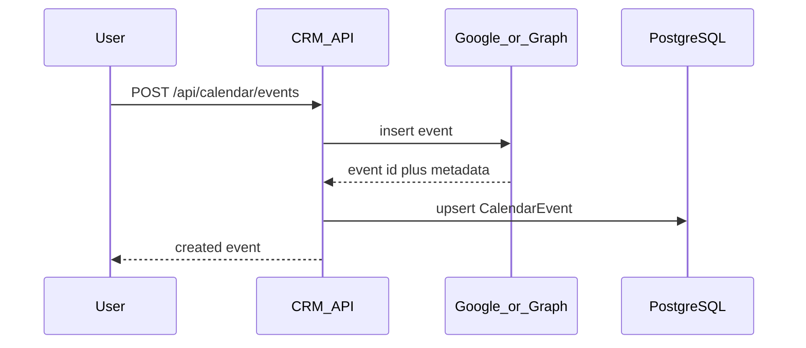

# Calendar Integration — Phase 3 (Multi-Calendar and Read/Write)

**File:** `docs/CALENDAR_PHASE_3.md`  
**Purpose:** Let users pick which calendars to sync and create/update meetings from the CRM.  
**Status:** **Implemented** — tasks 01–08 complete per [calendar-phase-3/README.md](./calendar-phase-3/README.md). Requires [CALENDAR_PHASE_1.md](./CALENDAR_PHASE_1.md) complete. [CALENDAR_PHASE_2.md](./CALENDAR_PHASE_2.md) recommended but not strictly required.

**Task breakdown:** Implement via ordered tasks in [calendar-phase-3/README.md](./calendar-phase-3/README.md).

**Prerequisites:**
- Phase 1: `CalendarEvent` model, read sync, `/calendar` UI
- Phase 2 (recommended): push webhooks for timely write confirmation

**Related docs:**
- [CALENDAR_INTEGRATION.md](./CALENDAR_INTEGRATION.md) — index and cross-phase limitations
- [CALENDAR_PHASE_1.md](./CALENDAR_PHASE_1.md) — read sync foundation

---

## Table of contents

1. [Phase 3 scope](#1-phase-3-scope)
2. [Task index](#2-task-index)
3. [Create flow](#3-create-flow)
4. [Limitations](#4-limitations)

---

## 1. Phase 3 scope

| Goal | Detail |
|------|--------|
| Calendar picker | User selects one or more calendars in Settings (not only `primary`) |
| Write access | Create and update meetings from CRM (e.g. on contact record) |
| Scopes | Upgrade to `calendar.events` (Google) / `Calendars.ReadWrite` (Microsoft) |
| Reconnect | All users must reconnect OAuth after scope upgrade |

**Deferred from Phase 1 (now in scope):**

| Feature | Phase 1 | Phase 3 |
|---------|---------|---------|
| Create meeting from CRM | No | Yes |
| Edit/cancel from CRM | No | Yes |
| Secondary/shared calendars | No | Yes (user-selected) |
| Team workspace calendar | No | Still no — per-user model remains |

---

## 2. Task index

Implement tasks in order. See [calendar-phase-3/README.md](./calendar-phase-3/README.md) for dependencies and progress tracking.

| # | Task | Doc | Covers (former sections) |
|---|------|-----|--------------------------|
| 01 | OAuth write scopes | [01-oauth-write-scopes.md](./calendar-phase-3/01-oauth-write-scopes.md) | §2 OAuth scope upgrade |
| 02 | Database schema | [02-database-schema.md](./calendar-phase-3/02-database-schema.md) | §5 Database changes |
| 03 | Calendar list API | [03-calendar-list-api.md](./calendar-phase-3/03-calendar-list-api.md) | §3.1, §6.1 |
| 04 | Multi-calendar sync | [04-multi-calendar-sync.md](./calendar-phase-3/04-multi-calendar-sync.md) | §3.2 Sync changes |
| 05 | Write API routes | [05-write-api-routes.md](./calendar-phase-3/05-write-api-routes.md) | §4, §6.2 |
| 06 | Settings calendar picker | [06-settings-calendar-picker.md](./calendar-phase-3/06-settings-calendar-picker.md) | §7 Settings |
| 07 | Meeting scheduler UI | [07-meeting-scheduler-ui.md](./calendar-phase-3/07-meeting-scheduler-ui.md) | §4.3, §7 Contacts/Calendar |
| 08 | Tests and verification | [08-tests-and-verification.md](./calendar-phase-3/08-tests-and-verification.md) | §8–9 Implementation + manual QA |

**Suggested path:** 01 → 02 → 03 → 04 (read path), then 05 → 06 → 07 (write path), finish with 08.

---

## 3. Create flow

When a user schedules a meeting from the CRM:

Full API, schema, and UI detail live in the individual task files above.

---

## 4. Limitations

| Topic | Note |
|-------|------|
| Team calendar | Still per-user; no shared workspace calendar view |
| Recurring CRM creates | Start with single events; RRULE builder is future work |
| Video links | Store `hangoutLink` / `onlineMeetingUrl` if provider returns them |
| Permission errors | Shared calendar write may fail if user lacks edit access — surface clear error |
| Google verification | Write scopes may trigger stricter OAuth verification |
| Provider switch | No migration when switching Gmail ↔ Outlook; optional future dedup by `icalUid` |

See also [CALENDAR_INTEGRATION.md §6](./CALENDAR_INTEGRATION.md#6-limitations-and-expectations).

---

**Last updated:** Phase 3 tasks 01–08 implemented (OAuth write scopes through tests and verification).
