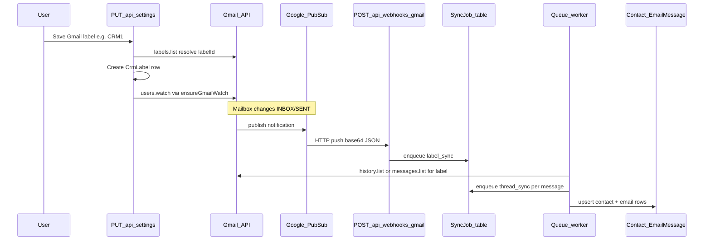

# Google Gmail Webhook Guide

This guide explains how real-time Gmail sync works in this project: what happens when you label mail, what you must configure, how to test it, and how to fix common problems.

**Audience:** developers and operators setting up or debugging webhook sync.

**Related docs:**
- [gmail-webhook-integration-spec.md](./gmail-webhook-integration-spec.md) — integration spec (debounced direct sync, push-mode UI)
- [google-webhook-tasks/README.md](./google-webhook-tasks/README.md) — week-by-week implementation tasks
- [google-webhook-tasks/pubsub-ngrok-setup.md](./google-webhook-tasks/pubsub-ngrok-setup.md) — short Pub/Sub + ngrok checklist
- [GOOGLE_WEBHOOK_TASKS.md](./GOOGLE_WEBHOOK_TASKS.md) — detailed technical specification

---

## Table of contents

1. [What this feature does](#1-what-this-feature-does)
2. [What it is not (manual sync vs webhook)](#2-what-it-is-not-manual-sync-vs-webhook)
3. [Big-picture flow](#3-big-picture-flow)
4. [Key concepts (simple glossary)](#4-key-concepts-simple-glossary)
5. [One-time setup (Google Cloud + environment)](#5-one-time-setup-google-cloud--environment)
6. [What runs when (triggers)](#6-what-runs-when-triggers)
7. [How to test (three levels)](#7-how-to-test-three-levels)
8. [Health checks and server logs](#8-health-checks-and-server-logs)
9. [Troubleshooting](#9-troubleshooting)
10. [Code file map](#10-code-file-map)

---

## 1. What this feature does

When a user connects Gmail and picks a **sync label** in Settings (for example `CRM1`), the CRM can update **automatically** when mail in that label changes.

You do **not** need to click “Sync” every few minutes. Gmail tells Google Cloud that something changed; Google pushes a notification to our server; the server **debounces (2s)** and runs **`syncUserGmail`** to write contacts and emails into the database. The Message Center UI polls the database every ~15s when push is enabled.

Typical delay under normal conditions: **about 5–15 seconds** after a labeled message appears in Gmail.

---

## 2. What it is not (manual sync vs webhook)

This project has **two** ways to pull Gmail into the CRM. They look similar but use different code paths.

| | **Webhook sync (this guide)** | **Manual / safety sync** |
|--|-------------------------------|------------------------------|
| **Trigger** | Gmail change → Pub/Sub → webhook → 2s debounce → `syncUserGmail` | User clicks Sync, daily client sync, or `POST /api/gmail/sync` |
| **Uses `SyncJob` table?** | No (direct sync); queue kept for `thread_sync` / dev simulate | No |
| **Needs public URL / ngrok?** | Yes (for real Gmail events) | No |
| **Code** | `gmail/gmailWebhook/`, `syncRunner.ts`, `syncUserGmail.ts`, `watchManager.ts` | `server/src/gmail/sync.ts` → `syncUserGmail` |

If manual sync works but `SyncJob` stays empty, the webhook pipeline is not receiving events—not that the CRM or Gmail OAuth is broken.

---

## 3. Big-picture flow

### Diagram



### Step-by-step 

| Step | What happens | Where in code |
|------|----------------|---------------|
| 1 | User picks a Gmail label in Settings | `server/src/users/settings.ts` |
| 2 | App checks the label exists in Gmail, saves `User.gmailSyncLabel`, and creates a **`CrmLabel`** row (name + Gmail `labelId`) | same file |
| 3 | App registers a Gmail **watch** (expires in about 7 days) | `server/src/gmail/watchManager.ts` |
| 4 | When INBOX or SENT changes, Gmail publishes to your **Pub/Sub topic** | Google Cloud + `GMAIL_PUBSUB_TOPIC` |
| 5 | Pub/Sub **POSTs** to your public URL `/api/webhooks/gmail` | `server/src/webhooks/gmailReceiver.ts` |
| 6 | Webhook responds **204 immediately**, then creates **`label_sync`** jobs in `SyncJob` | webhook + `server/src/queue/worker.ts` |
| 7 | Background worker runs **`label_sync`**: finds message IDs for your tracked label | `server/src/queue/handlers/labelSync.ts` |
| 8 | Worker creates **`thread_sync`** jobs per message and writes **Contact** / **EmailMessage** rows | `server/src/queue/handlers/threadSync.ts` |

### How step 4 works — who publishes to Pub/Sub?

**You do not publish anything manually.** Google does it for you after step 3 succeeds.

1. **Your app registers a watch** by calling Gmail API `users.watch` with:
   - `topicName` = your `GMAIL_PUBSUB_TOPIC` (e.g. `projects/my-project/topics/gmail-notifications`)
   - `labelIds` = `INBOX` and `SENT` (watch mailbox changes in those areas)

   Code: `server/src/gmail/watchManager.ts` → `gmail.users.watch(...)`.

2. **Gmail stores that subscription** for the user’s mailbox. It lasts about 7 days (`User.gmailWatchExpiry`), then your app renews it.

3. **When mail changes** (new message, label applied, sent mail, etc. in INBOX or SENT), **Google’s Gmail servers** send a small notification to your Pub/Sub topic. The publisher is Google’s system account:
   ```
   gmail-api-push@system.gserviceaccount.com
   ```
   That is why you must grant that account **Pub/Sub Publisher** on your topic in GCP.

4. **What gets published** is not the full email. It is a tiny JSON payload (base64-wrapped by Pub/Sub) with roughly:
   - `emailAddress` — which Gmail account changed
   - `historyId` — a pointer Gmail uses for incremental sync

5. **Your Pub/Sub push subscription** then forwards that message to your server as an HTTP POST to `/api/webhooks/gmail`.

So the chain is:

```
Gmail mailbox change
  → Google publishes to YOUR topic (automatic)
  → Pub/Sub push subscription calls YOUR webhook URL
  → Your server enqueues SyncJob
```

If step 3 never ran (no watch, expired watch, or missing `GMAIL_PUBSUB_TOPIC`), Gmail never publishes and step 4 never happens.

### Job types

1. **`label_sync`** — “Something changed in this mailbox; which messages have our CRM label?”
2. **`thread_sync`** — “Fetch this one message and save it to the CRM.”

The worker polls the `SyncJob` table every few seconds (configurable), claims jobs safely, retries on failure, and marks jobs `done` or `failed`.

---

## 4. Key concepts (simple glossary)

### `CrmLabel` (database table)

Stores which Gmail label each user tracks for webhook sync.

- **`labelName`** — what you type in Settings (e.g. `CRM1`)
- **`labelId`** — Gmail’s internal id (e.g. `Label_3414070727078591007`)

The webhook **does not** read `User.gmailSyncLabel` alone. It looks up **`CrmLabel`**. If that table is empty, the webhook logs `no_crm_labels` and creates no jobs.

**Important:** Applying a label to mail inside Gmail does **not** create `CrmLabel`. Only **saving the label in Settings** does.

### `SyncJob` (database table)

A Postgres-backed queue. Each row is one unit of work (`label_sync` or `thread_sync`) with status `pending`, `processing`, `done`, or `failed`.

- **Empty table** → webhook never ran successfully, or every job was skipped before enqueue.
- **Rows with `done`** → pipeline ran; check `Contact` / `EmailMessage` for results.
- **Rows with `failed`** → read `lastError` on the job row.

### `User.gmailWatchExpiry`

Timestamp when the current Gmail watch stops working. Gmail watches last about **7 days**. The app renews watches:

- when you save or change your sync label
- when the server starts
- every **6 hours** for users who have `CrmLabel` rows

If this field is **null** while you have a sync label, real-time sync is not active.

### `User.gmailLastHistoryId`

A bookmark Gmail gives us so the next sync only fetches **new** changes instead of scanning the whole mailbox again. Updated after successful `label_sync` runs.

### Pub/Sub push

Google Cloud Pub/Sub delivers mailbox notifications by calling **your HTTPS URL**. Your dev machine at `localhost:3000` is not reachable from Google unless you expose it (for example with **ngrok**).

---

## 5. One-time setup (Google Cloud + environment)

### Google Cloud Console

Do this once per environment (dev/staging/prod).

1. **Create a Pub/Sub topic**  
   Example full name: `projects/my-project/topics/gmail-notifications`  
   This must match `GMAIL_PUBSUB_TOPIC` in your `.env`.

2. **Grant Gmail permission to publish**  
   On that topic, add principal:
   ```
   gmail-api-push@system.gserviceaccount.com
   ```
   Role: **Pub/Sub Publisher**  
   Without this, `users.watch` can succeed but **no events** reach Pub/Sub.

3. **Create a push subscription** on the same topic  
   Push endpoint URL must be exactly:
   ```
   https://YOUR_PUBLIC_HOST/api/webhooks/gmail
   ```
   Examples:
   - Local dev with ngrok: `https://abc123.ngrok-free.dev/api/webhooks/gmail`
   - Production: `https://your-domain.com/api/webhooks/gmail`

4. **Update the subscription URL** whenever your public hostname changes (free ngrok URLs rotate).

5. **OAuth / Gmail API** (same as rest of app)  
   - Gmail API enabled in Google Cloud  
   - OAuth client with correct redirect URI  
   - Scopes must include **`gmail.modify`** (read mail + labels)

See also: [GOOGLE_CLOUD_SETUP.md](./GOOGLE_CLOUD_SETUP.md) (new project + OAuth from scratch), [pubsub-ngrok-setup.md](./google-webhook-tasks/pubsub-ngrok-setup.md)

### Environment variables

Set these in the project root `.env` (loaded by `server/src/env.ts`):

| Variable | Required | Purpose |
|----------|----------|---------|
| `GMAIL_PUBSUB_TOPIC` | Yes (for webhook) | Full topic resource name Gmail watch publishes to |
| `GOOGLE_WEBHOOK_AUDIENCE` | Production | Full webhook URL; used to verify Pub/Sub JWT in prod |
| `SYNC_WORKER_POLL_MS` | No (default `2000`) | Milliseconds between worker queue polls |
| `SYNC_WORKER_BATCH_SIZE` | No (default `5`) | Max jobs claimed per poll |
| `GOOGLE_SCOPES` | Yes | Must include `gmail.modify` for sync |
| `DATABASE_URL` | Yes | Postgres connection |
| `GOOGLE_CLIENT_ID` / `GOOGLE_CLIENT_SECRET` | Yes | OAuth |

**Production vs development**

- **Development** (`NODE_ENV` not set to `production`): webhook accepts POST without Google OIDC token check.
- **Production**: webhook requires valid `Authorization: Bearer` JWT; audience must match `GOOGLE_WEBHOOK_AUDIENCE` (usually your full webhook URL).

After changing `.env`, **restart** the server so `GMAIL_PUBSUB_TOPIC` and worker settings load.

---

## 6. What runs when (triggers)

| Event | What the server does |
|-------|----------------------|
| **Save Gmail label in Settings** | Validates label via Gmail API → upserts `CrmLabel` → updates `User.gmailSyncLabel` → calls `ensureGmailWatch` when label changed or `CrmLabel` was missing |
| **Google OAuth login** | Attempts `ensureGmailWatch` (usually skipped until `CrmLabel` exists) |
| **Server startup** | Starts queue worker; runs `renewExpiredWatches()` once |
| **Every 6 hours** | Renews watches for users with `CrmLabel` and missing/expiring watch |
| **Pub/Sub POST to webhook** | Decodes payload → enqueues one `label_sync` job per registered label |
| **Worker poll** | Claims pending jobs → runs handlers → retries with backoff on failure |

---

## 7. How to test (three levels)

Test from simplest (no Google infrastructure) to full end-to-end.

### Level A — Is the app queue working? (no ngrok, no real Gmail)

This proves webhook → `SyncJob` → worker works on your machine.

**Prerequisites**

- Server running: `cd server && npm run dev`
- User exists in DB with `authProvider = gmail`
- At least one `CrmLabel` row for that user (save label in Settings first)
- Use the exact email from the `User` table

**PowerShell**

Replace `YOUR_GMAIL_EMAIL` with your user’s email (e.g. `you@gmail.com`):

```powershell
$payload = '{"emailAddress":"YOUR_GMAIL_EMAIL","historyId":"999999"}'
$b64 = [Convert]::ToBase64String([Text.Encoding]::UTF8.GetBytes($payload))
Invoke-RestMethod -Method POST -Uri "http://localhost:3000/api/webhooks/gmail" `
  -ContentType "application/json" `
  -Body (@{ message = @{ data = $b64 } } | ConvertTo-Json)
```

**Expected result**

- HTTP **204** (empty body)
- Within a few seconds, **`SyncJob`** rows appear in Adminer (`label_sync`, then possibly `thread_sync`)
- Server log: `[gmail-webhook] enqueued { ... }`

If this works but real mail does not, the problem is **Gmail watch or Pub/Sub → your public URL**, not the queue.

### Level B — Simulate as logged-in user (development only)

Endpoint: `POST /api/dev/gmail-webhook-simulate`

- Only available when `NODE_ENV` is **not** `production`
- Requires session cookie (log in via the web app first)

Optional JSON body:

```json
{ "historyId": "999999" }
```

Example with curl (after copying session cookie from browser):

```bash
curl -X POST http://localhost:3000/api/dev/gmail-webhook-simulate \
  -H "Content-Type: application/json" \
  -H "Cookie: gmail_connector.sid=YOUR_SESSION_COOKIE" \
  -d '{"historyId":"999999"}'
```

Response includes `pendingJobs` count and the email used.

### Level C — Full end-to-end (real Gmail)

1. Start **one** server process on port 3000 (avoid `EADDRINUSE`).
2. Start **ngrok** (or similar) pointing to port 3000:
   ```bash
   ngrok http 3000
   ```
3. Copy the HTTPS URL and set Pub/Sub push subscription to:
   ```
   https://YOUR_NGROK_HOST/api/webhooks/gmail
   ```
4. Set `GOOGLE_WEBHOOK_AUDIENCE` to that same full URL (needed for production; optional in dev).
5. Log into the app with Gmail.
6. Open **Settings**, choose your CRM label, **Save**.
7. Verify in database (Adminer):
   - `CrmLabel` has a row with correct `labelId`
   - `User.gmailWatchExpiry` is a **future** date
8. In Gmail, send a test email or apply your CRM label to an existing message.
9. Watch:
   - **ngrok** request inspector → `POST /api/webhooks/gmail`
   - **Server logs** → `[gmail-webhook] enqueued`
10. Confirm `SyncJob` rows move to `done` and `Contact` / `EmailMessage` rows appear.

### Health checks (without Adminer)

**Global watch health** (no login):

```bash
curl http://localhost:3000/api/health/watch
```

Example healthy response:

```json
{
  "ok": true,
  "usersWithExpiredOrMissingGmailWatch": 0,
  "gmailPubsubTopicConfigured": true
}
```

**Your user’s readiness** (must be logged in — use browser or curl with session cookie):

```bash
curl http://localhost:3000/api/health/gmail-sync -b "gmail_connector.sid=YOUR_COOKIE"
```

Useful fields: `crmLabelCount`, `gmailWatchExpiry`, `gmailPubsubTopicConfigured`, `pendingSyncJobs`, `failedSyncJobs`, `ok`.

---

## 8. Health checks and server logs

### Log messages to watch

| Log | Meaning |
|-----|---------|
| `[gmail-webhook] no_payload` | Request body missing or invalid Pub/Sub format |
| `[gmail-webhook] user_not_found` | `emailAddress` in push does not match any Gmail user in DB |
| `[gmail-webhook] no_workspace` | User has no workspace membership |
| `[gmail-webhook] no_crm_labels` | Save sync label in Settings to create `CrmLabel` |
| `[gmail-webhook] enqueued` | Jobs created — pipeline started |
| `[gmail-webhook] processing_failed` | Unexpected error during enqueue |
| `[gmail-watch] skipped: GMAIL_PUBSUB_TOPIC not configured` | Set topic in `.env` and restart |
| `[gmail-watch] skipped: no CRM labels` | No `CrmLabel` rows for user |
| `[gmail-watch] registered` | Watch created; check `expiresAt` |
| `[gmail-watch] already active` | Watch still valid; no API call needed |
| `[gmail-watch] registration_failed` | Gmail watch API error (permissions, topic, token) |
| `[gmail-watch] startup renewal` / `renewal_run` | Background renewal batch finished |

---

## 9. Troubleshooting

### Quick decision tree

1. Is **`CrmLabel`** empty? → Re-save label in **Settings** (not only in Gmail UI).
2. Is **`gmailWatchExpiry`** null? → Check `GMAIL_PUBSUB_TOPIC`, restart server, save label again.
3. Does **Level A simulate** create `SyncJob` rows?  
   - **No** → user email mismatch, missing `CrmLabel`, or server not running.  
   - **Yes** → queue is fine; fix Pub/Sub/ngrok for real mail.
4. Does **ngrok** show POSTs when you label mail?  
   - **No** → watch, topic IAM, or wrong subscription URL.  
   - **Yes** but no jobs → check server logs for skip reasons.

### Common issues

| Symptom | Likely cause | What to do |
|---------|--------------|------------|
| `CrmLabel` empty | Label never saved via Settings, or save failed | Open Settings, pick label, Save; check API for `label_not_found` or `reauth_required` |
| `SyncJob` always empty | Webhook never called | Run Level A test; then fix Pub/Sub push URL |
| Simulate works, real mail does not | Pub/Sub not reaching server | Update ngrok URL on subscription; verify topic IAM |
| `gmailWatchExpiry` null | Missing topic env or no `CrmLabel` | Set `GMAIL_PUBSUB_TOPIC`, restart, save label |
| `usersWithExpiredOrMissingGmailWatch` > 0 | Watch expired | Restart server or wait for renewal job; re-save label |
| `EADDRINUSE :::3000` | Two servers on same port | Stop extra Node processes; run one `npm run dev` |
| Jobs stuck `failed` | Gmail API or token error | Read `SyncJob.lastError`; re-login for fresh OAuth |
| Webhook 401 in production | OIDC misconfigured | Set `GOOGLE_WEBHOOK_AUDIENCE` to exact webhook URL |

### Database tables to inspect (Adminer)

| Table | What to check |
|-------|----------------|
| `User` | `email`, `gmailSyncLabel`, `gmailWatchExpiry`, `gmailLastHistoryId` |
| `CrmLabel` | Row for your `userId`, correct `labelId` |
| `SyncJob` | `type`, `status`, `lastError`, `createdAt` |
| `Contact` / `EmailMessage` | New rows after successful `thread_sync` |

---

## 10. Code file map

| File | Responsibility |
|------|----------------|
| `server/src/users/settings.ts` | Save sync label; create `CrmLabel`; trigger watch |
| `server/src/gmail/watchManager.ts` | `ensureGmailWatch`, `renewExpiredWatches`, health counts |
| `server/src/webhooks/gmailReceiver.ts` | `POST /api/webhooks/gmail`, decode Pub/Sub, enqueue jobs |
| `server/src/queue/worker.ts` | Poll `SyncJob`, claim, retry, dispatch handlers |
| `server/src/queue/handlers/labelSync.ts` | Find labeled messages; enqueue `thread_sync` |
| `server/src/queue/handlers/threadSync.ts` | Fetch message; upsert contact and email |
| `server/src/index.ts` | Mount routes, start worker, health endpoints, renewal timer |
| `server/src/dev/routes.ts` | `POST /api/dev/gmail-webhook-simulate` (non-prod) |
| `server/src/auth/routes.ts` | OAuth callback; optional watch on login |
| `server/prisma/schema.prisma` | `CrmLabel`, `SyncJob`, `User.gmailWatchExpiry` models |

---

## Summary

Real-time Gmail sync is a chain: **Settings → CrmLabel → Gmail watch → Pub/Sub → webhook → SyncJob queue → CRM records**. Manual `POST /api/gmail/sync` is a separate path. To verify your setup, save a label in Settings, run the Level A webhook simulate test, then connect ngrok and confirm Pub/Sub hits `/api/webhooks/gmail` when mail changes.

For implementation history and task checklists, see [google-webhook-tasks/](./google-webhook-tasks/).
