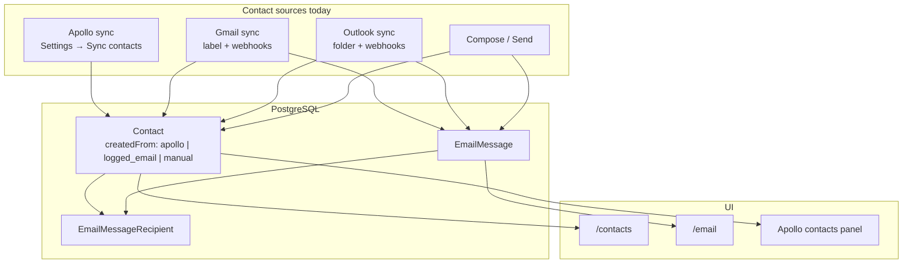
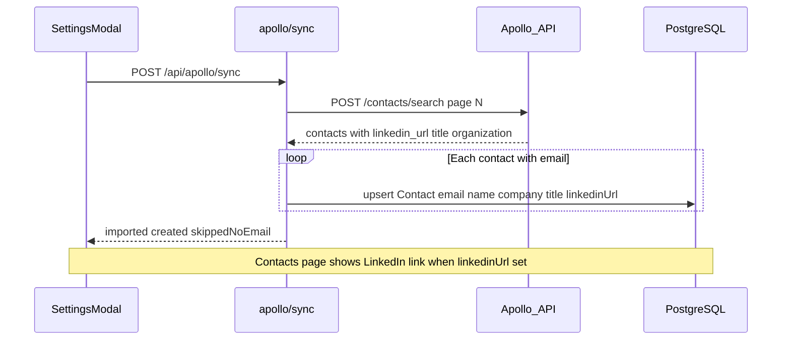
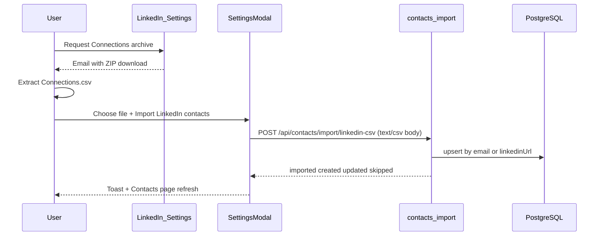
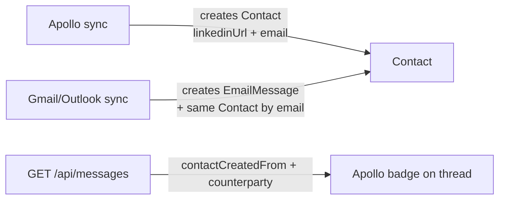

# LinkedIn Data in FlyCRM — Integration Guide

**File:** `docs/LINKEDIN_DATA_INTEGRATION.md`  
**Purpose:** How LinkedIn profile data (URLs, title, company) can enter FlyCRM alongside contacts — what works today, what does not, and the recommended path to implement.  
**Status:** **Phase 1 implemented** — LinkedIn `Connections.csv` import via Settings. Apollo LinkedIn URL enrichment (Phase 2) is still pending.

**Related docs:**
- [APOLLO_INTEGRATION.md](./APOLLO_INTEGRATION.md) — existing Apollo contact import (email + name today)
- [COMPLETE_FEATURE_SPEC.md](./COMPLETE_FEATURE_SPEC.md) — contacts, workspaces, mail sync

---

## Table of contents

1. [Overview](#1-overview)
2. [What LinkedIn data means in FlyCRM](#2-what-linkedin-data-means-in-flycrm)
3. [Why there is no direct LinkedIn API integration](#3-why-there-is-no-direct-linkedin-api-integration)
4. [How contacts enter the app today](#4-how-contacts-enter-the-app-today)
5. [Options for getting LinkedIn data](#5-options-for-getting-linkedin-data)
6. [Recommended approach: extend Apollo sync](#6-recommended-approach-extend-apollo-sync)
7. [Apollo field mapping](#7-apollo-field-mapping)
8. [Alternative: LinkedIn Connections CSV import](#8-alternative-linkedin-connections-csv-import)
9. [Alternative: on-demand Apollo People Enrichment](#9-alternative-on-demand-apollo-people-enrichment)
10. [How LinkedIn data links to email and inbox](#10-how-linkedin-data-links-to-email-and-inbox)
11. [Planned database schema](#11-planned-database-schema)
12. [Planned API and UI changes](#12-planned-api-and-ui-changes)
13. [Security and compliance](#13-security-and-compliance)
14. [Limitations and expectations](#14-limitations-and-expectations)
15. [Manual verification (after implementation)](#15-manual-verification-after-implementation)
16. [Troubleshooting](#16-troubleshooting)
17. [Implementation checklist](#17-implementation-checklist)
18. [LinkedIn CSV import — build specification](#18-linkedin-csv-import--build-specification)

---

## 1. Overview

FlyCRM users want **LinkedIn context on contacts** — profile URL, job title, company — the same way they already import contacts via Apollo and email sync.

LinkedIn does **not** offer a public API for CRM apps to bulk-import connections or enrich leads. The practical approach for FlyCRM is:

| Priority | Method | Summary |
|----------|--------|---------|
| **1 (build next)** | **LinkedIn CSV** import | User exports `Connections.csv` from LinkedIn → uploads in Settings → contacts created with profile URL |
| 2 (follow-up) | Extend **Apollo** sync | Also persist `linkedin_url`, `title`, `company` from Apollo `contacts/search` |
| 3 (supplement) | **Manual** LinkedIn URL | User pastes a profile URL on a contact record |
| Not viable | **LinkedIn login / API sync** | No automatic fetch of the logged-in user’s connections |

This guide is the blueprint for implementation. See [Section 18](#18-linkedin-csv-import--build-specification) for the full CSV import spec.

---

## 2. What LinkedIn data means in FlyCRM

In this project, “LinkedIn data” means **metadata attached to a `Contact` row**, not a separate LinkedIn inbox or messaging integration.

| Field (planned) | Example | Source |
|-----------------|---------|--------|
| `linkedinUrl` | `https://www.linkedin.com/in/jane-doe` | Apollo `linkedin_url` or CSV `URL` column |
| `title` | `VP Sales` | Apollo `title` or CSV `Position` |
| `company` | `Acme Inc` | Apollo `organization.name` or CSV `Company` |

**What this does not include:**
- LinkedIn connection requests or InMail
- Live sync with the user’s LinkedIn network
- Scraping LinkedIn without user-exported data or a licensed data provider (Apollo)

Contacts remain keyed by **`(workspaceId, email)`**. LinkedIn URL is enrichment on that record, not a second primary key (unless a future CSV import path adds email-optional contacts).

---

## 3. Why there is no direct LinkedIn API integration

### Partner program and CRM restrictions

LinkedIn removed broad public API access years ago. CRM integrations for sales/prospecting require the [LinkedIn Partner Program](https://developer.linkedin.com/). Multiple CRM vendors have reported:

- Applications for CRM partnerships are **not being accepted** for new vendors.
- Approved CRM partners are largely limited to enterprise platforms (e.g. Salesforce, Microsoft Dynamics) with Sales Navigator tiers.

Reference: [Capsule CRM — LinkedIn integration discontinued](https://capsulecrm.com/blog/linkedin-integration/)

### Restricted use of member data

Microsoft’s [Restricted Uses of LinkedIn Marketing APIs and Data](https://learn.microsoft.com/en-us/linkedin/marketing/restricted-use-cases) states member data must not be used for:

- Lead creation or CRM enrichment
- Identifying sales or marketing prospects
- Building audience lists for outreach

Building a FlyCRM feature that pulls LinkedIn member profiles via official APIs for sales CRM purposes would likely violate these terms and risk access revocation.

### Practical conclusion

| Approach | Viable for FlyCRM? |
|----------|-------------------|
| LinkedIn OAuth + Connections API for CRM | No (partner / policy) |
| LinkedIn Sales Navigator CRM sync | No (enterprise partners only) |
| User-initiated data export (CSV) | Yes (user’s own data) |
| Third-party enrichment (Apollo) | Yes (already integrated for contacts) |
| Unofficial scraping | No (ToS risk; out of scope) |

---

## 4. How contacts enter the app today

Before adding LinkedIn fields, understand the existing contact pipeline. Full detail: [APOLLO_INTEGRATION.md](./APOLLO_INTEGRATION.md).



| Source | Trigger | `createdFrom` | Stored fields today |
|--------|---------|---------------|-------------------|
| Apollo | `POST /api/apollo/sync` | `apollo` | `email`, `name` |
| Gmail / Outlook sync | Top-bar Sync, webhooks | `logged_email` | `email`, `name` (from mail headers) |
| Compose / send | Send in Message Center | `logged_email` | `email`, `name` |
| Manual | — | `manual` (enum only) | No create API yet |

**LinkedIn today:** Apollo’s API response includes `linkedin_url` for many contacts, but **`server/src/apollo/sync.ts` does not persist it**. The `Contact` model has no `linkedinUrl`, `title`, or `company` columns yet.

---

## 5. Options for getting LinkedIn data

### Option A — Extend Apollo sync (recommended)

**Best fit** because Apollo is already connected, documented, and used for contact import.

- **API:** `POST https://api.apollo.io/api/v1/contacts/search` (same as today)
- **User flow:** Unchanged — Settings → Save key → **Sync contacts now**
- **New behavior:** Map `linkedin_url`, `title`, `organization` → `Contact` enrichment fields
- **Effort:** Low (~1 migration, ~6 files)
- **Cost:** Uses existing Apollo subscription; no new vendor

See [Section 6](#6-recommended-approach-extend-apollo-sync).

### Option B — LinkedIn `Connections.csv` import (future)

User exports their own 1st-degree connections from LinkedIn:

1. LinkedIn → **Me** → **Settings & Privacy** → **Data privacy**
2. **Get a copy of your data** → select **Connections** → **Request archive**
3. Download ZIP → extract **`Connections.csv`**

Typical CSV columns: `First Name`, `Last Name`, `URL`, `Email Address`, `Company`, `Position`, `Connected On`.

| Pros | Cons |
|------|------|
| No Apollo dependency for own network | Manual; not real-time |
| Official LinkedIn export | Many rows lack email |
| Includes profile URL | Requires new import API + possibly email-optional contacts |

See [Section 8](#8-alternative-linkedin-connections-csv-import).

### Option C — Manual LinkedIn URL on contact (future supplement)

Allow editing `linkedinUrl` on a contact in the UI or via `PATCH /api/contacts/:id`.

Useful when Apollo has no URL but the user knows the profile. Low effort; no bulk import.

### Option D — Apollo People Enrichment (future, on-demand)

Separate from `contacts/search`:

- **Search:** `POST /mixed_people/api_search` — find prospects (no email in response)
- **Enrich:** `POST /people/match` — get `linkedin_url`, title, etc. for a known email or name

May consume Apollo credits. Better for “enrich this one contact” than bulk workspace import.

See [Section 9](#9-alternative-on-demand-apollo-people-enrichment).

### Option E — Direct LinkedIn API

**Not recommended** for FlyCRM. See [Section 3](#3-why-there-is-no-direct-linkedin-api-integration).

---

## 6. Recommended approach: extend Apollo sync

### Architecture (planned)



### User flow (unchanged from Apollo today)

| Step | Action | Result |
|------|--------|--------|
| 1 | Settings → paste Apollo API key → **Save key** | Key encrypted on `User.apolloApiKey` |
| 2 | **Sync contacts now** | Contacts upserted; enrichment fields filled when Apollo provides them |
| 3 | Open **Contacts** or Email Center **Apollo panel** | Cards show company, title, clickable LinkedIn URL |

No LinkedIn login. No new environment variables (reuses `ENCRYPTION_KEY` and per-user Apollo key).

### Server files to change (when implementing)

| File | Change |
|------|--------|
| `server/prisma/schema.prisma` | Add `company`, `title`, `linkedinUrl` on `Contact` |
| `server/src/apollo/client.ts` | Extend `ApolloContact` type with `linkedin_url`, `title` |
| `server/src/apollo/sync.ts` | Map Apollo fields → upsert payload |
| `server/src/contacts/upsert.ts` | Accept enrichment fields; backfill empty only |
| `server/src/contacts/routes.ts` | Return new fields in list/detail APIs |
| `server/src/apollo/sync.test.ts` | Tests for mapping and backfill |

### Web files to change (when implementing)

| File | Change |
|------|--------|
| `web/src/types.ts` | Add optional `company`, `title`, `linkedinUrl` to `CrmContact` |
| `web/src/pages/Contacts.tsx` | Display enrichment + external LinkedIn link |
| `web/src/components/message-center/ApolloContactsPanel.tsx` | Same in sidebar list |

---

## 7. Apollo field mapping

Apollo `contacts/search` response (subset) — [Apollo API reference](https://docs.apollo.io/reference/search-for-contacts):

```json
{
  "contacts": [
    {
      "id": "66e3726977d36c03f2c30afc",
      "first_name": "Jane",
      "last_name": "Doe",
      "name": "Jane Doe",
      "email": "jane@example.com",
      "linkedin_url": "http://www.linkedin.com/in/jane-doe",
      "title": "VP Sales",
      "organization_name": "Acme Inc",
      "organization": {
        "name": "Acme Inc",
        "linkedin_url": "http://www.linkedin.com/company/acme"
      }
    }
  ]
}
```

### CRM mapping (planned)

| Apollo field | CRM `Contact` field | Rules |
|--------------|---------------------|-------|
| `email` | `email` | Required; `trim().toLowerCase()`; skip if missing |
| `name` or `first_name` + `last_name` | `name` | Same as today |
| `linkedin_url` | `linkedinUrl` | Normalize `http` → `https`; store null if empty |
| `title` | `title` | Job title |
| `organization.name` | `company` | Prefer nested name |
| `organization_name` | `company` | Fallback if `organization.name` empty |
| — | `createdFrom` | `'apollo'` on **new** rows only |

**Do not import** organization `linkedin_url` as the person’s profile URL — that is the company page, not `/in/...`.

### Upsert / backfill rules (planned)

Same idempotency as today’s Apollo import (`@@unique([workspaceId, email])`):

| Scenario | Behavior |
|----------|----------|
| New contact | Create with all provided enrichment fields |
| Existing contact | **Do not** change `createdFrom` |
| Existing, empty `name` | Backfill name from Apollo |
| Existing, empty `company` / `title` / `linkedinUrl` | Backfill from Apollo |
| Existing, field already set | **Do not** overwrite (user or prior sync wins) |
| Re-run sync | Idempotent — no duplicate rows |

Example: A contact created from Gmail (`logged_email`) who later appears in Apollo sync gets `linkedinUrl` backfilled on re-sync without becoming `createdFrom: 'apollo'`.

---

## 8. LinkedIn Connections CSV import (primary path)

The **only supported way** to import **your own LinkedIn connections** into FlyCRM. No LinkedIn login in the app — user exports data from LinkedIn, then uploads the file.

### User flow (planned)



### Export steps (official)

1. LinkedIn → **Me** → **Settings & Privacy** → **Data privacy**
2. **Get a copy of your data** → select **Connections** only (faster) or full archive
3. **Request archive** → wait for email (minutes to 24 hours)
4. Download ZIP → extract **`Connections.csv`**

Help: [Export connections from LinkedIn](https://www.linkedin.com/help/linkedin/answer/a566336/export-connections-from-linkedin)

### CSV shape

LinkedIn may include note lines before the header. Parser must skip until a row contains `First Name` and `URL`.

| CSV column | CRM field | Notes |
|------------|-----------|-------|
| First Name + Last Name | `name` | Join with space; skip row if both empty |
| URL | `linkedinUrl` | Required if no email; normalize to `https://` |
| Email Address | `email` | Often blank; lowercase trim when present |
| Company | `company` | |
| Position | `title` | |
| Connected On | — | Not stored in v1 |

Example header row:

```text
First Name,Last Name,URL,Email Address,Company,Position,Connected On
```

### Import rules (planned)

| Rule | Behavior |
|------|----------|
| Row identifier | Need **email** or **LinkedIn URL**; skip row if neither |
| `createdFrom` | `'linkedin_csv'` on **new** rows only |
| Match existing | By `email` first, else by `linkedinUrl` |
| Backfill | Fill empty `name`, `company`, `title`, `linkedinUrl`; never overwrite non-empty |
| `createdFrom` on existing | Never change (e.g. `logged_email` contact gets LinkedIn URL backfilled) |
| Re-import same file | Idempotent — updates counts, no duplicates |
| Email optional | **Yes** — `Contact.email` becomes nullable; unique on `(workspaceId, linkedinUrl)` |

**Do not** skip rows without email — that would drop most LinkedIn connections. URL is the primary identifier for CSV import.

---

## 9. Alternative: on-demand Apollo People Enrichment

For enriching **one contact** when bulk sync did not return a LinkedIn URL.

| Endpoint | Use |
|----------|-----|
| `POST /people/match` | Input email, name, or domain → returns `person.linkedin_url`, `title`, etc. |
| `POST /people/bulk_match` | Batch enrichment |

**Trigger ideas (future):**
- Button on contact detail: “Enrich from Apollo”
- Auto-enrich when opening Compose to an Apollo contact missing `linkedinUrl`

**Caveats:**
- May use Apollo credits (unlike `contacts/search` list for saved contacts)
- Requires Apollo key already saved
- Still not a live LinkedIn API call

Docs: [Apollo People Enrichment](https://docs.apollo.io/reference/people-enrichment)

---

## 10. How LinkedIn data links to email and inbox

LinkedIn metadata does **not** create inbox messages. Linking to email works through the **shared email address**:



1. Apollo sync creates `jane@acme.com` with `linkedinUrl` and `createdFrom: 'apollo'`.
2. User emails Jane → mail sync logs message; same `Contact` row (unique on email).
3. Inbox API sets `contactCreatedFrom: 'apollo'` on threads where the counterparty matches ([`server/src/messages/routes.ts`](../server/src/messages/routes.ts)).

**After enrichment:** Contacts page and Apollo panel show the LinkedIn link; inbox threads still show mail from Gmail/Outlook, with Apollo badge when applicable.

Optional later improvement: inbox preview `company` field could use `Contact.company` instead of deriving from email domain.

---

## 11. Planned database schema

**Current** (`server/prisma/schema.prisma`):

```prisma
model Contact {
  id          String        @id @default(cuid())
  workspaceId String
  email       String
  name        String?
  createdFrom ContactSource @default(logged_email)
  @@unique([workspaceId, email])
}
```

**Planned (CSV import + Apollo enrichment):**

```prisma
enum ContactSource {
  manual
  logged_email
  apollo
  linkedin_csv   // new
}

model Contact {
  id          String        @id @default(cuid())
  workspaceId String
  email       String?       // nullable for LinkedIn-only rows
  name        String?
  company     String?
  title       String?
  linkedinUrl String?
  createdFrom ContactSource @default(logged_email)

  @@unique([workspaceId, email])
  @@unique([workspaceId, linkedinUrl])
}
```

- Email sync / compose paths always supply email — unchanged.
- LinkedIn CSV rows without email are stored with `linkedinUrl` only.
- Re-import or Apollo sync can later add email to the same row (match by URL or email).

---

## 12. Planned API and UI changes

### New endpoint — LinkedIn CSV import

**`POST /api/contacts/import/linkedin-csv`**

| Item | Detail |
|------|--------|
| Auth | Session required (`requireAuth`) |
| Body | Raw `Connections.csv` as `text/csv` (up to ~15 MB) |
| Route order | Register **before** `GET /:id` so `import` is not treated as an id |

**Response 200:**

```json
{
  "imported": 1200,
  "created": 1100,
  "updated": 100,
  "skippedNoIdentifier": 5,
  "skippedInvalidUrl": 2
}
```

| Field | Meaning |
|-------|---------|
| `imported` | Rows processed (created + updated) |
| `created` | New `Contact` rows |
| `updated` | Existing rows backfilled |
| `skippedNoIdentifier` | No email and no URL |
| `skippedInvalidUrl` | URL present but not a linkedin.com profile |

**Errors:**

| Status | `error` | When |
|--------|---------|------|
| 400 | `missing_csv` | Empty body |
| 400 | `invalid_csv` | No header row found |
| 413 | — | File too large |

### Updated list/detail APIs

| Endpoint | Change |
|----------|--------|
| `GET /api/contacts` | Add `company`, `title`, `linkedinUrl`; search also matches company/title |
| `GET /api/contacts` | Support `?createdFrom=linkedin_csv` filter |
| `GET /api/contacts/:id` | Return enrichment fields |

Example list item:

```json
{
  "id": "clx...",
  "email": null,
  "name": "Jane Doe",
  "createdFrom": "linkedin_csv",
  "company": "Acme Inc",
  "title": "VP Sales",
  "linkedinUrl": "https://www.linkedin.com/in/jane-doe",
  "emailCount": 0,
  "lastEmailAt": null
}
```

### UI (planned)

| Surface | Change |
|---------|--------|
| **Settings** → LinkedIn section | File input + **Import LinkedIn contacts**; short export instructions |
| `/contacts` | **LinkedIn** badge for `linkedin_csv`; show title/company; link to profile |
| `/contacts` | Handle `email: null` — show “No email” instead of crashing |
| Email Center Apollo panel | Unchanged (Apollo-only filter) |

Frontend upload (no multipart library):

```typescript
const text = await file.text();
await fetch('/api/contacts/import/linkedin-csv', {
  method: 'POST',
  headers: { 'Content-Type': 'text/csv' },
  credentials: 'include',
  body: text,
});
```

---

## 13. Security and compliance

| Topic | Approach |
|-------|----------|
| Apollo key at rest | Already encrypted (`User.apolloApiKey`) — see [APOLLO_INTEGRATION.md §13](./APOLLO_INTEGRATION.md#13-security) |
| LinkedIn URLs in DB | Public profile URLs only; no LinkedIn OAuth tokens |
| CSV import | User uploads their own export; treat upload as sensitive PII; do not log row contents |
| Scraping | Out of scope — violates LinkedIn ToS |
| Data retention | Disconnect Apollo clears key only; contacts (and planned LinkedIn URLs) remain until user deletes workspace data |

Use Apollo and LinkedIn exports in line with each provider’s terms of service.

---

## 14. Limitations and expectations

| Limitation | Detail |
|------------|--------|
| Sparse `linkedin_url` | Apollo often returns `null` for `linkedin_url`; not every contact will have a link |
| Not real-time LinkedIn | Data is Apollo’s cache, not a live LinkedIn profile pull |
| Email required (Apollo sync) | Contacts without email are skipped (`skippedNoEmail`); LinkedIn-only Apollo records need a different flow |
| No LinkedIn messaging | Profile metadata only |
| Company LinkedIn vs person | Store person `/in/` URL on `Contact.linkedinUrl`; company page URL is separate (future `Company` entity if needed) |
| Re-sync overwrite | Planned: only backfill empty fields — manual edits preserved |

---

## 15. Manual verification (after implementation)

1. **Apollo sync with LinkedIn**
   - Settings → Sync contacts now
   - DB: `Contact` rows have `linkedinUrl` where Apollo returned it
   - Contacts page: LinkedIn link opens correct profile

2. **Backfill on existing contact**
   - Create contact via email sync (`logged_email`)
   - Run Apollo sync for same email with Apollo `linkedin_url`
   - Verify `linkedinUrl` filled, `createdFrom` still `logged_email`

3. **No overwrite**
   - Set `linkedinUrl` manually (once PATCH exists) or via first sync
   - Re-sync Apollo with different URL
   - Verify URL unchanged

4. **Apollo panel + compose**
   - Apollo panel still lists contacts; compose **To** unchanged

5. **Inbox unchanged**
   - Mail sync still independent; Apollo badge logic still email-based

---

## 16. Troubleshooting

| Symptom | Likely cause | What to do |
|---------|--------------|------------|
| No LinkedIn links after sync | Apollo returned `linkedin_url: null` for those records | Check raw Apollo response; try People Enrichment for one contact |
| `skippedNoEmail` high | Apollo contacts lack email | Expected; LinkedIn URL alone cannot import with current email-required rule |
| LinkedIn link is company page | Wrong field mapped | Use person `linkedin_url`, not `organization.linkedin_url` |
| Expected direct LinkedIn sync | Not supported | Use Apollo or CSV path per this guide |
| Contacts have email/name only | Enrichment not implemented yet | Follow [Section 17](#17-implementation-checklist) |

---

## 17. Implementation checklist

### Phase 1 — LinkedIn CSV import

- [x] Prisma: `linkedin_csv` enum, `company`, `title`, `linkedinUrl`, optional `email`, unique on `(workspaceId, linkedinUrl)`
- [x] `server/src/contacts/linkedinCsv.ts` — parse CSV, normalize LinkedIn URLs
- [x] `server/src/contacts/linkedinImport.ts` — import loop + stats
- [x] `server/src/contacts/upsert.ts` — `upsertContactFromLinkedInCsv()`
- [x] `server/src/contacts/routes.ts` — `POST /import/linkedin-csv` + enriched `GET /`
- [x] `server/src/contacts/linkedinCsv.test.ts` — parser + import tests
- [x] `web/src/components/settings/SettingsModal.tsx` — file upload UI
- [x] `web/src/types.ts` + `web/src/pages/Contacts.tsx` — `linkedin_csv` badge, URL link, null email
- [ ] Manual test: export → import → Contacts page

### Phase 2 — Apollo LinkedIn enrichment (follow-up)

- [ ] Extend `ApolloContact` + `sync.ts` field mapping
- [ ] Share enrichment backfill in `upsertContactFromApollo()`
- [ ] `ApolloContactsPanel.tsx` — show LinkedIn link

### Phase 3 — Optional

- [ ] `POST /people/match` on-demand enrich
- [ ] `PATCH /api/contacts/:id` for manual `linkedinUrl`
- [ ] Inbox preview uses `Contact.company` when set

---

## 18. LinkedIn CSV import — build specification

This section is the **implementation contract** for Phase 1.

### Server file map

| File | Responsibility |
|------|----------------|
| `server/src/contacts/linkedinCsv.ts` | Parse `Connections.csv`, map columns, `normalizeLinkedInUrl()` |
| `server/src/contacts/linkedinImport.ts` | `importLinkedInCsv(workspaceId, csvText)` → result stats |
| `server/src/contacts/upsert.ts` | `upsertContactFromLinkedInCsv()` — match by email or URL |
| `server/src/contacts/routes.ts` | `POST /import/linkedin-csv` with `express.text({ limit: '15mb' })` |
| `server/src/contacts/linkedinCsv.test.ts` | Unit tests |

### `normalizeLinkedInUrl(raw)`

1. Trim; return `null` if empty.
2. Prepend `https://` if no scheme.
3. Parse with `URL`; reject if hostname does not include `linkedin.com`.
4. Lowercase hostname; strip trailing slash from pathname.
5. Reject company-only URLs if desired (optional): paths like `/company/` still valid as profile identifier — **allow all** `/in/` and `/company/` only if person URL; for connections export, URLs are `/in/...`.

### `parseLinkedInConnectionsCsv(text)`

1. Strip UTF-8 BOM.
2. Split lines; skip until header row matches `first name` + (`url` or `profile url`).
3. Parse CSV rows (quoted fields with commas).
4. Map columns case-insensitively:

| Header aliases | Field |
|----------------|-------|
| `first name` | firstName |
| `last name` | lastName |
| `url`, `profile url` | linkedinUrl |
| `email address`, `email` | email |
| `company` | company |
| `position`, `title` | title |

5. Output `{ firstName, lastName, name, linkedinUrl, email, company, title }[]`.

### `upsertContactFromLinkedInCsv(workspaceId, row)`

```
if (!email && !linkedinUrl) → skip (skippedNoIdentifier)
if (linkedinUrl invalid) → skip (skippedInvalidUrl)

existing = find by (workspaceId, email) OR (workspaceId, linkedinUrl)

if (!existing)
  create { createdFrom: linkedin_csv, ...all fields }
  return created++

updates = backfill empty fields only
if (updates) update existing
return updated++ or no-op
```

### Settings UI copy (planned)

**Section title:** LinkedIn connections  
**Help text:** Export your connections from LinkedIn (Settings → Data privacy → Get a copy of your data → Connections). Upload the `Connections.csv` file from the ZIP.  
**Button:** Import LinkedIn contacts  
**Success toast:** `Imported N contacts (M new, K updated).`

### Manual verification — CSV import

1. Export `Connections.csv` from LinkedIn (or use a small test CSV with 2–3 rows).
2. Settings → choose file → **Import LinkedIn contacts**.
3. Network: `POST /api/contacts/import/linkedin-csv` → 200 with `imported` > 0.
4. `/contacts`: rows show **LinkedIn** badge, profile link, company/title.
5. Rows without email still appear (URL only).
6. Re-import same file → `updated` > 0, `created` = 0, no duplicates.
7. If a row’s email matches an existing `logged_email` contact → same row updated, `createdFrom` unchanged.

### FAQ

**Can we sync LinkedIn on login?**  
No. Use CSV export + import.

**Does this replace Apollo?**  
No. CSV = your LinkedIn network. Apollo = your Apollo account lists.

**Why is email optional?**  
LinkedIn hides most connection emails. URL is the reliable identifier.

---

*End of LinkedIn data integration guide.*
