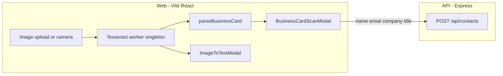

# Tesseract.js OCR in FlyCRM — Integration Guide

**File:** `docs/OCR_TESSERACT_INTEGRATION.md`  
**Purpose:** How browser-side [Tesseract.js](https://github.com/naptha/tesseract.js) OCR is integrated into FlyCRM — business card scanning and generic image-to-text.  
**Status:** **Implemented** — Phases 1–4 complete.

**Related docs:**
- [docs/README.md](./README.md) — upstream Tesseract.js README (reference)
- [LINKEDIN_DATA_INTEGRATION.md](./LINKEDIN_DATA_INTEGRATION.md) — similar contact import pattern
- [COMPLETE_FEATURE_SPEC.md](./COMPLETE_FEATURE_SPEC.md) — product overview

---

## Table of contents

1. [Overview](#1-overview)
2. [Architecture](#2-architecture)
3. [Phase index](#3-phase-index)
4. [Phase 1 — Core OCR module](#4-phase-1--core-ocr-module)
5. [Phase 2 — Image-to-text UI](#5-phase-2--image-to-text-ui)
6. [Phase 3 — Business card scan](#6-phase-3--business-card-scan)
7. [Phase 4 — Tests and verification](#7-phase-4--tests-and-verification)
8. [Vite and worker configuration](#8-vite-and-worker-configuration)
9. [Business card parsing heuristics](#9-business-card-parsing-heuristics)
10. [Security and privacy](#10-security-and-privacy)
11. [Manual verification checklist](#11-manual-verification-checklist)
12. [Troubleshooting](#12-troubleshooting)
13. [Future extensions](#13-future-extensions)

---

## 1. Overview

FlyCRM integrates Tesseract.js for **two features**, both running **entirely in the browser**:

| Feature | Entry point | Server call |
|---------|-------------|-------------|
| **Generic image-to-text** | Sidebar **TOOLS → Extract text**; Quick Add → Extract text from image | None |
| **Business card scan** | Quick Add → Scan business card; Contacts page button | `POST /api/contacts` (parsed fields only) |

**Design choices:**

- **Browser-only OCR** — images never uploaded; fits Vercel serverless limits and privacy expectations.
- **English (`eng`)** language pack by default (~2–4 MB first download, cached by browser).
- **No PDF support** — Tesseract.js does not support PDF; use [Scribe.js](https://github.com/scribeocr/scribe.js) if needed later.
- **No image storage** — scanned images are not persisted in v1.
- **Mandatory review** — business card fields are always shown in an editable form before save.

**Out of scope (v1):**

- Server-side OCR
- PDF / multi-page documents
- `phone` database column (shown in review UI only)
- Auto-save without user confirmation

---

## 2. Architecture



**Data flow:**

1. User selects image (file input or camera on mobile).
2. `useOcr` hook runs `recognizeFile` via lazy-loaded Tesseract worker.
3. **Generic mode:** raw text displayed; user copies to clipboard.
4. **Business card mode:** `parseBusinessCard(text)` pre-fills form; user edits and saves.
5. API receives JSON only; `upsertContactFromOcr` creates or backfills contact with `createdFrom: 'ocr_card'`.

---

## 3. Phase index

| Phase | Status | Deliverables |
|-------|--------|--------------|
| 1 — Core OCR module | Done | `web/src/lib/ocr/*`, `web/src/hooks/useOcr.ts` |
| 2 — Image-to-text UI | Done | `ImageToTextModal`, Quick Add entry |
| 3 — Business card scan | Done | `parseBusinessCard`, `BusinessCardScanModal`, `POST /api/contacts`, `ocr_card` enum |
| 4 — Tests | Done | Parser tests, contact route tests |

Track progress in [my_task.md](../my_task.md) under **OCR / Tesseract**.

---

## 4. Phase 1 — Core OCR module

### Files

| File | Role |
|------|------|
| `web/src/lib/ocr/constants.ts` | Max file size (10 MB), accepted MIME types |
| `web/src/lib/ocr/tesseractWorker.ts` | Singleton worker, progress handler, idle terminate |
| `web/src/lib/ocr/recognizeImage.ts` | `recognizeFile`, `recognizeDataUrl` |
| `web/src/hooks/useOcr.ts` | React hook: `status`, `progress`, `text`, `recognize`, `reset` |

### Worker pattern (from Tesseract README)

```typescript
import { createWorker } from 'tesseract.js';

const worker = await createWorker('eng');
const ret = await worker.recognize(image, { rotateAuto: true });
const text = ret.data.text;
// Reuse worker for next image; terminate on modal close or 5 min idle
```

### Rules

- Dynamic `import('tesseract.js')` — OCR chunk not in initial bundle.
- `rotateAuto: true` — better accuracy on skewed business card photos.
- Worker terminates after 5 minutes idle or when OCR modal unmounts.
- First run downloads `eng` traineddata — show loading UI with progress.

---

## 5. Phase 2 — Image-to-text UI

### Files

- `web/src/components/ocr/ImageToTextModal.tsx`

### Entry points

- Sidebar **TOOLS → Extract text**
- Quick Add → **Extract text from image**

### UX

- Drag-and-drop or file picker; `capture="environment"` on mobile.
- Progress bar during recognition.
- Textarea with extracted text; **Copy** button.
- Hint: "Review text — OCR may contain errors."
- No API call.

---

## 6. Phase 3 — Business card scan

### Files

| Layer | File |
|-------|------|
| Parser | `web/src/lib/ocr/parseBusinessCard.ts` |
| UI | `web/src/components/ocr/BusinessCardScanModal.tsx` |
| Validation | `server/src/contacts/parseContactBody.ts` |
| Upsert | `server/src/contacts/upsert.ts` → `upsertContactFromOcr` |
| Route | `server/src/contacts/routes.ts` → `POST /` |
| Schema | `ContactSource.ocr_card` migration |

### API

```
POST /api/contacts
Authorization: Bearer <access token>
Content-Type: application/json

{
  "name": "Jane Doe",
  "email": "jane@acme.com",
  "company": "Acme Inc",
  "title": "VP Sales",
  "linkedinUrl": "https://www.linkedin.com/in/jane-doe"
}
```

**Responses:**

| Status | Body | Meaning |
|--------|------|---------|
| 201 | `{ contact, created: true }` | New contact |
| 200 | `{ contact, created: false }` | Existing contact updated (backfill) |
| 400 | `{ error: "missing_identifier" }` | No email and no LinkedIn URL |
| 400 | `{ error: "invalid_body" }` | Malformed request |
| 400 | `{ error: "invalid_url" }` | Invalid LinkedIn URL |
| 401 | `{ error: "unauthorized" }` | Not signed in |

### Upsert rules

| Scenario | Behavior |
|----------|----------|
| New contact | Create with `createdFrom: 'ocr_card'` |
| Match by email | Upsert on `(workspaceId, email)` |
| Match by LinkedIn URL | Upsert on `(workspaceId, linkedinUrl)` if no email |
| Existing contact | Never change `createdFrom` |
| Backfill | Fill empty `name`, `company`, `title`, `linkedinUrl` only |
| Re-scan same card | Idempotent backfill |

### Entry points

- Quick Add → **Scan business card**
- Contacts page header → **Scan card**

---

## 7. Phase 4 — Tests and verification

### Automated

| File | Coverage |
|------|----------|
| `web/src/lib/ocr/parseBusinessCard.test.ts` | Email, name, title, company, LinkedIn extraction |
| `server/src/contacts/parseContactBody.test.ts` | Request validation |
| `server/src/contacts/routes.test.ts` | `POST /api/contacts` success and error paths |

OCR worker is **not** run in CI (WASM); browser smoke-test only.

### Commands

```bash
cd web && npm test
cd server && npm test
cd web && npm run build
```

---

## 8. Vite and worker configuration

- **Package:** `tesseract.js@^7` in `web/package.json` only.
- **Default paths:** Tesseract loads worker and language files from jsDelivr CDN.
- **If CDN blocked:** copy `node_modules/tesseract.js/dist/*` to `web/public/tesseract/` and set `workerPath` / `langPath` in `createWorker` options.
- **Bundle:** lazy import keeps main chunk small; OCR loads on first modal open.

---

## 9. Business card parsing heuristics

`parseBusinessCard(ocrText)` returns:

```typescript
{
  name?: string;
  email?: string;
  company?: string;
  title?: string;
  linkedinUrl?: string;
  phone?: string;   // display only
  website?: string; // display only
  rawText: string;
}
```

| Field | Method |
|-------|--------|
| `email` | Regex for standard email addresses |
| `linkedinUrl` | `linkedin.com/in/...` pattern, normalized to `https://` |
| `phone` | Phone-like lines (display in form, not saved) |
| `website` | `http(s)://` or `www.` lines (display only) |
| `title` | Lines matching job-title keywords (VP, Director, Manager, Engineer, etc.) |
| `name` | First substantial non-email line near top |
| `company` | Remaining prominent line, often after title block |

Parser output is a **best guess** — user must review before save.

---

## 10. Security and privacy

- Images processed only in the browser; never sent to API or logged.
- Business card save transmits only user-approved field values.
- Do not log raw OCR text on the server.
- Treat extracted PII (names, emails) like LinkedIn CSV import data.
- Max upload size: 10 MB (client-side guard).

---

## 11. Manual verification checklist

- [ ] First OCR use shows download/loading progress for language pack
- [ ] Sidebar **TOOLS → Extract text** → copy works
- [ ] Quick Add → Extract text from image → copy works
- [ ] Quick Add → Scan business card → form pre-filled → save → contact on `/contacts`
- [ ] Contact shows **OCR** source badge
- [ ] Re-scan card with same email → backfills missing fields only
- [ ] Card with no email and no LinkedIn → save blocked with clear error
- [ ] Mobile: camera capture works (`capture="environment"`)
- [ ] `npm run build` in `web/` succeeds; OCR code-split
- [ ] Production (Vercel web): OCR works without new API env vars

---

## 12. Troubleshooting

| Issue | Cause | Fix |
|-------|-------|-----|
| Slow first scan | Language pack download | Expected; subsequent scans use cache |
| Garbled text | Poor photo (glare, blur, angle) | Retake photo; use good lighting; edit form manually |
| Worker failed to load | CDN blocked | Use `public/tesseract/` fallback (see §8) |
| Save returns `missing_identifier` | No email or LinkedIn on card | Enter email manually in review form |
| Build size concern | Tesseract in main bundle | Confirm dynamic `import('tesseract.js')` |

---

## 13. Future extensions

- Multi-language: `createWorker('eng+deu')` with language picker in Settings
- `phone` column on `Contact` model
- Dedicated `/tools/ocr` page
- [Scribe.js](https://github.com/scribeocr/scribe.js) for PDF business cards
- Optional server-side OCR for email attachment processing (separate project)

---

**Last updated:** OCR Phases 1–4 implemented.
