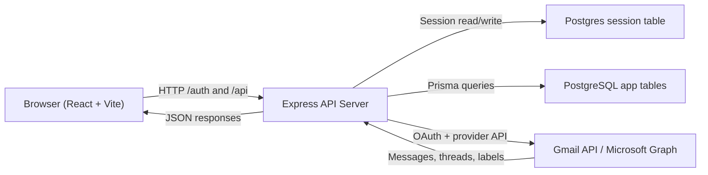
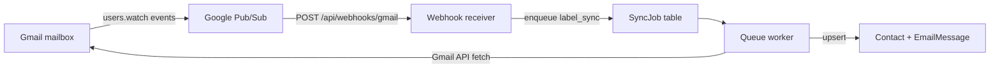
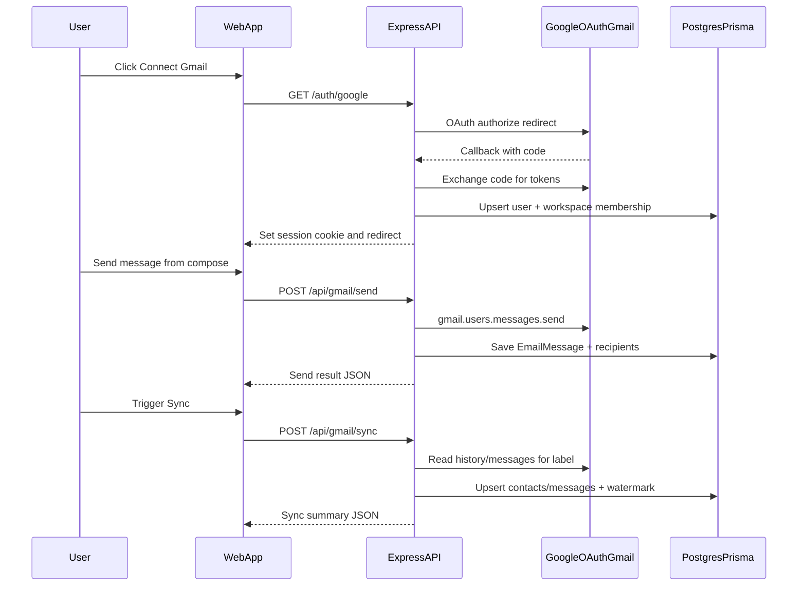

# Gmail Connector Project Guide

**Related documentation**

- **[COMPLETE_FEATURE_SPEC.md](./COMPLETE_FEATURE_SPEC.md)** — full web + server feature spec (port to another project)
- **[GOOGLE_WEBHOOK_GUIDE.md](./GOOGLE_WEBHOOK_GUIDE.md)** — real-time Gmail sync (Pub/Sub, queue, testing)
- **[GOOGLE_WEBHOOK_TASKS.md](./GOOGLE_WEBHOOK_TASKS.md)** — detailed webhook implementation spec
- **[google-webhook-tasks/](./google-webhook-tasks/)** — week-by-week task checklists

---

## 1) What this project is

FlyConnector is a lightweight CRM focused on email relationship management. Users connect either Gmail or Outlook, send emails from the app, and sync inbox/sent activity back into CRM contact timelines.

The core rule of this project is provider-native delivery: emails are sent and received through Gmail API or Microsoft Graph, never a separate SMTP service.

## 2) What this project does

- Connects a user account with Google OAuth or Microsoft OAuth.
- Stores OAuth tokens (encrypted at rest) and refreshes access tokens when needed.
- Sends emails via Gmail API or Microsoft Graph with provider-native payloads.
- Syncs messages into CRM records using **two modes** (see below).
- Auto-creates contacts from synced email participants (and optional Apollo.io import).
- Shows contact timelines and threaded message history.
- Lets users configure sync selector (Gmail label or Outlook folder) and timezone settings.
- **Real-time Gmail sync** (when configured): Gmail watch + Google Pub/Sub + background queue worker.
- **Gmail watch lifecycle**: registers and renews `users.watch` subscriptions (~7 day expiry).
- **Health endpoints** for sync job failures and watch status.

### Two Gmail sync modes

| Mode | Trigger | Code path | Uses `SyncJob`? |
|------|---------|-----------|-----------------|
| **Manual / polling** | User clicks Sync or frontend timer | `POST /api/gmail/sync` → `gmail/sync.ts` | No |
| **Webhook / real-time** | Gmail change → Pub/Sub → webhook | `POST /api/webhooks/gmail` → queue worker | Yes |

Details for webhook mode: **[GOOGLE_WEBHOOK_GUIDE.md](./GOOGLE_WEBHOOK_GUIDE.md)**.

## 3) Technology stack

### Backend
- Node.js + TypeScript
- Express
- Prisma ORM
- PostgreSQL
- `googleapis` for Gmail integration
- Microsoft Graph REST API for Outlook integration
- `express-session` + `connect-pg-simple` for server-side session storage
- Postgres-backed `SyncJob` queue with in-process worker

### Frontend
- React + TypeScript
- Vite
- Tailwind CSS + Radix/shadcn UI components

For folder layout, routing, design system, and Message Center UI details, see **[UI_STRUCTURE.md](./UI_STRUCTURE.md)**. For how to build pages and components (patterns, styling, workflows), see **[UI_REFERENCE.md](./UI_REFERENCE.md)**.

### Dev and infra
- Supabase PostgreSQL (see [SUPABASE.md](./SUPABASE.md))
- Prisma migrations
- Vitest + Supertest for backend tests (`server/vitest.config.ts` runs `src/**/*.test.ts` only)

## 4) Repository structure

```text
gmail-microsoft-connector/
  .env
  CLAUDE.md
  docs/
    PROJECT_GUIDE.md
    SUPABASE.md
    GOOGLE_WEBHOOK_GUIDE.md
    google-webhook-tasks/
  server/
    vitest.config.ts
    src/
      index.ts
      env.ts
      auth/
      gmail/              # send, sync, watchManager
      webhooks/           # Gmail Pub/Sub receiver
      queue/              # worker + label_sync / thread_sync handlers
      outlook/
      apollo/             # Apollo.io contact import
      dev/                # dev-only helpers (non-prod)
      contacts/
      workspaces/
      users/
    prisma/
      schema.prisma
      migrations/
  package.json              # root scripts: dev:all, postinstall server+web
  web/
    package.json
    index.html
    public/
    src/
      main.tsx
      App.tsx
      components/
      lib/
      pages/
    vite.config.ts
    tailwind.config.ts
    tsconfig.json
```

## 5) System architecture

### Browser and API (manual sync path)



### Real-time Gmail webhook path



### Runtime behavior

- Frontend runs in Vite dev server.
- Backend runs as Express server and mounts all API routers.
- **Webhook route** (`/api/webhooks/gmail`) is mounted **before** session middleware (no cookie auth).
- Session cookies (`gmail_connector.sid`) authenticate browser calls to `/api/*`.
- Backend reads/writes CRM data through Prisma.
- On startup: queue worker starts, Gmail watch renewal runs, then every 6 hours.
- Backend talks to Gmail/Outlook APIs for auth, send, labels/folders, profile, and sync.

### Real-time Gmail webhook sync (summary)

When `GMAIL_PUBSUB_TOPIC` and Pub/Sub push are configured:

1. User saves a Gmail label in Settings → app creates **`CrmLabel`** row and calls **`ensureGmailWatch`**.
2. Gmail publishes mailbox changes to Pub/Sub.
3. Pub/Sub POSTs to **`/api/webhooks/gmail`** → enqueues **`label_sync`** jobs.
4. Worker runs **`label_sync`** → enqueues **`thread_sync`** per message → writes CRM rows.

Full setup, testing, and troubleshooting: **[GOOGLE_WEBHOOK_GUIDE.md](./GOOGLE_WEBHOOK_GUIDE.md)**.

## 6) End-to-end flow

### 6.1 Login and session flow

**Gmail**

1. User clicks **Connect Gmail** in frontend.
2. Browser opens `/auth/google`.
3. Backend creates Google OAuth URL and redirects user.
4. Google redirects to `/auth/google/callback`.
5. Backend exchanges code for tokens, loads user profile, upserts user in DB.
6. Backend ensures workspace membership exists.
7. Backend best-effort calls `ensureGmailWatch` (usually no-op until `CrmLabel` exists).
8. Backend creates session and redirects to frontend.
9. Frontend calls `/auth/me` and renders authenticated app shell.

**Outlook** — same pattern via `/auth/microsoft` and `/auth/microsoft/callback` (requires Microsoft OAuth env vars).

### 6.2 Send email flow

1. User opens compose modal and submits email.
2. Frontend posts to `/api/gmail/send` or `/api/outlook/send`.
3. Backend validates recipients/subject/body.
4. Backend sends via provider API (Gmail MIME or Graph send).
5. Backend stores message in `EmailMessage` and participant links in `EmailMessageRecipient`.
6. Frontend refreshes contact/timeline state.

### 6.3 Manual sync inbox/sent flow (Gmail)

1. User triggers manual sync (and app also runs periodic sync while tab is visible).
2. Frontend posts to `/api/gmail/sync`.
3. Backend loads authorized client and refreshes token if required.
4. Backend resolves configured Gmail label and reads history/messages.
5. Backend parses headers/body/participants.
6. Backend upserts contacts and message records.
7. Backend updates user history watermark (`gmailLastHistoryId`).
8. Frontend refreshes views when new messages are added.

This path does **not** use the `SyncJob` queue.

### 6.4 Real-time Gmail webhook sync (summary)

1. User saves Gmail sync label in Settings → **`CrmLabel`** upsert + **`ensureGmailWatch`**.
2. Gmail notifies Pub/Sub on INBOX/SENT changes.
3. Pub/Sub pushes to **`POST /api/webhooks/gmail`** (public HTTPS URL, e.g. ngrok in dev).
4. Webhook returns **204** immediately and enqueues **`label_sync`** jobs.
5. Worker finds labeled message IDs via Gmail history/messages API.
6. Worker enqueues **`thread_sync`** per message and upserts CRM data.
7. Expected latency: roughly **5–15 seconds** under normal load.

Step-by-step testing: **[GOOGLE_WEBHOOK_GUIDE.md](./GOOGLE_WEBHOOK_GUIDE.md)** sections 7–9.

### 6.5 Manual sync flow (Outlook)

1. User triggers sync from the app.
2. Frontend posts to `/api/outlook/sync`.
3. Backend uses Microsoft Graph delta/history for the configured folder.
4. Backend upserts contacts and messages; updates `outlookLastDeltaToken`.

## 7) Lifecycle sequence (login, send, manual sync)



## 8) Backend modules and responsibilities

### `server/src/index.ts`
- App bootstrap, middleware, route mounting, error handler, server start.
- Mounts **webhook before session** (`/api/webhooks/gmail`).
- Configures CORS, JSON parsing, cookie parser, Postgres-backed session store.
- Starts queue worker with `label_sync` / `thread_sync` handlers.
- Runs Gmail watch renewal on startup and every 6 hours.
- Health routes and dev router (non-prod).

### `server/src/env.ts`
- Loads root `.env`.
- Validates required environment variables.
- Parses Gmail scopes and optional webhook/worker settings.

### `server/src/auth/*`
- Google and Microsoft OAuth redirect/callback routes.
- Session auth middleware (`requireAuth`).
- Token refresh and error handling.
- Encryption utilities for token-at-rest protection.

### `server/src/gmail/*`
- Gmail API routes (`/profile`, `/send`, `/labels`, `/reset-sync`, `/sync`).
- MIME construction, parsing, and manual sync orchestration.
- **`watchManager.ts`** — `users.watch` registration and renewal.

### `server/src/webhooks/gmailReceiver.ts`
- `POST /api/webhooks/gmail` — decode Pub/Sub payload, enqueue `label_sync`.
- Production OIDC verification for push authenticity.

### `server/src/queue/*`
- **`worker.ts`** — poll `SyncJob`, claim with `FOR UPDATE SKIP LOCKED`, retry/backoff, stuck-job recovery.
- **`handlers/labelSync.ts`** — find labeled messages, enqueue `thread_sync`.
- **`handlers/threadSync.ts`** — fetch message, upsert contact/email rows.

### `server/src/outlook/*`
- Outlook Graph routes (profile, send, folders, reset-sync, sync).
- Send and delta-based sync helpers.

### `server/src/apollo/*`
- Apollo.io API key storage and contact import into workspace.

### `server/src/dev/routes.ts`
- Dev-only `POST /api/dev/gmail-webhook-simulate` (requires login; disabled in production).

### `server/src/contacts/*`
- Contact listing, detail, and timeline APIs.
- Contact upsert helpers used by send/sync flows.

### `server/src/workspaces/*`
- Workspace membership lookup for current user context.

### `server/src/users/settings.ts`
- User settings read/update (sync label/folder, timezone).
- Gmail label save: validates via Gmail API, upserts **`CrmLabel`**, triggers **`ensureGmailWatch`**; may return `watchWarning`.

## 9) API map

### Auth routes (`/auth`)
- `GET /auth/google`: start Google OAuth.
- `GET /auth/google/callback`: OAuth callback and session creation.
- `GET /auth/microsoft`: start Microsoft OAuth (503 if not configured).
- `GET /auth/microsoft/callback`: Microsoft callback and session creation.
- `GET /auth/me`: current user from active session.
- `POST /auth/logout`: destroy session.

### Webhook (no session auth)
- `POST /api/webhooks/gmail`: Gmail Pub/Sub push receiver (returns 204).

### Gmail routes (`/api/gmail`) — session required
- `GET /profile`: Gmail profile stats.
- `POST /send`: send Gmail message and log into CRM.
- `POST /labels`: create or reuse Gmail label.
- `POST /reset-sync`: wipe synced workspace contacts/messages and reset watermark.
- `POST /sync`: manual sync Gmail history/messages into CRM.

### Outlook routes (`/api/outlook`) — session required
- `GET /profile`: Outlook profile info.
- `POST /send`: send Outlook message and log into CRM.
- `POST /folders`: create or reuse Outlook folder.
- `POST /reset-sync`: wipe synced Outlook messages in workspace and reset delta token.
- `POST /sync`: sync Outlook folder messages into CRM.

### Apollo routes (`/api/apollo`) — session required
- `GET /status`: whether Apollo API key is saved.
- `PUT /key`: save and validate Apollo API key.
- `DELETE /key`: remove stored key.
- `POST /sync`: import Apollo contacts into workspace.

### Workspace routes (`/api/workspaces`)
- `GET /me`: current memberships and selected workspace context.

### Contact routes (`/api/contacts`)
- `GET /`: list/search contacts.
- `GET /:id`: contact detail.
- `GET /:id/threads`: grouped thread timeline for a contact.
- `GET /:id/emails`: paginated flat message timeline for a contact.

### Settings routes (`/api/settings`)
- `GET /`: read user settings.
- `PUT /`: update sync label/folder and timezone.

### Health
- `GET /api/health`: failed sync jobs + users with watch issues.
- `GET /api/health/watch`: expired/missing Gmail watches among CRM-label users.
- `GET /api/health/gmail-sync`: per-session Gmail webhook readiness (auth required).

### Dev (non-production only)
- `POST /api/dev/gmail-webhook-simulate`: enqueue webhook jobs for logged-in Gmail user.

## 10) Data model overview (Prisma)

### `User`
- Identity, `authProvider` (`gmail` | `outlook`).
- Gmail tokens + `gmailSyncLabel`, `gmailLastHistoryId`, **`gmailWatchExpiry`**.
- Outlook tokens + `outlookSyncFolder`, `outlookLastDeltaToken`.
- Apollo: `apolloApiKey`, `apolloLastSyncedAt`.
- Optional `timezone`.

### `Workspace`
- Tenant boundary for contacts/messages.
- Created by a user.

### `Membership`
- User-workspace relationship with role (`owner`, `admin`, `member`).

### `Contact`
- Unique by `(workspaceId, email)`.
- Source (`manual`, `logged_email`, or `apollo`).

### `EmailMessage`
- Canonical synced/sent message record.
- Provider identifiers (`gmailMessageId`, `gmailThreadId`, optional `rfcMessageId`).
- Direction (`sent`/`received`), content metadata, attachments JSON.

### `EmailMessageRecipient`
- Participant join table linking message to contact per role (`from`, `to`, `cc`, `bcc`).

### `CrmLabel`
- Tracks which Gmail label a user syncs via webhook (`labelId`, `labelName`, `userId`, `workspaceId`).
- Created when user saves sync label in Settings (required for webhook enqueue).

### `SyncJob`
- Background queue: types `label_sync` | `thread_sync`; status `pending` | `processing` | `done` | `failed`.
- Payload JSON, retry fields (`attempts`, `maxAttempts`, `runAt`, `lastError`).

## 11) Frontend behavior and user journey

> **UI layout and component map:** see **[UI_STRUCTURE.md](./UI_STRUCTURE.md)**. The two-pane `TopBar` / `ContactList` description below is outdated; the app uses a sidebar shell + Message Center at `/email`.

- App bootstraps from `web/src/main.tsx` into `App.tsx`.
- App checks `/auth/me` on load.
- Unauthenticated users see connect screen (Gmail or Outlook).
- Authenticated users see two-pane layout:
  - left: contact list with search
  - right: contact detail + thread history
- Top bar provides compose, sync, settings, and logout actions.
- Compose modal supports new message and reply context.
- Settings modal handles sync label/folder, timezone, Apollo key, and reset sync.
- Background **manual** sync runs every 3 minutes while the tab is visible (`POST /api/gmail/sync` or Outlook equivalent).

## 12) Environment configuration

See root `.env.example` for a template. Copy to `.env` and fill in values.

### Required (all deployments)
- `SESSION_SECRET`
- `DATABASE_URL`
- `GOOGLE_CLIENT_ID`
- `GOOGLE_CLIENT_SECRET`
- `GOOGLE_REDIRECT_URI`
- `GOOGLE_SCOPES` (comma-separated; include `gmail.modify` for sync/labels)
- `ENCRYPTION_KEY` (32-byte base64; token encryption at rest)

### Required for Outlook (optional for Gmail-only dev)
- `MICROSOFT_CLIENT_ID`
- `MICROSOFT_CLIENT_SECRET`
- `MICROSOFT_REDIRECT_URI`
- `MICROSOFT_TENANT_ID` (default `common` — personal + work/school)
- `MICROSOFT_SCOPES` (defaults in code if unset)

Server starts without Microsoft vars; Outlook login returns `microsoft_oauth_not_configured` until set.

### Optional — Gmail webhook / queue
- `GMAIL_PUBSUB_TOPIC` — full topic name for `users.watch` (required for real-time sync)
- `GOOGLE_WEBHOOK_AUDIENCE` — full webhook URL; OIDC audience in production
- `SYNC_WORKER_POLL_MS` (default `2000`)
- `SYNC_WORKER_BATCH_SIZE` (default `5`)

Setup details: **[GOOGLE_WEBHOOK_GUIDE.md](./GOOGLE_WEBHOOK_GUIDE.md)** section 5.

### Optional / defaults
- `PORT` (default `3000`)
- `WEB_ORIGIN` (default `http://localhost:5173`)
- `NODE_ENV` (`production` enables webhook OIDC verification)

### Provider behavior
- One provider per user is enforced (`gmail` or `outlook`).
- Gmail sync selector uses label name (`gmailSyncLabel`); webhook uses linked **`CrmLabel.labelId`**.
- Outlook sync selector uses folder name (`outlookSyncFolder`).
- Frontend routes API calls to `/api/gmail/*` or `/api/outlook/*` based on `/auth/me`.

## 13) Local development workflow

1. Configure `.env` at repo root with Supabase URLs — see **[SUPABASE.md](./SUPABASE.md)**.
2. Apply migrations: `cd server && npm run prisma:deploy && npm run prisma:generate`
3. Start backend:
   - `cd server && npm run dev`
4. Start frontend:
   - `cd web && npm run dev`
5. Open frontend URL from Vite output and authenticate with Google or Outlook.

For real-time Gmail webhook testing, also configure Pub/Sub + ngrok — see **[GOOGLE_WEBHOOK_GUIDE.md](./GOOGLE_WEBHOOK_GUIDE.md)**.

## 14) Important operational notes

- Vite dev proxy forwards `/auth` and `/api` to `http://localhost:3000` by default.
- Ensure backend `PORT` matches proxy target during local development.
- Session cookies rely on aligned `WEB_ORIGIN` and frontend dev URL.
- Gmail scopes are restricted; label operations require proper granted scopes.
- Token refresh failures return `reauth_required` and should trigger user re-login.
- Run only **one** backend process on port 3000 (`EADDRINUSE` means a stale server is still running).
- Webhook push requires a **public HTTPS** URL; update Pub/Sub subscription when ngrok hostname changes.

## 15) Testing coverage

Backend tests cover key logic and route behavior:
- MIME message construction/parsing.
- Token refresh and auth-related behavior (Gmail and Outlook).
- Gmail manual sync and parsing helpers.
- **Webhook receiver**, **watch manager**, **queue worker**, **label_sync** / **thread_sync** handlers.
- Contacts, settings (including CrmLabel upsert), and route-level behavior with mocked dependencies.
- Tests live under `server/src/**/*.test.ts`; `vitest.config.ts` excludes compiled `dist/**`.

Manual E2E for Gmail webhook (Pub/Sub + ngrok): **[GOOGLE_WEBHOOK_GUIDE.md](./GOOGLE_WEBHOOK_GUIDE.md)** section 7.

Run from `server`:
- `npm run test`
- `npm run test:watch`
- `npm run build`

---

This document is the main onboarding and architecture reference for this repository. For webhook-specific depth, use **[GOOGLE_WEBHOOK_GUIDE.md](./GOOGLE_WEBHOOK_GUIDE.md)**.
