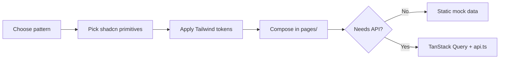

# FlyCRM UI Reference

A practical guide for **how we build UI** in this project — visual language, component choices, copy-paste patterns, and step-by-step workflows.

For **where** things live (routes, folders, state layers), see [UI_STRUCTURE.md](./UI_STRUCTURE.md).

---

## 1. Introduction

Use this doc when you need to:

- Match the existing FlyCRM look and feel
- Pick the right shadcn component for a job
- Add a new page or feature component
- Wire UI to an API the same way Message Center does

**Prerequisites:** frontend runs from `web/` on port **5173**.

```bash
# From repo root (API + web)
npm run dev:all

# Frontend only
npm run dev
```

Open http://localhost:5173. API calls proxy to port 3000.

---

## 2. What we use (toolchain)

| Tool | Role in UI |
|------|------------|
| **shadcn/ui** + Radix | Accessible primitives in [`web/src/components/ui/`](../web/src/components/ui/) |
| **Tailwind CSS 3** | Utility styling; design tokens in [`web/src/index.css`](../web/src/index.css) |
| **class-variance-authority (cva)** | Component variants (e.g. [`button.tsx`](../web/src/components/ui/button.tsx)) |
| **`cn()`** | Merge Tailwind classes — [`web/src/lib/utils.ts`](../web/src/lib/utils.ts) |
| **Lucide React** | Icons (`h-4 w-4` in buttons, `h-5 w-5` in headers) |
| **Sonner** | Success/error toasts (`toast.success`, `toast.error`) |
| **TanStack Query** | Loading/error/data for API-backed screens |

**Config files:**

- [`web/components.json`](../web/components.json) — shadcn aliases and paths
- [`web/tailwind.config.ts`](../web/tailwind.config.ts) — theme extensions, plugins

**Primitive API details:** [ui.shadcn.com](https://ui.shadcn.com) (we do not duplicate prop docs here).

---

## 3. Visual language

FlyCRM uses a **dark-first, AI-powered CRM** aesthetic (originally from Lovable).

### Theme defaults

- **Dark mode is default** — `html` applies `@apply dark` in `index.css`; `ThemeProvider` uses `defaultTheme="dark"`.
- Users can switch light/dark via `ThemeToggle` in the app header.

### Dark-mode palette (reference)

| Token | Role | Approx. |
|-------|------|---------|
| `--background` | Page background | `#151515` |
| `--foreground` | Body text | light gray |
| `--primary` | Brand accent (lime) | `#B6FF5F` |
| `--card` | Card surfaces | `#323232` |
| `--muted-foreground` | Secondary text | medium gray |
| `--border` | Dividers | subtle gray |

### Signature styles

| Style | Class / token | Used for |
|-------|---------------|----------|
| Gradient heading | `gradient-text` | Page titles |
| Primary CTA | `bg-gradient-primary text-primary-foreground` | Main actions |
| Surface panels | `bg-gradient-surface` | Sidebar, header, marketing cards |
| Subtle border | `border-border/50` | Cards, header, inputs |
| Hover feedback | `hover-glow` | Clickable cards, icon buttons |
| Frosted panel | `glass` | Optional overlay panels |
| Accent shadow | `shadow-accent` | Primary buttons |
| Card shadow | `shadow-card` | App header |

**Border radius:** `--radius: 0.75rem` — components feel rounded (`rounded-md` / `rounded-lg`).

### Do and don't

| Do | Don't |
|----|-------|
| `bg-background`, `text-muted-foreground` | Hard-coded `#fff` / `#000` |
| `border-border/50` for subtle dividers | Random gray hex values |
| Primary CTA: `bg-gradient-primary text-primary-foreground` | Inline `style={{ … }}` |
| Lucide icons at consistent sizes | Mix icon libraries |
| `cn()` to merge optional classes | String-concat classes blindly |

---

## 4. Layout patterns

Authenticated pages render **inside** [`Layout`](../web/src/components/layout.tsx): collapsible sidebar + top header + scrollable main.

Public pages (e.g. landing) are **full-screen** with no sidebar.

### Standard page wrapper

Used in [`Email.tsx`](../web/src/pages/Email.tsx), [`Contacts.tsx`](../web/src/pages/Contacts.tsx), and other CRM pages:

```tsx
<div className="p-6 space-y-6">
  {/* page header */}
  {/* optional toolbar */}
  {/* main content */}
</div>
```

### Page header recipe

```tsx
import { Button } from '@/components/ui/button';
import { Plus } from 'lucide-react';

<div className="flex items-center justify-between">
  <div>
    <h1 className="text-3xl font-bold gradient-text">Page Title</h1>
    <p className="text-muted-foreground">Short subtitle</p>
  </div>
  <Button className="bg-gradient-primary text-primary-foreground hover:opacity-90 shadow-accent">
    <Plus className="h-4 w-4 mr-2" />
    Primary action
  </Button>
</div>
```

### Page anatomy

```text
Layout header (global search, notifications, theme, logout)
└── p-6 space-y-6
    ├── Page title row (gradient-text + optional CTA)
    ├── Toolbar row (search, filters, view toggle) — optional
    └── Content (cards, tabs, tables, grids)
```

---

## 5. Component selection guide

| Need | Use | Example in repo |
|------|-----|-----------------|
| Primary / secondary actions | `Button` (`default`, `outline`, `ghost`, `destructive`) | Layout logout, inbox actions |
| Grouped content | `Card`, `CardHeader`, `CardContent` | Dashboard metrics, Contacts |
| Multi-section page | `Tabs`, `TabsList`, `TabsTrigger`, `TabsContent` | Message Center |
| Modal workflow | `Dialog` | [`SettingsModal.tsx`](../web/src/components/settings/SettingsModal.tsx) |
| Slide-over panel | `Sheet` | Available for narrow detail panels |
| Row / menu actions | `DropdownMenu` | Inbox row menu |
| Status chips | `Badge` | Contact status, counts |
| Text input | `Input`, `Textarea`, `Label` | Compose, settings |
| Dropdown pickers | `Select` | Timezone in settings |
| Data lists | `Table` or responsive **card grid** | Contacts = grid; tables available |
| Loading placeholder | `Skeleton` | API pages (when added) |
| Icon button hints | `Tooltip` | EmailInbox toolbar |
| Inline banners | `Alert` | Landing API offline |
| App navigation | `Sidebar` + `SidebarProvider` | [`app-sidebar.tsx`](../web/src/components/app-sidebar.tsx) |
| Separators | `Separator` | Settings modal sections |
| Destructive confirm | `AlertDialog` | Available for delete flows |

---

## 6. UI patterns (from real code)

### A. Mock list page (CRM placeholder)

**Reference:** [`Contacts.tsx`](../web/src/pages/Contacts.tsx)

1. Static data array at top of file
2. Page header + optional `UserFilter`, `ViewToggle`
3. Search `Input` with `Search` icon
4. Responsive grid: `grid gap-4 md:grid-cols-2 lg:grid-cols-3`
5. Each item in a `Card`; row menu via `Button variant="ghost" size="icon"` + `MoreHorizontal`

### B. Dashboard KPI grid

**Reference:** [`dashboard.tsx`](../web/src/components/dashboard/dashboard.tsx)

1. Metric cards: icon + title + large value + trend (`TrendingUp` / `TrendingDown`)
2. Add `hover-glow` on clickable cards
3. `useNavigate()` for drill-down to other routes

### C. Tabbed feature page (live API)

**Reference:** [`Email.tsx`](../web/src/pages/Email.tsx)

```tsx
const [tab, setTab] = useState('inbox');

<Tabs value={tab} onValueChange={setTab} className="space-y-6">
  <TabsList className="grid w-full grid-cols-3 lg:w-96">
    <TabsTrigger value="inbox">Inbox</TabsTrigger>
    <TabsTrigger value="compose">Compose</TabsTrigger>
    <TabsTrigger value="templates">Templates</TabsTrigger>
  </TabsList>
  <TabsContent value="inbox">{/* … */}</TabsContent>
  {/* … */}
</Tabs>
```

- Keep tab state in the page; pass callbacks (`onReply`, etc.) to children
- Mount modals as siblings: `<SettingsModal open={…} onClose={…} />`

### D. Dialog / settings form

**Reference:** [`SettingsModal.tsx`](../web/src/components/settings/SettingsModal.tsx)

1. Controlled `Dialog` — `open` + `onClose` props
2. Form stacks: `Label` + `Input` or `Select`
3. `Separator` between logical sections
4. Local flags: `loading`, `saving`, `error`
5. Success: `toast.success(...)`; errors: inline text or `toast.error`
6. Destructive action (wipe): confirm input must match before enabling button

### E. OAuth / marketing card

**Reference:** [`ConnectProvider.tsx`](../web/src/components/auth/ConnectProvider.tsx)

```tsx
<Card className="bg-gradient-surface border-border/50 max-w-lg mx-auto w-full">
  <CardHeader>
    <CardTitle className="flex items-center gap-2">
      <Mail className="h-5 w-5 text-primary" />
      Connect your email
    </CardTitle>
    <CardDescription>…</CardDescription>
  </CardHeader>
  <CardContent className="flex flex-col gap-3">
    <Button className="bg-gradient-primary text-primary-foreground">Connect Gmail</Button>
    <Button variant="outline">Connect Outlook</Button>
  </CardContent>
</Card>
```

### F. API-backed list with loading / empty / sync

**Reference:** [`EmailInbox.tsx`](../web/src/components/message-center/EmailInbox.tsx)

```tsx
const { data, isLoading, error } = useQuery({
  queryKey: ['messages', search],
  queryFn: () => api.get(`/api/messages?search=…`),
});

const syncMutation = useMutation({
  mutationFn: () => api.post(`${mailApiBase(provider)}/sync`),
  onSuccess: (result) => {
    toast.success(syncToastMessage(result));
    queryClient.invalidateQueries({ queryKey: ['messages'] });
  },
});
```

- **Loading:** simple text or `Skeleton`
- **Empty:** message + link/button to open sync settings
- **Sync button:** disable while `syncMutation.isPending`; show spinning `RefreshCw`

---

## 7. Styling quick reference

Copy-paste class combos used across the app:

| Use case | Classes |
|----------|---------|
| Page title | `text-3xl font-bold gradient-text` |
| Subtitle | `text-muted-foreground` |
| Primary CTA | `bg-gradient-primary text-primary-foreground hover:opacity-90 shadow-accent` |
| Marketing / surface card | `bg-gradient-surface border-border/50` |
| Interactive card | add `hover-glow` |
| App header bar | `h-16 border-b border-border/50 bg-gradient-surface shadow-card` |
| Active sidebar link | `bg-primary/10 text-primary border-r-2 border-primary font-medium` |
| Muted nav link | `text-muted-foreground hover:text-foreground hover:bg-muted/50` |
| Search input in header | `pl-10 bg-background/50 border-border/50 focus:bg-background` |
| Responsive hide (desktop only) | `hidden sm:block` |
| Responsive hide (mobile icon) | `sm:hidden` |

### Merging classes in components

```tsx
import { cn } from '@/lib/utils';

<div className={cn('rounded-lg border p-4', className)} />
```

shadcn components use **cva** for variants — extend via `className` prop, not by editing variants unless the design system changes globally.

---

## 8. Icons, spacing, responsiveness

### Icons

- **Library:** Lucide React only
- **Import:** named icons — `import { Plus, Mail } from 'lucide-react'`
- **Sizes:** `h-4 w-4` inside buttons (Button sets `[&_svg]:size-4`); `h-5 w-5` in titles/toolbars
- **Layout:** flex rows with `gap-2` between icon and label

### Spacing scale

| Level | Typical classes |
|-------|-----------------|
| Page padding | `p-6` |
| Section gaps | `space-y-6` |
| Inline groups | `gap-2`, `gap-3`, `gap-4` |
| Card internal | `p-4`, `p-6` via CardContent |

### Responsive behavior

- **Mobile-first** Tailwind breakpoints (`sm:`, `md:`, `lg:`)
- **Sidebar:** collapses to icon rail via shadcn `Sidebar` (`collapsible="icon"`)
- **Header search:** full input hidden on small screens; icon button shown instead ([`layout.tsx`](../web/src/components/layout.tsx))
- **JS breakpoint:** [`use-mobile.tsx`](../web/src/hooks/use-mobile.tsx) when CSS alone is not enough

---

## 9. Feedback and theme

### Toasts

Prefer **Sonner** for new code:

```tsx
import { toast } from 'sonner';

toast.success('Settings saved');
toast.error('Sync failed');
```

Used on: landing OAuth errors, sync results, settings save, compose send.

`App.tsx` also mounts Radix `Toaster` — legacy; Sonner is the active pattern in feature code.

### Theme toggle

[`ThemeToggle`](../web/src/components/theme-toggle.tsx) reads/writes theme through [`ThemeProvider`](../web/src/components/theme-provider.tsx) (localStorage + `class` on `<html>`).

When testing new UI, check **both** dark and light — semantic tokens should adapt automatically.

---

## 10. How to create new UI

### New authenticated page

1. Create `web/src/pages/YourPage.tsx`:

```tsx
export default function YourPage() {
  return (
    <div className="p-6 space-y-6">
      <div>
        <h1 className="text-3xl font-bold gradient-text">Your Page</h1>
        <p className="text-muted-foreground">Description</p>
      </div>
      {/* content */}
    </div>
  );
}
```

2. Register in [`App.tsx`](../web/src/App.tsx) inside `RequireAuth` → `AppShell`:

```tsx
<Route path="/your-page" element={<YourPage />} />
```

3. Add sidebar link in [`app-sidebar.tsx`](../web/src/components/app-sidebar.tsx) (`mainItems` or `toolsItems`).

4. If the page grows beyond ~80 lines of JSX, extract sections to `web/src/components/your-feature/`.

### New feature component

1. File: `web/src/components/<feature>/YourComponent.tsx`
2. Props: data + callbacks; avoid fetching inside leaf components unless isolated (prefer page-level or custom hook)
3. Optional `className?: string` merged with `cn()`
4. Import primitives from `@/components/ui/*`

### Add a shadcn component

```bash
cd web
npx shadcn@latest add dialog
```

Component is written to `web/src/components/ui/` per [`components.json`](../web/components.json).

### Wire UI to the API

1. Add types in [`types.ts`](../web/src/types.ts)
2. Fetch with [`api.ts`](../web/src/lib/api.ts) + TanStack Query
3. In the UI handle three states: **loading**, **empty**, **error**
4. After mutations, `queryClient.invalidateQueries({ queryKey: […] })`
5. User feedback via Sonner toasts

---

## 11. UI creation flow



---

## 12. Checklist before opening a PR

- [ ] Uses semantic tokens (`bg-background`, `text-muted-foreground`, etc.)
- [ ] Primary actions use gradient CTA pattern where appropriate
- [ ] Icons from Lucide at consistent sizes
- [ ] Page uses `p-6 space-y-6` inside authenticated shell
- [ ] New route registered in `App.tsx` + sidebar if user-facing
- [ ] API pages handle loading / empty / error
- [ ] Toasts for success and failure on mutations
- [ ] Checked in dark mode (and light if user-facing settings)

---

## Related docs

- [UI_STRUCTURE.md](./UI_STRUCTURE.md) — architecture, routing, folder map, Message Center internals
- [PROJECT_GUIDE.md](./PROJECT_GUIDE.md) — full-stack onboarding
- [COMPLETE_FEATURE_SPEC.md](./COMPLETE_FEATURE_SPEC.md) — feature spec
- [README.md](../README.md) — run commands
