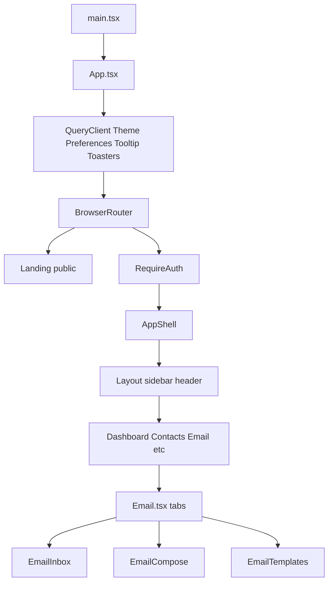

# FlyCRM UI Structure

This document describes the frontend architecture in `web/` — folder layout, routing, layout shell, design system, state management, and the live **Message Center** integration.

**Related:** [UI_REFERENCE.md](./UI_REFERENCE.md) — how to build UI (patterns, styling recipes, step-by-step).

For backend APIs and onboarding, see [PROJECT_GUIDE.md](./PROJECT_GUIDE.md). For feature-level specs, see [COMPLETE_FEATURE_SPEC.md](./COMPLETE_FEATURE_SPEC.md).

---

## 1. Overview

| Item | Detail |
|------|--------|
| **Location** | All UI code lives under [`web/`](../web/) |
| **Dev URL** | http://localhost:5173 (Vite) |
| **API proxy** | `/auth` and `/api` → http://localhost:3000 |

### Stack

- **React 18** + **TypeScript** + **Vite 5**
- **React Router 6** — client-side routing
- **TanStack Query 5** — server state (auth, messages, settings)
- **Tailwind CSS 3** + **shadcn/ui** (Radix UI primitives)
- **Lucide React** — icons
- **Sonner** + Radix Toast — notifications
- **react-hook-form** + **zod** — forms (where used)
- **next-themes** pattern — dark/light theme (`ThemeProvider`)

### Live vs mock

The CRM shell was generated with Lovable and includes Dashboard, Contacts, Pipeline, and other pages as **mock UI** (static data, no API). The **Message Center** (`/email`) is the only area fully wired to Gmail/Outlook backend APIs.

---

## 2. Directory map

```text
web/
├── index.html                 # Vite HTML entry
├── vite.config.ts             # dev server, proxy, @ alias
├── tailwind.config.ts         # Tailwind theme extensions
├── components.json            # shadcn/ui config
├── postcss.config.js
├── eslint.config.js
├── package.json
├── public/                    # favicon, logo, robots.txt
└── src/
    ├── main.tsx               # React root → App + index.css
    ├── App.tsx                # providers + route table
    ├── index.css              # design tokens + utility classes
    ├── types.ts               # shared TypeScript types
    ├── pages/                 # route-level screens
    ├── components/
    │   ├── ui/                # shadcn primitives (see §8)
    │   ├── layout.tsx         # sidebar + header + main content
    │   ├── app-sidebar.tsx    # navigation groups
    │   ├── layout/AppShell.tsx
    │   ├── auth/              # ConnectProvider, RequireAuth
    │   ├── message-center/    # EmailInbox, EmailDetail, EmailCompose, …
    │   ├── settings/          # SettingsModal, EmailIntegrationSettings
    │   ├── dashboard/         # mock dashboard widgets
    │   ├── theme-provider.tsx
    │   ├── theme-toggle.tsx
    │   ├── floating-quick-add.tsx
    │   ├── quick-add-modal.tsx
    │   ├── user-filter.tsx
    │   └── view-toggle.tsx
    ├── hooks/
    │   ├── useAuth.ts
    │   ├── useBackgroundSync.ts
    │   ├── useReopenSettingsModal.ts
    │   └── use-mobile.tsx
    └── lib/
        ├── api.ts             # fetch wrapper + ApiError
        ├── apiHealth.ts       # landing page API check
        ├── provider.ts        # gmail/outlook path helpers
        ├── preferences.tsx    # timezone context
        ├── formatters.ts
        ├── inboxThreads.ts    # thread grouping
        ├── inboxReadState.ts  # localStorage read state
        ├── emailBody.ts
        ├── syncResult.ts
        └── utils.ts           # cn() helper
```

### Component hierarchy



---

## 3. Bootstrap and providers

**Entry:** [`web/src/main.tsx`](../web/src/main.tsx) mounts `App` and imports global styles from `index.css`.

**App wrapper** ([`web/src/App.tsx`](../web/src/App.tsx)):

| Provider | File | Purpose |
|----------|------|---------|
| `QueryClientProvider` | `@tanstack/react-query` | Server state: auth, messages, settings, mutations |
| `ThemeProvider` | `components/theme-provider.tsx` | Dark/light theme; default **dark** |
| `PreferencesProvider` | `lib/preferences.tsx` | Loads timezone from `/api/settings`; exposes `useFormatters()` |
| `TooltipProvider` | `components/ui/tooltip` | Global tooltip context |
| `Toaster` + `Sonner` | `components/ui/toaster`, `components/ui/sonner` | Toast notifications |

**Vite config** ([`web/vite.config.ts`](../web/vite.config.ts)):

- Port **5173**, `strictPort: true`
- Proxy `/auth` and `/api` → `http://localhost:3000` (keeps OAuth callback same-origin with the browser)
- Path alias `@` → `./src`

---

## 4. Routing

Routes are declared in [`web/src/App.tsx`](../web/src/App.tsx).

| Path | Auth | Page file | Status |
|------|------|-----------|--------|
| `/` | Public | `pages/Landing.tsx` | OAuth connect + API health banner |
| `/dashboard` | Yes | `pages/Index.tsx` | Mock KPI dashboard |
| `/contacts` | Yes | `pages/Contacts.tsx` | Mock CRM |
| `/companies` | Yes | `pages/Companies.tsx` | Mock CRM |
| `/pipeline` | Yes | `pages/Pipeline.tsx` | Mock CRM |
| `/tasks` | Yes | `pages/Tasks.tsx` | Mock CRM |
| `/email` | Yes | `pages/Email.tsx` | **Live Message Center** |
| `/reports` | Yes | `pages/Reports.tsx` | Mock analytics |
| `/ai` | Yes | `pages/AI.tsx` | Mock AI assistant |
| `/settings` | Yes | `pages/Settings.tsx` | Mock settings tabs |
| `*` | — | `pages/NotFound.tsx` | 404 |

### Route guards

```text
/  → Landing (no layout)

RequireAuth (Outlet)
  └── AppShell (Layout + Outlet + background sync)
        └── /dashboard, /contacts, … /email, …
```

- **[`RequireAuth`](../web/src/components/auth/RequireAuth.tsx)** — loads `/auth/me` via `useAuth`; redirects to `/` when unauthenticated.
- **[`AppShell`](../web/src/components/layout/AppShell.tsx)** — wraps authenticated pages in `Layout`; runs `useBackgroundSync` every 3 minutes while the tab is visible.

### Sidebar navigation

[`app-sidebar.tsx`](../web/src/components/app-sidebar.tsx) defines two groups:

| Group | Items |
|-------|-------|
| **Main** | Dashboard, Contacts, Companies, Pipeline, Tasks |
| **Tools** | Message Center (`/email`), Reports, AI Assistant |

Footer link: Settings (`/settings`).

---

## 5. Layout shell (authenticated chrome)

[`Layout`](../web/src/components/layout.tsx) is the shared chrome for all authenticated routes.

```text
┌─────────────────────────────────────────────────────────┐
│ AppSidebar │  Header (search, bell, theme, user, logout) │
│ (collapsible)├───────────────────────────────────────────┤
│              │  Main content (page Outlet)                │
│              │                                            │
└──────────────┴────────────────────────────────────────────┘
                                    [FloatingQuickAdd FAB]
```

| Region | Component | Notes |
|--------|-----------|-------|
| Left rail | `AppSidebar` | shadcn `Sidebar`, collapsible to icon mode |
| Top bar | Header in `Layout` | Sidebar trigger, search (mock), notifications badge, `ThemeToggle`, email, logout |
| Body | `{children}` / `<Outlet />` | Scrollable page content |
| FAB | `FloatingQuickAdd` | Mock quick-create (not wired to API) |

**Landing** (`/`) renders full-screen without this shell.

---

## 6. Pages — mock vs live

| Page | File | Data source |
|------|------|-------------|
| Landing | `pages/Landing.tsx` | `/auth/me`, `checkApiReachable()` |
| Dashboard | `pages/Index.tsx` + `components/dashboard/` | Static mock widgets |
| Contacts, Companies, Pipeline, Tasks | `pages/*.tsx` | Static mock cards/tables/filters |
| Reports, AI, Settings | `pages/*.tsx` | Static mock UI |
| **Email Center** | `pages/Email.tsx` | Gmail/Outlook APIs via `/api/*` |

CRM pages outside Message Center are intentionally placeholders. They demonstrate the shell and navigation but do not call backend CRM endpoints yet.

---

## 7. Message Center (live UI)

The Message Center is the production-ready email UI. It lives at **`/email`** and is composed inside the standard `Layout` shell.

### Page structure

[`Email.tsx`](../web/src/pages/Email.tsx):

- Page header with title and **Compose** button
- **Tabs:** Inbox | Compose | Templates
- **Settings modal** — sync label/folder, timezone, wipe, Apollo
- Deep link: `?openSettings=1` opens settings after OAuth reconnect
- Reply and template actions switch to Compose tab with prefilled context

### Components

| Component | File | Responsibility |
|-----------|------|----------------|
| `EmailInbox` | `message-center/EmailInbox.tsx` | Lists messages via `GET /api/messages`; search; thread grouping; sync; read/star state; opens detail panel |
| `EmailDetail` | `message-center/EmailDetail.tsx` | Thread view via `GET /api/messages/thread/:id`; reply; marks thread read |
| `EmailCompose` | `message-center/EmailCompose.tsx` | Send via `POST /api/gmail/send` or `/api/outlook/send` |
| `EmailMessageBody` | `message-center/EmailMessageBody.tsx` | Renders HTML/plain body (`lib/emailBody.ts`) |
| `EmailTemplates` | `message-center/EmailTemplates.tsx` | Local templates → prefills compose |
| `SettingsModal` | `settings/SettingsModal.tsx` | Sync selector, timezone, create label/folder, wipe, Apollo |
| `EmailIntegrationSettings` | `settings/EmailIntegrationSettings.tsx` | Gmail health card (standalone; not yet wired to a page route) |
| `ConnectProvider` | `auth/ConnectProvider.tsx` | Gmail/Outlook OAuth buttons on landing |

### Inbox behavior

**Thread grouping** ([`lib/inboxThreads.ts`](../web/src/lib/inboxThreads.ts)):

- Groups messages by `gmailThreadId` or `conversationId` (Outlook)
- Normalizes subject for orphan linking
- One row per thread in the inbox list

**Read state** ([`lib/inboxReadState.ts`](../web/src/lib/inboxReadState.ts)):

- Persisted in **localStorage** per user ID
- Thread-level read marking; unread count derived from threads
- Survives page refresh (client-only; not synced to Gmail/Outlook labels yet)

**Client-only actions:**

- **Star** and **Archive** — UI state only; not persisted to provider APIs yet

### Background sync

[`useBackgroundSync`](../web/src/hooks/useBackgroundSync.ts):

- Runs every **3 minutes** while the browser tab is visible
- Calls `POST ${mailApiBase(provider)}/sync`
- Invalidates message queries when new mail is imported

### Provider routing

[`lib/provider.ts`](../web/src/lib/provider.ts):

```typescript
connectPath('gmail')   → '/auth/google'
connectPath('outlook') → '/auth/microsoft'
mailApiBase('gmail')   → '/api/gmail'
mailApiBase('outlook') → '/api/outlook'
```

### Settings modal flows

1. **Save sync selector** → `PUT /api/settings` with `syncSelector`
2. **Create label/folder** → `POST /api/gmail/labels` or `/api/outlook/folders`, then save
3. **Reset sync** → type `WIPE` confirm → `POST .../reset-sync`
4. **Apollo** → save key, sync contacts, disconnect

After OAuth reconnect, [`useReopenSettingsModal`](../web/src/hooks/useReopenSettingsModal.ts) reads `sessionStorage` to reopen the settings modal automatically.

---

## 8. Design system (shadcn + Tailwind)

### shadcn configuration

[`web/components.json`](../web/components.json):

- Style: **default**
- CSS variables: enabled
- Aliases: `@/components`, `@/components/ui`, `@/lib/utils`, `@/hooks`

Add new primitives from the `web/` directory:

```bash
cd web
npx shadcn@latest add button
```

### Design tokens

[`web/src/index.css`](../web/src/index.css) defines HSL CSS variables for `:root` (light) and `.dark` (default app mode).

Custom properties include:

- Semantic colors: `--background`, `--foreground`, `--primary`, `--muted`, `--destructive`, `--success`, …
- Gradients: `--gradient-primary`, `--gradient-surface`, `--gradient-dark`
- Shadows: `--shadow-soft`, `--shadow-accent`, `--shadow-card`
- Sidebar: `--sidebar-background`, `--sidebar-foreground`, …

### Dark mode token reference (defaults)

| Token | Role | Dark value (HSL) |
|-------|------|------------------|
| `--background` | Page background | `0 0% 8%` (#151515) |
| `--foreground` | Primary text | `0 0% 95%` |
| `--primary` | Brand accent | `79 100% 68%` (#B6FF5F) |
| `--primary-foreground` | Text on primary | `0 0% 8%` |
| `--card` | Card surfaces | `0 0% 20%` (#323232) |
| `--muted-foreground` | Secondary text | medium gray |
| `--border` | Borders | subtle gray |
| `--sidebar-background` | Sidebar fill | matches surface gradient |

### Tailwind config

[`web/tailwind.config.ts`](../web/tailwind.config.ts):

- `darkMode: ["class"]`
- Colors map to `hsl(var(--token))`
- Plugins: `tailwindcss-animate`, `@tailwindcss/typography`
- Custom background images: `gradient-primary`, `gradient-surface`

### Utility classes (index.css)

| Class | Purpose |
|-------|---------|
| `.gradient-text` | Primary gradient on headings |
| `.bg-gradient-primary` | Primary button/CTA background |
| `.bg-gradient-surface` | Sidebar/header surface |
| `.glass` | Frosted glass effect |
| `.hover-glow` | Subtle hover highlight |
| `.shadow-accent` | Accent-colored shadow |
| `.card-success` | Success-state card border |

### UI primitives (`components/ui/`)

48 shadcn components. Grouped by role:

| Category | Components |
|----------|------------|
| **Forms** | `button`, `input`, `textarea`, `label`, `checkbox`, `radio-group`, `select`, `switch`, `slider`, `form`, `input-otp`, `calendar` |
| **Overlays** | `dialog`, `alert-dialog`, `sheet`, `drawer`, `popover`, `hover-card`, `dropdown-menu`, `context-menu`, `command`, `menubar`, `navigation-menu` |
| **Data display** | `card`, `table`, `badge`, `avatar`, `separator`, `scroll-area`, `accordion`, `collapsible`, `tabs`, `breadcrumb`, `pagination`, `chart`, `carousel`, `progress`, `skeleton`, `aspect-ratio` |
| **Navigation** | `sidebar`, `resizable` |
| **Feedback** | `alert`, `toast`, `toaster`, `sonner`, `tooltip` |
| **Toggle** | `toggle`, `toggle-group` |

### Styling conventions

1. Use **semantic tokens** (`bg-background`, `text-muted-foreground`, `border-border/50`) — not hard-coded hex in components.
2. Merge classes with **`cn()`** from [`lib/utils.ts`](../web/src/lib/utils.ts) (`clsx` + `tailwind-merge`).
3. Icons from **Lucide React**; consistent `h-4 w-4` / `h-5 w-5` sizing.
4. Page titles often use **`gradient-text`**; primary CTAs use **`bg-gradient-primary`**.

---

## 9. State management

| Layer | Mechanism | Examples |
|-------|-----------|----------|
| Server data | TanStack Query | `['auth','me']`, `['messages', search]`, thread queries, sync/send mutations |
| User preferences | React Context | `PreferencesProvider` → timezone, `useFormatters()` |
| Theme | Context + localStorage | `ThemeProvider`, `ThemeToggle` |
| Ephemeral UI | `useState` | Tab selection, compose draft, selected thread, modal open |
| Cross-session client | localStorage | `inboxReadState.ts` — read thread IDs per user |
| OAuth return | sessionStorage | `useReopenSettingsModal.ts` |

No Redux, Zustand, or global auth Context — auth is a React Query hook (`useAuth`).

### Common query keys

| Key | Used by |
|-----|---------|
| `['auth', 'me']` | `useAuth`, `RequireAuth`, landing redirect |
| `['messages', search]` | `EmailInbox` |
| `['messages', 'thread', threadId]` | `EmailDetail` |
| Settings queries | `SettingsModal`, `PreferencesProvider` |

Mutations invalidate relevant keys after sync, send, or settings save.

---

## 10. API and auth UI flow

### Fetch wrapper

[`lib/api.ts`](../web/src/lib/api.ts):

- `credentials: 'include'` for session cookies
- Throws `ApiError` with status + body on non-OK responses

### Auth hook

[`hooks/useAuth.ts`](../web/src/hooks/useAuth.ts):

- `GET /auth/me` → `{ user: Me | null }`
- `logout()` → `POST /auth/logout`, clears query cache

### Landing health check

[`lib/apiHealth.ts`](../web/src/lib/apiHealth.ts) probes API reachability. Landing shows a red alert when the API on port 3000 is down.

### OAuth flow (UI side)

1. User clicks **Connect Gmail** or **Connect Outlook** on landing (`ConnectProvider`)
2. Browser navigates to `/auth/google` or `/auth/microsoft` (proxied to Express)
3. Provider OAuth → callback on `:5173` → session cookie set
4. Redirect to app; `useAuth` loads user; landing redirects to `/dashboard`

Error query params (`?error=oauth_denied`, etc.) show Sonner toasts on landing.

---

## 11. Types reference

Shared types in [`web/src/types.ts`](../web/src/types.ts):

| Type | Purpose |
|------|---------|
| `AuthProvider` | `'gmail' \| 'outlook'` |
| `Me` | Logged-in user from `/auth/me` |
| `InboxMessage` | Single message row in inbox/thread |
| `InboxThread` | Grouped thread with `threadKey`, latest message, count |
| `ReplyContext` | Prefill for compose/reply (to, subject, body, thread ids) |
| `SyncResult` | `{ messagesAdded, messagesUpdated?, error?, notice? }` |
| `UserSettings` | Sync label/folder, timezone, watch warning |
| `GmailSyncHealth` | Gmail watch/queue health for integration settings |

Thread identity uses **`gmailThreadId`** (Gmail) or **`conversationId`** (Outlook). The thread API accepts either as `:threadId`.

---

## 12. Adding new UI (conventions)

1. **New route** — Create `pages/YourPage.tsx`, register in `App.tsx` inside `RequireAuth` → `AppShell`. Add sidebar entry in `app-sidebar.tsx` if needed.
2. **Reuse primitives** — Prefer `components/ui/*` over custom markup.
3. **Semantic styling** — Use design tokens from `index.css`; extend Tailwind config for new tokens if required.
4. **Server data** — Use TanStack Query + `api.ts`; define query keys consistently; invalidate after mutations.
5. **New shadcn component** — Run `npx shadcn@latest add <name>` from `web/` per `components.json`.
6. **Mock vs live** — Keep placeholder CRM pages clearly mock until backend endpoints exist; wire real data only through documented API routes.

---

## Related docs

- [UI_REFERENCE.md](./UI_REFERENCE.md) — how to build UI (patterns, styling, workflows)
- [PROJECT_GUIDE.md](./PROJECT_GUIDE.md) — full-stack onboarding and API flows
- [COMPLETE_FEATURE_SPEC.md](./COMPLETE_FEATURE_SPEC.md) — feature spec (§16 superseded by this doc for UI layout)
- [GOOGLE_WEBHOOK_GUIDE.md](./GOOGLE_WEBHOOK_GUIDE.md) — Gmail Pub/Sub webhook setup
- [README.md](../README.md) — quick start and run commands
