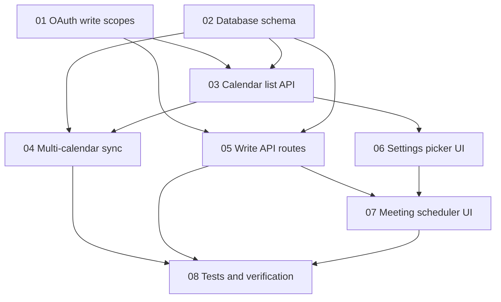

# Calendar Phase 3 — Task Index

**Purpose:** Implement multi-calendar selection and create/update meetings from the CRM.  
**Status:** **Phase 3 complete** — all tasks 01–08 implemented. Requires [CALENDAR_PHASE_1.md](../CALENDAR_PHASE_1.md) complete. [CALENDAR_PHASE_2.md](../CALENDAR_PHASE_2.md) recommended but not strictly required.

**Parent doc:** [CALENDAR_PHASE_3.md](../CALENDAR_PHASE_3.md) — scope, limitations, architecture overview

**Progress tracking:** When implementation begins, add completed items to [my_task.md](../../my_task.md) under a new "Calendar Phase 3" section.

---

## Prerequisites

- Phase 1 shipped: `CalendarEvent` model, read sync, `/calendar` UI, `calendar.readonly` / `Calendars.Read` scopes
- Phase 2 (recommended): push webhooks for timely write confirmation after CRM creates events

---

## Task order

Implement tasks in numeric order unless noted. See dependency diagram below.

| # | Task | Status | Prerequisites |
|---|------|--------|---------------|
| 01 | [OAuth write scopes](./01-oauth-write-scopes.md) | Done | Phase 1 |
| 02 | [Database schema](./02-database-schema.md) | Done | Phase 1 |
| 03 | [Calendar list API](./03-calendar-list-api.md) | Done | 01, 02 |
| 04 | [Multi-calendar sync](./04-multi-calendar-sync.md) | Done | 02, 03 |
| 05 | [Write API routes](./05-write-api-routes.md) | Done | 01, 02 |
| 06 | [Settings calendar picker](./06-settings-calendar-picker.md) | Done | 03 |
| 07 | [Meeting scheduler UI](./07-meeting-scheduler-ui.md) | Done | 05, 06 |
| 08 | [Tests and verification](./08-tests-and-verification.md) | Done | 04, 05, 07 |

**Suggested path:** 01 → 02 → 03 → 04 (read path), then 05 → 06 → 07 (write path), finish with 08.

---

## Dependencies

---

## Phase 3 goals (summary)

| Goal | Detail |
|------|--------|
| Calendar picker | User selects one or more calendars in Settings (not only `primary`) |
| Write access | Create and update meetings from CRM (e.g. on contact record) |
| Scopes | Upgrade to `calendar.events` (Google) / `Calendars.ReadWrite` (Microsoft) |
| Reconnect | All users must reconnect OAuth after scope upgrade |

---

**Last updated:** Task 08 (tests and verification) implemented — Phase 3 complete.
