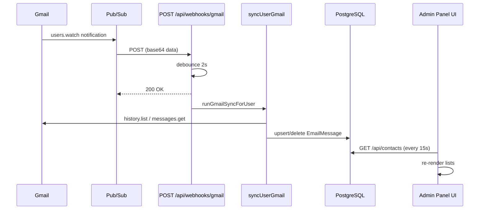

# Gmail Webhook & Push Sync — Integration Specification

**Project:** FlyConnector / Gmail-Native CRM  
**Audience:** Third-party integrators (e.g. admin panel dashboard)  
**Goal:** Replicate this webhook strategy so GCP + backend + UI work end-to-end with minimal guesswork.

---

## 1. Product behavior

| Trigger | What happens |
|--------|----------------|
| User applies/removes **CRM sync label** in Gmail | Pub/Sub → webhook → incremental Gmail sync → Postgres updated |
| User sends email **from CRM** | Gmail send API + label applied + DB written immediately (no webhook wait) |
| User saves **sync label** in Settings | Validates label in Gmail, clears history watermark, starts label-scoped watch, runs backfill sync |
| User clicks **Sync now** | `POST /api/gmail/sync` → full/incremental pull → UI refresh |
| **Daily** (server) | All Gmail users with a sync label get one safety-net sync |
| **UI (push mode)** | Does not call Gmail every few seconds; polls DB every ~15s |

**Core rule (do not break in admin panel):**  
Email is sent/received **through the user's Gmail API**, not SMTP. The CRM only stores/logs mail that has the **configured Gmail label** (selective sync).

---

## 2. Architecture overview

```
┌─────────────────────────────────────────────────────────────────────────┐
│ Google Cloud                                                             │
│  Gmail API users.watch (label-scoped)                                    │
│       → publishes to Pub/Sub topic (GMAIL_PUBSUB_TOPIC)                  │
│       → Push subscription POSTs to public HTTPS URL                      │
└───────────────────────────────┬─────────────────────────────────────────┘
                                │
                                ▼
┌─────────────────────────────────────────────────────────────────────────┐
│ Backend (Express) — NO AUTH on webhook                                     │
│  POST /api/webhooks/gmail                                                │
│    → decode Pub/Sub payload                                              │
│    → map emailAddress → User                                             │
│    → debounce 2s → runGmailSyncForUser → syncUserGmail                    │
│    → Contact + EmailMessage in PostgreSQL                                │
└───────────────────────────────┬─────────────────────────────────────────┘
                                │
                                ▼
┌─────────────────────────────────────────────────────────────────────────┐
│ Admin panel / CRM UI (session auth)                                        │
│  pushEnabled from GET /api/gmail/sync-config                             │
│  setInterval → GET /api/contacts (DB only) every uiRefreshIntervalMs     │
│  POST /api/gmail/sync at most 1×/24h + manual "Sync now"                 │
└─────────────────────────────────────────────────────────────────────────┘
```

**Important:** The webhook **never** talks to the browser. UI updates are **eventually consistent** via DB polling (or immediate after manual sync / CRM send).

---

## 3. Google Cloud prerequisites

### 3.1 APIs & OAuth

- Gmail API enabled in GCP project.
- OAuth client (Web) with redirect URI matching `GOOGLE_REDIRECT_URI`.
- Scopes must include at least `gmail.send` and `gmail.modify` (modify = read + labels + apply labels).
- Test users on consent screen while app is in **Testing** mode.

### 3.2 Pub/Sub topic

- Create topic, e.g. `projects/<PROJECT_ID>/topics/gmail-notifications`.
- Grant **Publisher** on the topic to:  
  `serviceAccount:gmail-api-push@system.gserviceaccount.com`  
  (required for `users.watch`).

### 3.3 Push subscription

- **Delivery type:** Push
- **Endpoint URL:** `https://<PUBLIC_HOST>/api/webhooks/gmail`  
  (local dev: ngrok → port **3000**, API server not Vite)
- Handler must return **200** quickly; sync runs asynchronously after debounce.

### 3.4 Per-user Gmail watch (application-managed)

- On Settings save (label set) → `startGmailWatch(userId)`.
- On server startup + daily interval → `renewAllGmailWatches()` (watch expires ~7 days).

Watch is **label-scoped** (`labelIds` + `labelFilterAction: 'include'`).

---

## 4. Environment variables

| Variable | Required | Role |
|----------|----------|------|
| `GMAIL_PUBSUB_TOPIC` | For webhooks | Full topic name. Empty = push disabled. |
| `GOOGLE_CLIENT_ID` / `SECRET` / `REDIRECT_URI` | Yes | OAuth |
| `GOOGLE_SCOPES` | Yes | Must include send + modify |
| `DATABASE_URL` | Yes | Postgres |
| `ENCRYPTION_KEY` | Yes | OAuth tokens at rest |
| `SESSION_SECRET` | Yes | Session cookie |
| `WEB_ORIGIN` | Yes | CORS + OAuth redirect |
| `PORT` | No (default 3000) | API server |

When `GMAIL_PUBSUB_TOPIC` is set:

- `GET /api/health` → `gmailPushEnabled: true`, `webhookPath: "/api/webhooks/gmail"`.
- Server logs on boot: push enabled + topic name.

---

## 5. Database fields

On **`User`**:

| Field | Type | Purpose |
|-------|------|---------|
| `gmailSyncLabel` | `String?` | Label name in Gmail (e.g. `CRM`). Must exist in Gmail before save. No label → webhooks no-op. |
| `gmailLastHistoryId` | `String?` | Incremental sync watermark. Cleared when sync label changes in Settings. |
| `googleAccessToken` / `googleRefreshToken` | encrypted | Gmail API access |
| `authProvider` | `gmail` \| `outlook` | Webhook only processes `gmail` |

**`EmailMessage`** / **`Contact`:** populated by `syncUserGmail` and CRM send.

Admin panel should expose: connected email, sync label, push enabled status, **Sync now**, **Reset sync**.

---

## 6. Webhook HTTP contract

### Endpoint

- **Method:** `POST`
- **Path:** `/api/webhooks/gmail`
- **Auth:** None (Pub/Sub only)
- **Mount:** `app.use('/api/webhooks/', gmailWebhookRouter)` + `router.post('/gmail', ...)`

### Request body (Pub/Sub push envelope)

```json
{
  "message": {
    "data": "<base64-encoded JSON>",
    "messageId": "...",
    "publishTime": "..."
  },
  "subscription": "projects/.../subscriptions/..."
}
```

### Decoded `message.data` (Gmail notification)

```json
{
  "emailAddress": "user@gmail.com",
  "historyId": "12345678"
}
```

`historyId` may be JSON **number** or **string** — decoder normalizes to string.

Sync uses **`User.gmailLastHistoryId`** from the last successful sync, not the notification `historyId` directly.

### Responses

| Status | When |
|--------|------|
| `400` | Missing/invalid Pub/Sub body or decode failure |
| `200 OK` | Valid decode; user missing, wrong provider, or no sync label (ignored) |

Sync runs after **2s debounce**; response is sent before sync finishes.

---

## 7. Server code map

| File | Responsibility |
|------|----------------|
| `server/src/gmail/gmailWebhook/index.ts` | Route handler, debounce, schedule sync |
| `server/src/gmail/gmailWebhook/decode.ts` | Base64 + JSON parse |
| `server/src/gmail/syncRunner.ts` | Per-user mutex, logging, errors |
| `server/src/gmail/sync.ts` | `syncUserGmail` — history.list, ingest, delete on label remove |
| `server/src/gmail/watch.ts` | `startGmailWatch`, `renewAllGmailWatches` |
| `server/src/gmail/labels.ts` | Resolve label name → Gmail `labelId` |
| `server/src/gmail/dailySync.ts` | Daily safety-net for all labeled users |
| `server/src/users/settings.ts` | Save label → clear history, watch + sync |
| `server/src/auth/routes.ts` | OAuth; watch only if user already has label |
| `server/src/gmail/send.ts` | Send + apply label + DB row |
| `server/src/gmail/routes.ts` | `GET /sync-config`, `POST /sync`, `POST /reset-sync` |
| `server/src/index.ts` | Mount webhook, health, watch renewal + daily sync |

---

## 8. Webhook handler — step-by-step

1. `POST /api/webhooks/gmail` receives Pub/Sub POST.
2. `decodeGmailPushData(message.data)` → `{ emailAddress, historyId }`.
3. `prisma.user.findUnique({ where: { email: emailAddress } })`.
4. Guards: not Gmail user → `200`; no `gmailSyncLabel` → `200`.
5. `scheduleGmailSync(userId)`:
   - If timer already exists for user → return (timer not reset).
   - Else `setTimeout(2000ms)` → `runGmailSyncForUser(userId)`.
6. Respond `200 OK` immediately.

### After debounce: `runGmailSyncForUser`

- Skip if sync already in flight for that user.
- Call `syncUserGmail(userId)`.
- Log: `[webhook] Gmail sync <userId>: +N messages, -M removed, +C contacts`.

---

## 9. `syncUserGmail` — data changes

1. Load user + workspace + `gmailSyncLabel` + `gmailLastHistoryId`.
2. `getAuthorizedClient` — refresh token if expired.
3. Resolve label name → `labelId`.
4. `users.getProfile` → capture `newWatermark`.
5. **Incremental** (if `gmailLastHistoryId` set):
   - `history.list` with `startHistoryId`, `labelId`, types: `messageAdded`, `labelAdded`, `labelRemoved`
   - Adds → `messages.get` → `ingestMessage` (contact upsert + `EmailMessage` upsert)
   - CRM label removed → `deleteMany` on `EmailMessage`
6. **Fallback:** history 404 or no watermark → `messages.list` for that label.
7. Update `gmailLastHistoryId` if advanced.
8. Optional backfill for legacy rows.

---

## 10. Other sync triggers

| Source | When | Log prefix |
|--------|------|------------|
| Webhook | Label/mail change on watched label | `[webhook]` |
| Settings save | Label set/changed | `[settings]` |
| `POST /api/gmail/sync` | Manual / client daily | (route) |
| `dailySync` | Server interval 24h | `[daily]` |
| OAuth callback | Watch only if user already had `gmailSyncLabel` | — |

CRM **send** writes DB in `send.ts` after `gmail.users.messages.send` (instant UI).

---

## 11. Admin panel UI integration

### 11.1 Detect push mode

```
GET /api/gmail/sync-config
→ { pushEnabled, mailSyncIntervalMs: 86400000, uiRefreshIntervalMs: 15000 }
```

`pushEnabled === true` when `GMAIL_PUBSUB_TOPIC` is set on server.

### 11.2 Two timers

| Timer | Interval | API | Purpose |
|-------|----------|-----|---------|
| UI refresh | ~15s | `GET /api/contacts` | Show DB changes after webhook |
| Mail sync | 24h | `POST /api/gmail/sync` | Safety Gmail pull; throttle per user |

When `pushEnabled`: do **not** poll `POST /sync` every 15s.

### 11.3 `refreshSignal` pattern (React)

- Parent: `refreshSignal` counter; `setRefreshSignal(n => n + 1)` on interval / manual sync / send.
- Children: `useEffect(..., [refreshSignal])` refetch contacts.

### 11.4 Settings (required for webhooks)

1. User creates label in Gmail (e.g. `CRM`).
2. `PUT /api/settings` with `gmailSyncLabel` or `syncSelector`.
3. Server validates label, clears history if changed, `startGmailWatch`, backfill sync.

### 11.5 Manual actions

- **Sync now:** `POST /api/gmail/sync` → toast with counts → refresh UI.
- **Reset sync:** `POST /api/gmail/reset-sync` → wipe workspace emails/contacts + clear history.

---

## 12. API surface

| Endpoint | Auth | Use |
|----------|------|-----|
| `POST /api/webhooks/gmail` | None | Pub/Sub push |
| `GET /api/health` | None | `gmailPushEnabled`, `webhookPath` |
| `GET /api/gmail/sync-config` | Session | Frontend push mode |
| `PUT /api/settings` | Session | Set sync label + start watch |
| `POST /api/gmail/sync` | Session | Manual / daily client sync |
| `POST /api/gmail/reset-sync` | Session | Wipe CRM mail data |
| `GET /api/contacts` | Session | UI poll after webhook |
| Gmail send route | Session | Send + immediate DB |

---

## 13. Setup checklist

### Phase A — Infrastructure

- [ ] Postgres running; migrations applied
- [ ] `.env` filled (see section 4)
- [ ] GCP topic + `gmail-api-push` publisher
- [ ] Push subscription → `https://<host>/api/webhooks/gmail`
- [ ] API publicly reachable on HTTPS

### Phase B — Per user

- [ ] Sign in with Google (refresh token stored)
- [ ] Sync label created **in Gmail**
- [ ] Save sync label in Settings
- [ ] Server log: `Gmail watch renewed for <id> (label: …)`
- [ ] One **Sync now** for baseline

### Phase C — Verify webhook

- [ ] Apply CRM label to a message in Gmail
- [ ] Pub/Sub delivery HTTP 200
- [ ] Server ~2s later: `[webhook] Gmail sync … +N messages`
- [ ] DB: new `EmailMessage`
- [ ] UI within ~15s or **Sync now**

### Phase D — Negative tests

- [ ] Remove label → `-N removed`, row deleted
- [ ] No sync label → webhooks 200 but no sync
- [ ] `invalid_grant` → re-login

**Automated:** `./scripts/verify-gmail-webhook-stack.sh`  
**Manual:** [gmail-webhook-e2e-test.md](./gmail-webhook-e2e-test.md)

---

## 14. Troubleshooting

| Symptom | Likely cause | Fix |
|---------|--------------|-----|
| No POSTs to server | Wrong Pub/Sub URL / tunnel down | Fix subscription endpoint |
| POSTs, 400 | Bad payload / decode | Check base64 body shape |
| POSTs, no sync log | No `gmailSyncLabel` | Save label in Settings |
| Sync log, empty DB | Label mismatch / history gap | Re-save label or Reset sync + Sync now |
| DB ok, UI stale | UI not polling | 15s `GET /contacts` in push mode |
| `invalid_grant` | Revoked refresh token | Re-OAuth |
| Watch not started | Label missing in Gmail | Create label first |

---

## 15. Admin panel minimum implementation

1. Settings: Gmail sync label picker (validated against Gmail API).
2. Status: `pushEnabled` + webhook URL for ops.
3. Push-mode UI: DB poll ~15s when `pushEnabled`; no aggressive `/sync`.
4. Actions: Sync now, Reset sync, Connect / Reconnect Gmail.
5. Ops: Pub/Sub topic + push URL documented per environment.
6. Do not: SMTP send; full-mailbox sync without label filter.
7. Optional: verify Pub/Sub push JWT; per-user sync audit log.

---

## 16. Production log lines

```
Gmail push enabled → webhook POST /api/webhooks/gmail
Gmail watch renewed for <userId> (label: CRM)
[webhook] Gmail sync <userId>: +2 messages, -0 removed, +1 contacts
[webhook] Gmail sync <userId>: no new labeled messages ...
[webhook] Gmail sync skipped for <userId>: invalid_grant
```

---

## 17. Sequence diagram



---

## Related docs

- [gmail-webhook-e2e-test.md](./gmail-webhook-e2e-test.md) — manual test checklist
- [gmail-webhook-test-results-template.md](./gmail-webhook-test-results-template.md) — results template
- [README.md](../README.md) — quick start
