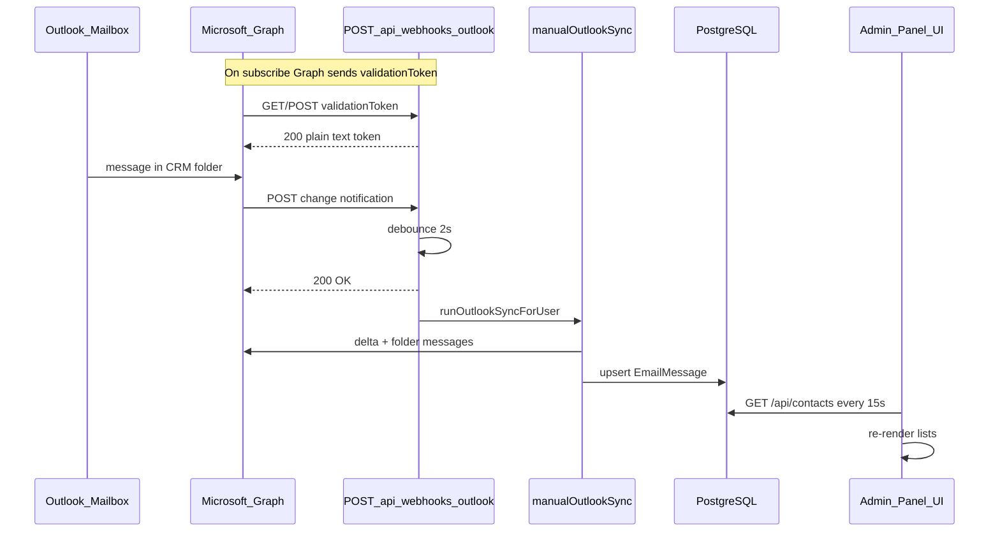

# Outlook Webhook & Push Sync — Integration Specification

**Project:** FlyConnector / Outlook-Native CRM  
**Audience:** Third-party integrators (e.g. admin panel dashboard)  
**Goal:** Replicate the Gmail push-sync strategy using Microsoft Graph change notifications so Azure + backend + UI work end-to-end with minimal guesswork.

**Status:** Outlook webhooks are **implemented** in the server when `OUTLOOK_WEBHOOK_URL` and `OUTLOOK_WEBHOOK_CLIENT_STATE` are set. Manual sync remains available without webhooks.

**Gmail analogue:** [gmail-webhook-integration-spec.md](./gmail-webhook-integration-spec.md)

---

## 1. Product behavior

| Trigger | What happens |
|--------|----------------|
| User moves mail **into/out of** the CRM sync folder in Outlook | Graph change notification → webhook → debounced sync → Postgres updated |
| User sends email **from CRM** | Graph `sendMail` + DB written immediately via `sendOutlookMessage` (no webhook wait) **Implemented today** |
| User saves **sync folder** in Settings | Validates folder in Graph, clears delta watermark; **To implement:** create/renew folder subscription + backfill sync |
| User clicks **Sync now** | `POST /api/outlook/sync` → folder list + delta pull → UI refresh **Implemented today** |
| **Daily** (server) | **To implement:** safety-net sync + subscription renewal for all Outlook users with a sync folder |
| **UI (push mode)** | Poll DB every ~15s via `GET /api/messages`; one `POST /api/outlook/sync` per browser session on load + webhooks + 24h safety sync |

**Core rule (do not break in admin panel):**  
Email is sent and received through the user's **Microsoft Graph** mailbox (`/me/sendMail`, folder APIs), not SMTP. The CRM only stores mail that lives in the **configured Outlook mail folder** (selective sync), same spirit as Gmail's CRM label.

---

## 2. Architecture overview

```
┌─────────────────────────────────────────────────────────────────────────┐
│ Microsoft Entra ID + Microsoft Graph                                     │
│  Per-user subscription on CRM mail folder messages                       │
│    resource: /me/mailFolders/{folderId}/messages                         │
│    notificationUrl: https://<PUBLIC_HOST>/api/webhooks/outlook           │
│    → Graph POSTs change notifications (and validationToken on create)    │
└───────────────────────────────┬─────────────────────────────────────────┘
                                │
                                ▼
┌─────────────────────────────────────────────────────────────────────────┐
│ Backend (Express) — NO SESSION on webhook                                │
│  POST|GET /api/webhooks/outlook                                          │
│    → validationToken echo (subscription handshake)                       │
│    → verify clientState → map subscriptionId → User                      │
│    → debounce 2s → runOutlookSyncForUser → manualOutlookSync             │
│    → Contact + EmailMessage in PostgreSQL                                │
└───────────────────────────────┬─────────────────────────────────────────┘
                                │
                                ▼
┌─────────────────────────────────────────────────────────────────────────┐
│ Admin panel / CRM UI (session auth)                                      │
│  pushEnabled from GET /api/outlook/sync-config  (To implement)           │
│  setInterval → GET /api/contacts (DB only) every uiRefreshIntervalMs     │
│  POST /api/outlook/sync at most 1×/24h + manual "Sync now"               │
└─────────────────────────────────────────────────────────────────────────┘
```

**Important:** The webhook **never** talks to the browser. UI updates are **eventually consistent** via DB polling (or immediate after manual sync / CRM send).

**Gmail vs Outlook transport:**

| Gmail | Outlook |
|-------|---------|
| `users.watch` → Google Pub/Sub → your URL | Graph **subscription** → direct HTTPS POST to your URL |
| One GCP topic for all users | One Graph subscription **per user** (delegated token) |
| Pub/Sub JWT optional | `clientState` secret + validation handshake |

---

## 3. Microsoft Azure / Graph prerequisites

### 3.1 App registration & OAuth **Implemented today**

1. Register an app in [Microsoft Entra admin center](https://entra.microsoft.com/) (or Azure Portal → App registrations).
2. **Redirect URI** (Web): must match `MICROSOFT_REDIRECT_URI` (e.g. `http://localhost:5173/auth/microsoft/callback` for dev).
3. **Supported account types:** typically "Accounts in any organizational directory and personal Microsoft accounts" (`MICROSOFT_TENANT_ID=common`).
4. **API permissions (delegated):**
   - `User.Read`
   - `Mail.ReadWrite` (read folders/messages, move mail)
   - `Mail.Send`
   - `offline_access` (refresh token)
5. Create a **client secret** → `MICROSOFT_CLIENT_SECRET`.
6. User signs in via `GET /auth/microsoft` → callback stores encrypted tokens on `User`.

### 3.2 Public HTTPS notification URL **To implement**

- Graph requires a **publicly reachable HTTPS** endpoint for `notificationUrl`.
- Local dev: tunnel (ngrok, Cloudflare Tunnel, etc.) to API port **3000** (Express), not the Vite dev server.
- Example: `https://<tunnel-host>/api/webhooks/outlook`

### 3.3 Per-user Graph subscription **To implement**

After the user saves a sync folder in Settings:

1. Resolve folder **display name** → Graph `mailFolder.id`.
2. `POST https://graph.microsoft.com/v1.0/subscriptions` with the user's access token.
3. Store `subscriptionId`, `expirationDateTime`, and cached `folderId` on `User`.
4. On server startup + scheduled job → **renew** subscriptions before expiry (mail subscriptions max lifetime ≈ **4230 minutes**, ~2.9 days).

Subscription is **folder-scoped**:

```http
POST /v1.0/subscriptions
Content-Type: application/json
Authorization: Bearer <user-access-token>

{
  "changeType": "created,updated,deleted",
  "notificationUrl": "https://<PUBLIC_HOST>/api/webhooks/outlook",
  "resource": "/me/mailFolders/{folderId}/messages",
  "expirationDateTime": "2026-06-07T12:00:00.000Z",
  "clientState": "<OUTLOOK_WEBHOOK_CLIENT_STATE>"
}
```

Optional (phase 2): `includeResourceData` + encryption certificate for rich notifications. Phase 1 can use **basic notifications** and fetch full messages inside `manualOutlookSync`.

### 3.4 Lifecycle notifications **To implement**

Enable `lifecycleNotificationUrl` (same as `notificationUrl` or a dedicated path) to receive:

- `reauthorizationRequired` — refresh token invalid; prompt user to reconnect.
- `subscriptionRemoved` — clear stored subscription id; recreate on next settings save or renewal job.
- `missed` — optional catch-up via manual/daily sync.

---

## 4. Environment variables

| Variable | Required | Role | Status |
|----------|----------|------|--------|
| `MICROSOFT_CLIENT_ID` | For Outlook | OAuth app id | Implemented |
| `MICROSOFT_CLIENT_SECRET` | For Outlook | OAuth secret | Implemented |
| `MICROSOFT_REDIRECT_URI` | For Outlook | OAuth redirect | Implemented |
| `MICROSOFT_TENANT_ID` | No (default `common`) | Tenant | Implemented |
| `MICROSOFT_SCOPES` | No | Default includes Mail.ReadWrite, Mail.Send | Implemented |
| `OUTLOOK_WEBHOOK_URL` | For webhooks | Public base URL used to build `notificationUrl` (e.g. `https://api.example.com`). Empty = push disabled. | **To implement** |
| `OUTLOOK_WEBHOOK_CLIENT_STATE` | For webhooks | Opaque secret sent in `clientState`; must match on every notification | **To implement** |
| `DATABASE_URL` | Yes | Postgres | Implemented |
| `ENCRYPTION_KEY` | Yes | OAuth tokens at rest | Implemented |
| `SESSION_SECRET` | Yes | Session cookie | Implemented |
| `WEB_ORIGIN` | Yes | CORS + OAuth | Implemented |
| `PORT` | No (default 3000) | API server | Implemented |

When `OUTLOOK_WEBHOOK_URL` is set (**To implement**):

- `GET /api/health` → `outlookPushEnabled: true`, `webhookPath: "/api/webhooks/outlook"`.
- Server logs on boot: Outlook push enabled.

---

## 5. Database fields

### 5.1 Implemented today (`User`)

| Field | Type | Purpose |
|-------|------|---------|
| `outlookSyncFolder` | `String?` | Folder **display name** (e.g. `CRM`). No folder → sync and webhooks no-op. |
| `outlookLastDeltaToken` | `String?` | Microsoft Graph **delta link** URL for incremental sync. Cleared when sync folder changes in Settings. |
| `outlookAccessToken` / `outlookRefreshToken` | encrypted | Graph API access |
| `authProvider` | `gmail` \| `outlook` | Webhook only processes `outlook` |

Unlike Gmail, Outlook does **not** use the `CrmLabel` table; folder validation is by display name against `GET /me/mailFolders`.

### 5.2 Proposed for webhooks (`User`)

| Field | Type | Purpose |
|-------|------|---------|
| `outlookFolderId` | `String?` | Cached Graph folder id for subscription `resource` path |
| `outlookSubscriptionId` | `String?` | Graph subscription id for renewal/delete |
| `outlookSubscriptionExpiry` | `DateTime?` | When to PATCH subscription before expiry |

**`EmailMessage`** / **`Contact`:** populated by `manualOutlookSync` and `sendOutlookMessage` (`outlookMessageId` on messages).

Admin panel should expose: connected email, sync folder, push enabled status, **Sync now**, **Reset sync**, **Reset delta**.

---

## 6. Webhook HTTP contract **To implement**

### Endpoint

- **Methods:** `POST` (change notifications), `GET` (validation — Graph may use GET or POST with query string)
- **Path:** `/api/webhooks/outlook`
- **Auth:** None (session cookie not used)
- **Mount:** `app.use('/api/webhooks', outlookWebhookRouter)` before session middleware

### 6.1 Subscription validation handshake (required)

When creating or renewing a subscription, Graph sends a request to `notificationUrl` with:

```
?validationToken=<opaque-string>
```

**Handler must:**

1. Read `validationToken` from query string (GET or POST).
2. Respond **within 10 seconds** with status **200**.
3. Body = **raw** `validationToken` string only (`Content-Type: text/plain`).
4. Do **not** JSON-wrap the token.

Failure → subscription creation fails (no push until fixed).

### 6.2 Change notification body

```json
{
  "value": [
    {
      "subscriptionId": "7f105c7d-2dc5-4530-97cd-4e7ae2e0710e",
      "subscriptionExpirationDateTime": "2026-06-07T11:00:00.000Z",
      "changeType": "created",
      "resource": "Users/{user-guid}/Messages/{message-id}",
      "resourceData": {
        "@odata.type": "#Microsoft.Graph.Message",
        "@odata.id": "Users/{user-guid}/Messages/{message-id}",
        "id": "{message-id}"
      },
      "clientState": "your-secret-from-env",
      "tenantId": "..."
    }
  ]
}
```

**Lifecycle example:**

```json
{
  "value": [
    {
      "subscriptionId": "...",
      "lifecycleEvent": "reauthorizationRequired",
      "clientState": "your-secret-from-env"
    }
  ]
}
```

### 6.3 Handler security

| Check | Action |
|-------|--------|
| `clientState` ≠ `OUTLOOK_WEBHOOK_CLIENT_STATE` | Log, return `202` or `200` (do not sync) |
| Unknown `subscriptionId` | Log, return `200` |
| `authProvider !== outlook` | Return `200`, no sync |
| No `outlookSyncFolder` | Return `200`, no sync |

Do not fetch message bodies in the webhook handler; schedule sync and use existing delta/folder ingest.

### 6.4 Responses

| Status | When |
|--------|------|
| `200` + plain text body | `validationToken` present — echo token |
| `400` | Malformed JSON (optional; prefer `200` for ignored notifications to avoid Graph retries storm) |
| `200` | Valid notification; sync scheduled or ignored |

Sync runs after **2s debounce**; HTTP response is sent **before** sync finishes (same pattern as Gmail).

---

## 7. Server code map

### 7.1 Implemented today

| File | Responsibility |
|------|----------------|
| `server/src/outlook/sync.ts` | `manualOutlookSync` — folder messages + delta + conversation import |
| `server/src/outlook/conversation.ts` | `upsertOutlookGraphMessage`, folder list, conversation import |
| `server/src/outlook/graph.ts` | Delta URL helper, stale delta detection (410/400) |
| `server/src/outlook/send.ts` | Graph send + immediate CRM log |
| `server/src/outlook/routes.ts` | `POST /sync`, `/send`, `/folders`, `/reset-sync`, `/reset-delta` |
| `server/src/users/settings.ts` | Save folder → validate via Graph, clear `outlookLastDeltaToken` |
| `server/src/auth/routes.ts` | Microsoft OAuth callback |
| `server/src/auth/tokens.ts` | `getOutlookAccessToken` with refresh |
| `server/src/index.ts` | Mounts `/api/outlook` (no Outlook webhook yet) |

### 7.2 To implement (proposed layout)

| File | Responsibility |
|------|----------------|
| `server/src/outlook/outlookWebhook/index.ts` | Route handler: validationToken, parse `value[]`, schedule sync |
| `server/src/outlook/outlookWebhook/validate.ts` | `clientState` check, subscription → user lookup |
| `server/src/outlook/syncRunner.ts` | Per-user mutex, 2s debounce, `[webhook]` logging (mirror Gmail `syncRunner.ts`) |
| `server/src/outlook/subscriptionManager.ts` | `ensureOutlookSubscription`, `renewAllOutlookSubscriptions`, DELETE on disconnect |
| `server/src/outlook/dailySync.ts` | 24h safety sync for all folder-configured Outlook users |
| `server/src/webhooks/outlookReceiver.ts` | Re-export router for `index.ts` |
| `server/src/outlook/routes.ts` | Add `GET /sync-config` |
| `server/src/users/settings.ts` | On folder save → `ensureOutlookSubscription` + `runOutlookSyncForUser(..., 'settings')` |
| `server/src/index.ts` | Mount webhook, health flag, renewal interval |

---

## 8. Webhook handler — step-by-step **To implement**

1. Request hits `/api/webhooks/outlook`.
2. If `validationToken` query param → respond `200` `text/plain` with token; **stop**.
3. Parse JSON body `value` array (may be empty → `200`).
4. For each item:
   - If `lifecycleEvent` → handle reauth/missed (update user flags, log); continue.
   - Verify `clientState`.
   - Load user by `outlookSubscriptionId` (or map from stored subscription table).
5. Guards: not Outlook user → skip; no `outlookSyncFolder` → skip.
6. `scheduleOutlookSync(userId)`:
   - If debounce timer exists for user → return (do not reset timer).
   - Else `setTimeout(2000ms)` → `runOutlookSyncForUser(userId, 'webhook')`.
7. Respond `200` immediately.

### After debounce: `runOutlookSyncForUser`

- Skip if sync already in flight for that user.
- Call `manualOutlookSync(userId, workspaceId)`.
- Log: `[webhook] Outlook sync <userId>: +N messages, ~M updated`.

---

## 9. `manualOutlookSync` — data changes **Implemented today**

Webhook only **triggers** this pipeline; it does not replace it.

1. Load user; require `outlookSyncFolder`.
2. `getOutlookAccessToken` — refresh if expired.
3. `GET /me/mailFolders` → find folder by `displayName`.
4. `listFolderMessages` (up to 200) → upsert into CRM; collect `conversationId`s.
5. **Delta sync** via `outlookLastDeltaToken` or `initialDeltaUrl(folderId)`:
   - Follow `@odata.nextLink` pages.
   - On 410/400 stale delta → clear token, restart from initial delta (**notice: `delta_reset`**).
   - Persist new `@odata.deltaLink` to `outlookLastDeltaToken`.
6. For each conversation in folder → `importOutlookConversationForCrm` (thread completeness).
7. Return `{ messagesAdded, messagesUpdated?, notice? }`.

**Selective sync:** Only messages in the configured folder are listed/delta-scoped. Mail elsewhere in the mailbox is ignored.

**Deletes:** Delta may return `#microsoft.graph.messageDeleted` entries; current code skips them (no CRM row removal yet). Document for integrators: optional future work to delete `EmailMessage` when removed from folder.

---

## 10. Other sync triggers

| Source | When | Log prefix | Status |
|--------|------|------------|--------|
| Webhook | Folder message created/updated/deleted | `[webhook]` | To implement |
| Settings save | Folder set/changed | `[settings]` | To implement (today: clear delta only) |
| `POST /api/outlook/sync` | Manual / client daily safety | `[manual]` or route | Implemented |
| `dailySync` | Server interval 24h | `[daily]` | To implement |
| OAuth callback | Subscription only if user already had folder | — | To implement |

CRM **send** writes DB in `send.ts` after `sendMail` (instant UI) **Implemented today**.

---

## 11. Admin panel UI integration

### 11.1 Detect push mode **To implement**

```
GET /api/outlook/sync-config
→ { pushEnabled, mailSyncIntervalMs: 86400000, uiRefreshIntervalMs: 15000 }
```

`pushEnabled === true` when `OUTLOOK_WEBHOOK_URL` is set on server.

**Today:** Only Gmail exposes `GET /api/gmail/sync-config`; Outlook UI should mirror the same contract.

### 11.2 Two timers

| Timer | Interval | API | Purpose |
|-------|----------|-----|---------|
| UI refresh | ~15s | `GET /api/contacts` | Show DB changes after webhook |
| Mail sync | 24h | `POST /api/outlook/sync` | Safety pull; throttle per user |

When `pushEnabled`: do **not** poll `POST /sync` every 15s.

**Today:** `web/src/hooks/useBackgroundSync.ts` only enables push mode for `provider === 'gmail'`. Extend for `outlook` when `pushEnabled`.

### 11.3 `refreshSignal` pattern (React)

Same as Gmail spec: parent counter incremented on interval / manual sync / send; children refetch on change.

### 11.4 Settings (required for webhooks)

1. User creates folder in Outlook (e.g. `CRM`) or via `POST /api/outlook/folders`.
2. `PUT /api/settings` with `outlookSyncFolder` or `syncSelector`.
3. **Today:** Server validates folder exists, clears `outlookLastDeltaToken`.
4. **To implement:** Resolve `folderId`, `ensureOutlookSubscription`, run backfill sync.

### 11.5 Manual actions **Implemented today**

- **Sync now:** `POST /api/outlook/sync` → toast with counts → refresh UI.
- **Reset sync:** `POST /api/outlook/sync` with body `{ confirm: "WIPE" }` on `/reset-sync` — wipe workspace emails/contacts + clear delta.
- **Reset delta:** `POST /api/outlook/reset-delta` — clear watermark only.

---

## 12. API surface

| Endpoint | Auth | Use | Status |
|----------|------|-----|--------|
| `POST` / `GET` `/api/webhooks/outlook` | None | Graph notifications + validation | To implement |
| `GET /api/health` | None | `outlookPushEnabled`, `webhookPath` | To implement |
| `GET /api/outlook/sync-config` | Session | Frontend push mode | To implement |
| `GET /api/health/outlook-sync` | Session | Per-user subscription readiness | To implement (optional) |
| `PUT /api/settings` | Session | Set sync folder | Implemented (partial) |
| `POST /api/outlook/sync` | Session | Manual / daily client sync | Implemented |
| `POST /api/outlook/reset-sync` | Session | Wipe CRM mail data | Implemented |
| `POST /api/outlook/reset-delta` | Session | Clear delta token | Implemented |
| `POST /api/outlook/folders` | Session | Create mail folder | Implemented |
| `POST /api/outlook/send` | Session | Send + immediate DB | Implemented |
| `GET /api/contacts` | Session | UI poll after webhook | Implemented |

---

## 13. Graph subscription API reference **To implement**

### Create

```http
POST https://graph.microsoft.com/v1.0/subscriptions
Authorization: Bearer <user-access-token>
Content-Type: application/json

{
  "changeType": "created,updated,deleted",
  "notificationUrl": "https://<PUBLIC_HOST>/api/webhooks/outlook",
  "lifecycleNotificationUrl": "https://<PUBLIC_HOST>/api/webhooks/outlook",
  "resource": "/me/mailFolders/{folderId}/messages",
  "expirationDateTime": "<now + max allowed minutes>",
  "clientState": "<OUTLOOK_WEBHOOK_CLIENT_STATE>"
}
```

Response includes `id`, `expirationDateTime` — persist on `User`.

### Renew

```http
PATCH https://graph.microsoft.com/v1.0/subscriptions/{subscriptionId}
Authorization: Bearer <user-access-token>
Content-Type: application/json

{
  "expirationDateTime": "<new expiry within max lifetime>"
}
```

Run when `outlookSubscriptionExpiry` is within 24 hours (same margin as Gmail watch renewal).

### Delete

```http
DELETE https://graph.microsoft.com/v1.0/subscriptions/{subscriptionId}
Authorization: Bearer <user-access-token>
```

On disconnect, reset sync, or folder change (delete old, create new).

---

## 14. Setup checklist

### Phase A — Infrastructure

- [ ] Postgres running; migrations applied
- [ ] `.env` filled: `MICROSOFT_*`, `DATABASE_URL`, `ENCRYPTION_KEY`, `SESSION_SECRET`, `WEB_ORIGIN`
- [ ] **To implement:** `OUTLOOK_WEBHOOK_URL`, `OUTLOOK_WEBHOOK_CLIENT_STATE`
- [ ] Entra app: redirect URI, delegated Mail permissions, client secret
- [ ] Public HTTPS tunnel → `https://<host>/api/webhooks/outlook`
- [ ] API reachable on port 3000

### Phase B — Per user

- [ ] Sign in with Microsoft (refresh token stored)
- [ ] Sync folder created in Outlook (or `POST /api/outlook/folders`)
- [ ] Save sync folder in Settings (`PUT /api/settings`)
- [ ] **To implement:** Server log: `Outlook subscription renewed for <userId> (folder: CRM)`
- [ ] One **Sync now** for baseline

### Phase C — Verify webhook **To implement**

- [ ] Move or receive mail into CRM folder in Outlook
- [ ] Graph delivery HTTP 200 (validation on first subscribe)
- [ ] Server ~2s later: `[webhook] Outlook sync … +N messages`
- [ ] DB: new/updated `EmailMessage` with `outlookMessageId`
- [ ] UI within ~15s or **Sync now**

### Phase D — Negative tests

- [ ] No sync folder → webhooks 200 but no sync
- [ ] Wrong `clientState` → ignored
- [ ] Expired subscription → renewal job or re-save settings
- [ ] `reauth_required` / lifecycle reauthorization → reconnect Microsoft
- [ ] Stale delta → `notice: delta_reset` on sync; `POST /reset-delta` if stuck

---

## 15. Troubleshooting

| Symptom | Likely cause | Fix |
|---------|--------------|-----|
| Subscription create fails | Validation token not echoed | Fix handler §6.1; check tunnel HTTPS |
| No POSTs to server | Wrong `notificationUrl` / tunnel down | Fix `OUTLOOK_WEBHOOK_URL` |
| POSTs, no sync log | No `outlookSyncFolder` | Save folder in Settings |
| POSTs, wrong user | `subscriptionId` not stored | Re-save settings; check subscription manager |
| Sync log, empty DB | Mail not in CRM folder | Move message to folder; Sync now |
| DB ok, UI stale | UI not in push mode | Enable outlook `sync-config` + 15s contacts poll |
| 401 on Graph | Expired/revoked refresh token | Re-OAuth Microsoft |
| Delta 410 | Stale `outlookLastDeltaToken` | Auto-reset in sync; or `POST /reset-delta` |
| Subscription expired | Not renewed within ~3 days | Implement renewal job; re-save folder |

---

## 16. Admin panel minimum implementation

1. Settings: Outlook sync folder picker (validated against Graph folder list).
2. Status: `pushEnabled` + webhook URL for ops (**To implement**).
3. Push-mode UI: DB poll ~15s when `pushEnabled`; no aggressive `/sync` (**To implement** for Outlook provider).
4. Actions: Sync now, Reset sync, Reset delta, Connect / Reconnect Microsoft.
5. Ops: document `OUTLOOK_WEBHOOK_URL` per environment (no Pub/Sub).
6. Do not: SMTP send; full-mailbox sync without folder filter.
7. Optional: per-user sync audit log; health endpoint for subscription expiry.

---

## 17. Production log lines **To implement**

```
Outlook push enabled → webhook POST /api/webhooks/outlook
[outlook-subscription] renewed for <userId> (folder: CRM, expires: …)
[webhook] Outlook sync <userId>: +2 messages, ~1 updated
[webhook] Outlook sync <userId>: no new folder messages
[webhook] Outlook sync skipped for <userId>: reauth_required
[outlook-subscription] lifecycle reauthorizationRequired <userId>
```

---

## 18. Sequence diagram



---

## 19. Gmail ↔ Outlook quick reference

| Gmail | Outlook |
|-------|---------|
| `GMAIL_PUBSUB_TOPIC` | `OUTLOOK_WEBHOOK_URL` + per-user subscription |
| `gmailSyncLabel` + `CrmLabel` | `outlookSyncFolder` (+ proposed `outlookFolderId`) |
| `gmailLastHistoryId` | `outlookLastDeltaToken` |
| `users.watch` | `POST /subscriptions` |
| Pub/Sub base64 payload | JSON `value[]` notifications |
| `GOOGLE_WEBHOOK_AUDIENCE` JWT | `OUTLOOK_WEBHOOK_CLIENT_STATE` |
| `ensureGmailWatch` | `ensureOutlookSubscription` |
| `POST /api/webhooks/gmail` | `POST /api/webhooks/outlook` |

---

## 20. Implementation phases (codebase work — out of scope for this doc)

Use this as a build order when implementing in the repo:

1. Prisma migration: `outlookFolderId`, `outlookSubscriptionId`, `outlookSubscriptionExpiry`
2. `subscriptionManager.ts` + env vars in `server/src/env.ts`
3. Webhook router + validation + `syncRunner.ts`
4. Wire `index.ts`, settings save, daily sync + renewal
5. `GET /api/outlook/sync-config` + `useBackgroundSync` for Outlook
6. Tests: validation handshake, clientState mismatch, debounce schedules sync once

---

## Related docs

- [gmail-webhook-integration-spec.md](./gmail-webhook-integration-spec.md) — Gmail push analogue
- [GOOGLE_WEBHOOK_GUIDE.md](./GOOGLE_WEBHOOK_GUIDE.md) — Gmail operational guide
- [COMPLETE_FEATURE_SPEC.md](./COMPLETE_FEATURE_SPEC.md) — §11 Outlook integration (current behavior)
- [Microsoft Graph: change notifications](https://learn.microsoft.com/en-us/graph/webhooks)
- [Microsoft Graph: mailFolder message delta](https://learn.microsoft.com/en-us/graph/delta-query-messages)
